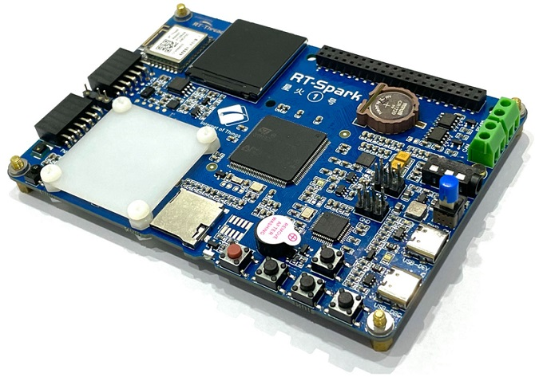
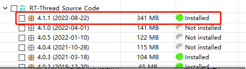
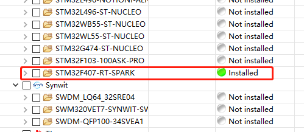
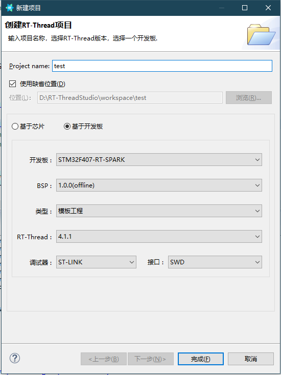
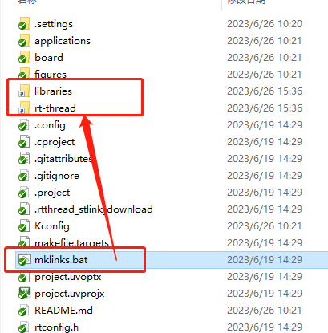

# 星火 1 号开发板

“星火一号” 一款专为工程师和高校学生设计的嵌入式 RTOS 开发学习板。在这个科技飞速发展的时代，嵌入式系统已经成为了现代工业、交通、通信等众多领域的核心驱动力。而 RTOS 实时操作系统作为嵌入式领域的基石，更是工程师们必须熟练掌握的核心技术。作为业界主流的 RTOS 实时操作系统 RT-Thread，我们有义务帮助更多开发者掌握这项技术。为此，我们精心打造了一款专为工程师和高校学生设计的嵌入式开发学习板。

星火一号主控选用了目前行业中比较常用且学习门槛较低的 STM32F407，性能强劲、功能丰富，完全能够满足嵌入式入门的需求。此开发板不仅具有众多的板载资源（Flash 存储、WIFI 通信、多个传感器），还支持丰富的扩展接口，让您轻松实现各种复杂的应用场景。通过使用这款开发学习板，您将能够深入了解 RTOS/RT-Thread 的工作原理，提升自己的技能水平，为当前以及未来的职业生涯做好充分准备。

## 外观与资源

板载资源：

- 复位按键、轻触按键 ×4、自锁开关
- 蜂鸣器
- LR1220 RTC 后备电池座
- ST-Link
- USB-FS
- 麦克风、4 极耳机
- SD 卡座
- 8MB NorFlash
- 红外发射、红外接收
- ICM20608 六轴传感器、AP3216 接近传感器、AHT20 温湿度传感器
- RW007 WIFI
- 240×240 并行 LCD 支持背光调节
- 19 灯等距全彩 LED
- 全彩 LED 外接
- 3.3V 电源扩展、5V 电源扩展

扩展接口：

- RS485 接口
- CAN 接口
- 40Pin 树莓派标准扩展无冲撞 IO
- Spark-10Pin 创意堆叠平台
- PMOD 接口 ×2

支持的 IDE：RT-Thread Studio、MDK。

## 如何使用

### 在 RT-Thread Studio 上使用

在 Studio 中的 SDK 管理界面下载本开发板的 SDK，基于该 SDK 创建相应的工程进行学习开发 ([点击此处查看 在 RT-Thread Studio 上快速上手 “星火一号” 视频](https://www.bilibili.com/video/BV1su411h71G))。

1. 在包管理界面下载资源包：

2. 新建工程（新建工程可以基于模板工程，也可以基于示例工程），之后编译

### 在 MDK 上使用

1. [下载 SDK](https://github.com/RT-Thread-Studio/sdk-bsp-stm32f407-spark)，在工程下双击 mklinks.bat，生成 libraries 和 rt-thread 文件夹的链接：

2. 打开 Env，使用 scons --target=mdk5 重新生成 mdk5 工程，之后则可双击打开 mdk5  工程。

