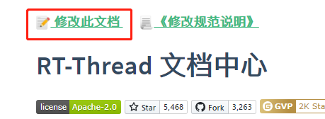
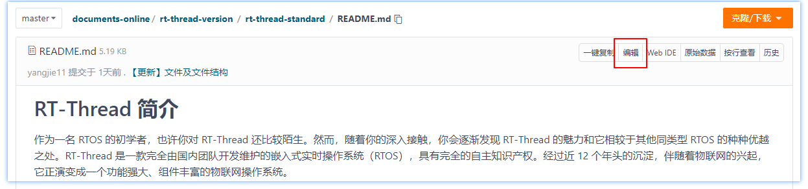
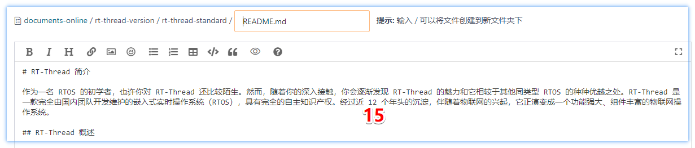
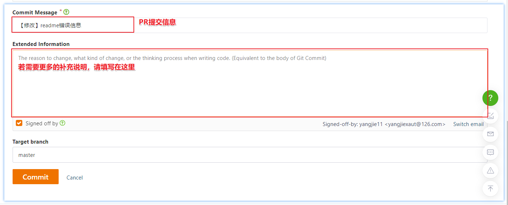
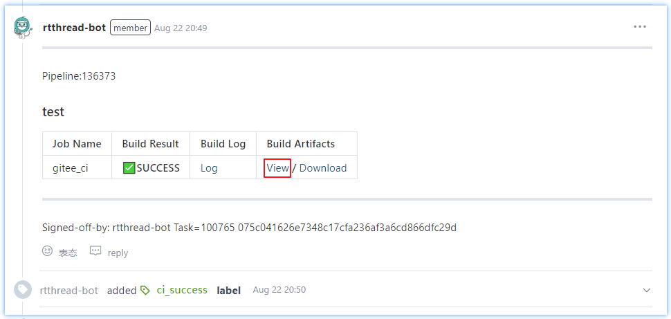

# 文档中心 PR 提交规范

感谢您为 RT-Thread 官方文档中心做贡献！为了文档中心和开源社区的规范化发展，请您在提交 PR 之前请仔细阅读以下规则，并确保贡献的文档已遵守如下规则。

## PR 标题

PR 标题规范要求如下所示，请按照要求填写 PR 标题，否则 PR 将不予通过。

| 提交类型       | PR 标题规范要求                                  |
| -------------- | ----------------------------------------------- |
| 修改**已有**的文档 | 【修改】xxx 文档中 xxx 描述问题（或增加了 xxx 功能），文档支持在线修改 |
| 新增文档       | 【新增】xxx 文档                                 |
| 删除文档       | 【删除】xxx 文档，原因：xxxx                     |

PR 标题示例：
1. 【修改】pin 设备驱动开发文档中引脚编号错误
1. 【修改】为 spi 设备驱动开发文档增加了 xxx 描述
1. 【修改】删除了 i2c 设备驱动开发文档中 xxx 段落
1. 【新增】pr 提交规则文档 
1. 【删除】xxx 文档，由于 yyy，该文档不再使用

## 图片要求

| 推荐绘图工具 | 种类     | 特点                   | 备注                                                         |
| ------------ | -------- | ---------------------- | ------------------------------------------------------------ |
| Drawio       | 多种类型 | 可在线绘图；可本地绘图 | [在线链接](https://www.draw.io/index.html)                   |
| Visio        | 多种类型 | 本地绘图               |                                                              |
| WaveDrom     | 时序     | 在线绘图；需要代码编写 | [在线链接](https://wavedrom.com/editor.html)                 |
| PlantUML     | UML 类    | 在线绘图；需要代码编写 | [语法](https://plantuml.com/zh/sequence-diagram)；[在线链接](https://www.plantuml.com/plantuml/uml/SyfFKj2rKt3CoKnELR1Io4ZDoSa70000) |

- Drawio 绘图要求字体及大小为默认 Helvetica 12pt；线粗 1pt；并需提交矢量图，将 xxx.drawio 文件放入 figures 文件夹中提交。请确保矢量图与文档中截图命名相同。
- Visio 绘图要求字体及大小为默认黑体 12pt；线粗 1pt；并需要提交矢量图，将 xxx.vsdx 文件放入 figures 文件夹中提交。请确保矢量图与文档中截图命名相同。
- WaveDrom 与 PlantUML 绘图需提交图片的源码，将源码保存在 xxx.txt 中，放入 figures 文件夹中一起提交。请确保 txt 名与文档中截图命名相同。
- 对截图的要求：截图的四周留白尽量减少。

>[!NOTE]
> 注意：为文章添加图片时，不要使用 URL 方式进行链接（URL 可能会失效），需要将图片上传至该仓库，采用相对路径进行链接，保证图片有效性。[正确示范](https://gitee.com/rtthread/docs-online/pulls/47/files) vs [错误示范](https://gitee.com/rtthread/docs-online/pulls/44/files)。

## 修改文档

文档支持在线修改，当发现某文档一处错误时，在该文档页面最上方，点击 “修改此文档”



跳转至该文档的 gitee 页面，点击 “编辑”



进入可编辑状态，如将 12 改为 15



拉到最下面填写 提交信息，扩展信息可以根据情况填写，无误后，点击提交审核




> [!NOTE]
> 修改文档需要符合以下规则：
>
>（1）修改文档段落或添加文章后，文档中包含的中英文之间需要添加空格，可以使用 vscode-pangu 插件进行格式化。注意 pangu 格式化会**破坏加粗格式**，格式化完成请再次检查加粗格式并修改。
>
>（2）在编辑文档中的代码段时，需要符合 [RT-Thread 代码规范](https://gitee.com/rtthread/rt-thread/blob/master/documentation/contribution_guide/coding_style_cn.md)；若进行代码修改，请描述清楚修改原因。
>
>（3）中文正文中标点符号需要使用中文标点符号；若出现连续、段落性英文，需在句子间或该段落使用英文标点符号。
> 

## 删除文档

删除文档则需要通过正常的 PR 流程进行提交（`fork -> clone -> 分支上开发 -> commit -> PR`），谨慎删除文档并描述删除原因。

## 新增文档

1. 新文档归属：首先需要确认新增的文档隶属于哪个模块下。

    ```
    ├─development-tools          # 工具
    │  ├─_sidebar.md                # 侧边导航栏
    │  ├─build-config-system        # 构建相关
    │  ├─env                        # Env 工具
    │  └─rtthread-studio            # Studio IDE
    ├─rt-thread-version          # RT-Thread 各版本
    │  ├─rt-thread-nano             # rt-thread nano 版本
    │  │   └─_sidebar.md            # 侧边导航栏
    │  ├─rt-thread-smart            # rt-thread smart 版本
    │  │   └─_sidebar.md            # 侧边导航栏
    │  └─rt-thread-standard         # rt-thread 标准版本
    │      ├─_sidebar.md            # 侧边导航栏
    │      ├─application-note       # 应用笔记
    │      ├─development-guide      # 开发指南
    │      ├─packages-manual        # 软件包指南
    │      ├─programming-manual     # 编程手册
    │      └─tutorial               # 小项目教程系列
    └─other
       ├─novice-guide               # 新手入门
       └─pr-rule                    # PR 提交规范
    ```

> [!NOTE]
> 注意：如果不确定新增文档应该存放的位置，请新建 issue 咨询，确认新增位置后可以提交新文档。

2. 新文档命名：文档及文件夹命名使用英文，有必要时候使用中杠链接单词，如 device-ipc。
3. 新文档结构：每篇文档使用一个 figures 文件夹，存储本篇文档中使用的图片及图片源码。


4. 更新文档中心导航栏：需要将新增的文档放在相应位置的导航栏中，修改的文件为对应的 `_sidebar.md` 文件。

## 提交后自查

在 PR 提交完成之后，文档中心会触发 rtthread-bot 机器人执行 pipeline CI 测试，将测试结果返回在 test 表格中，如下图所示。请点击 View 预览修改处，若有问题则及时修改；若无问题请等待审核合并。



> [!NOTE] 
> 注意：网站文档已开启缓存，测试没有效果时，请使用 CTRL+F5 强制刷新页面，或让浏览器进入无痕模式。

