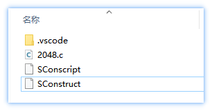
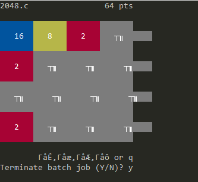
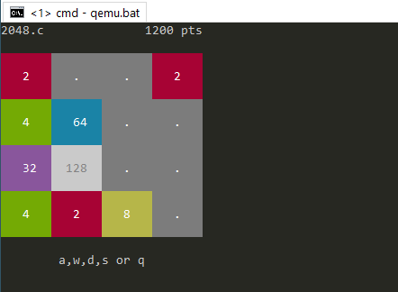

# 移植 Linux 应用到 RT-Smart

RT-Smart 用户态对 POSIX 接口的支持较为完善，所以在移植应用时，可以很方便地移植使用 POSIX 接口的应用。我们在 Github 上找到一个 star 数量较多的 linux [2048 小游戏](https://github.com/mevdschee/2048.c) ，希望将它移植到 RT-Smart 上运行，本文就以移植 2048 小游戏为例，讲解如何将 linux 应用移植到 RT-Smart 上。


## 应用文件夹介绍

新应用工程文件夹包含应用源码、构建脚本、VSCode 配置文件，如下所示：

```
│  main.c       # 应用源码文件
│  SConscript   # 构建脚本
│  SConstruct   # 构建脚本
│
└─.vscode       # VSCode 配置文件
        settings.json       # 新应用的配置文件
        smart.json          # 设置 vscode 底部状态栏功能按钮
```

## 移植步骤

移植一个新的用户态程序步骤：创建一个新的应用工程，更新用户态程序源文件。

**手动移植过程**：手动移植需要新建工程文件夹，并修改配置。

1. 创建一个新应用工程文件夹：在 userapps/apps 目录下，复制 hello 文件夹并改名为目标 app 名；
1. 修改构建脚本；
1. 修改 VSCode 配置文件；
1. 在目标 app 文件夹中新增用户态程序 c 源文件。

**VSCode 移植过程【推荐】**：只需新建工程并更新源码。

1. 创建新的工程，参考 [RT-Thread Smart 插件：创建工程示例](../../debug/vsc-plug-in/vsc-plug-in.md)。
2. 在新的工程文件夹中更新源文件。

这样一个用户态程序就移植完成了，后续可以进行编译、打包 sd.bin、用户态调试，参考 [使用 VSCode 调试用户态应用 (arm-Windows)](../../debug/qemu-arm-win/qemu-arm-win.md)。

## 移植示例

这是手动移植的示例，按照上述移植步骤，将 2048 小游戏移植到 RT-Smart 上。

1. 在 userapps/apps 下，复制 hello 文件夹并改名为 2048；

2. 修改构建脚本 SConscript 和 SConstruct。

    修改 SConscript，修改分组名为 2048：

    ```python
    ...
    group = DefineGroup('2048', src, depend = [''], CPPPATH = CPPPATH, CPPDEFINES = CPPDEFINES)
    ...
    ```

    修改 SConstruct，修改应用名为 2048：

    ```python
    ...
    BuildApplication('2048', 'SConscript', usr_root = '../../..')
    ...
    ```

3. 修改 VSCode 配置文件 `.vscode` 文件夹中的 settings.json，修改目标文件名即可；

    ```json
    {
        "RT-Thread Smart.Program": "2048.elf",      // 修改为目标文件名
        "RT-Thread Smart.Target Path": "/root/bin/",   // 目标文件存储位置
        "RT-Thread Smart.SDK ROOT": "../.."            // ROOT 根目录
    }
    ```

4. 将下载的 2048 小游戏源文件 2048.c 放入新建的 2048 文件夹中，该应用文件夹最终需要包含文件：`.vscode、源码、Sconscript、Sconstruct`。



5. 在 userapps 下设置工具链、编译、打包 sd.bin，QEMU 模拟运行，最后进行用户态调试，参考 [使用 VSCode 调试用户态应用 (arm-Windows)](../../debug/qemu-arm-win/qemu-arm-win.md)。2048 移植结果演示：终端输入 `qemu.bat`，smart 运行起来之后，再输入 `mnt/bin/2048.elf` 运行 2048 应用。如下是运行结果：



如发现问题，可以对当前应用进行调试修改，最终显示正常：



综上，基于 VSCode 移植会更简单，推荐使用。

