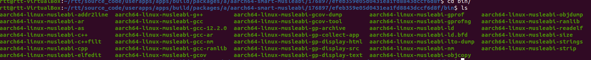
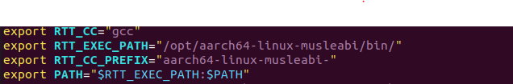
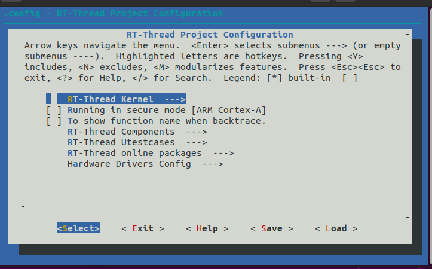
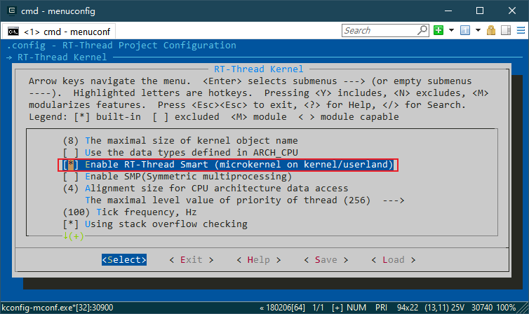
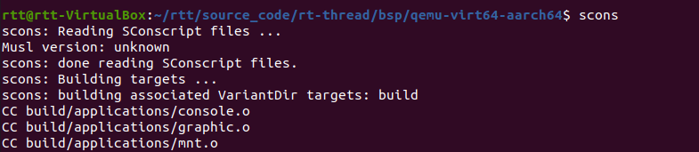
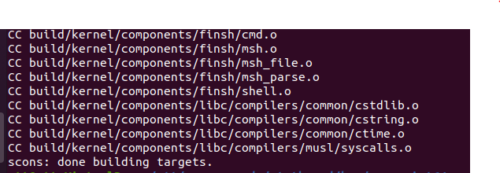
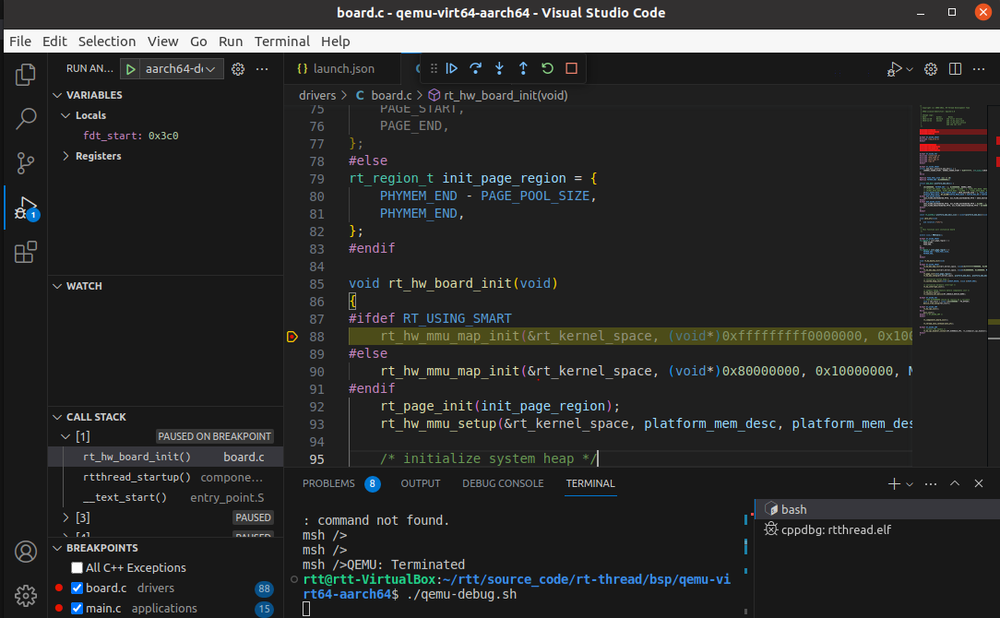
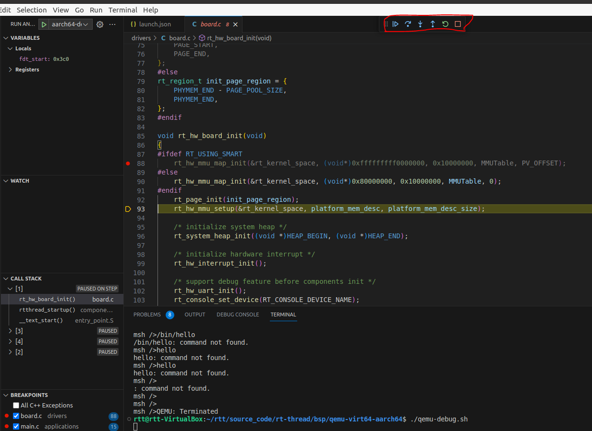

# 使用 VSCode 调试用户态应用 (arm-Linux)

本教程的内容是如何在 Ubuntu 上使用 VSCode 调试 RT-Smart 内核及用户态应用，基于 qemu-virt64-aarch64 BSP 完成。

## 准备工作

1. 下载源码：

    - rt-thread (https://github.com/RT-Thread/rt-thread.git) 。

    ```bash
    $ git clone https://github.com/RT-Thread/rt-thread.git
    ```

    - 用户态应用程序 (https://github.com/RT-Thread/userapps.git)

    ```bash
    $ git clone https://github.com/RT-Thread/userapps.git
    ```

2. 安装 VSCode：安装 VSCode 并安装 c/c++ 扩展插件。

    ```bash
    $ sudo add-apt-repository ppa:ubuntu-desktop/ubuntu-make
    $ sudo apt-get update
    $ sudo apt-get install ubuntu-make
    $ umake ide visual-studio-code
    
    # 提示输入 a 即可
    ```

4. 安装内核编译工具链

编译内核的时候需要用到 aarch64-linux-musleabi- 工具链，可在 userapps/apps 目录下通过 `xmake smart-rootfs --export=all` 命令导出。导出的目录为 `userapps/apps/build/packages/a/aarch64-smart-musleabi/176897/efeb359e05d0431ea1fd8843dccf6d8f/bin`



环境变量配置为：

```shell
export RTT_CC="gcc"
export RTT_EXEC_PATH="/opt/aarch64-linux-musleabi/bin/"
export RTT_CC_PREFIX="aarch64-linux-musleabi-"
export PATH="$RTT_EXEC_PATH:$PATH"
```



1. 安装 xmake 和 scons 工具

   - 安装 scons 

   ```bash
   sudo apt-get install scons
   ```

   - 安装 xmake

   请根据 [xmake 官方文档](https://xmake.io/#/zh-cn/guide/installation?id=ubuntu) 进行安装

   以下为 ubuntu 安装方式

   ```bash
   sudo add-apt-repository ppa:xmake-io/xmake
   sudo apt update
   sudo apt install xmake
   ```

   - 安装 gdb-multiarch

   ```bash
   sudo apt-get install gdb-multiarch
   ```

   

## 编译 userapps 与内核

在 userapps 中，编译 app：

```
cd apps
xmake f -a aarch64 # 配置为 aarch64 平台
xmake -j8
```

制作镜像：

```
xmake smart-rootfs
xmake smart-image -o ../prebuilt/qemu-virt64-aarch64-ext4/ext4.img # 将镜像输出至 qemu-virt64-aarch64-ext4 目录
```

> 注意事项：
>
> 自己写的应用程序可以仿照 userapps/apps 下的应用，写一个 xmake.lua, 使用 xmake 进行编译，然后从 `制作镜像` 这一步骤开始，把 app 放在 ext4.img 镜像里，然后运行 qemu，在 qemu 里就可以运行自己编写的程序了。

基于 rt-thread 仓库的  qemu-virt64-aarch64 构建内核镜像：

1. 选择 RT-Thread Kernel 选项

   

2. 使能 Smart 内核

   

3. 然后在该目录下执行 scons 编译

   

   

4. 将生成的内核镜像 rtthread.bin 和 rtthread.elf 更新到 userapps\prebuilt\qemu-virt64-aarch64 目录中。

5. 使用命令 `./run.sh`，测试 qemu 正常运行后，使用 ctrl a,x 结束运行。

## VSCode 配置

要想使用 VSCode 调试用户态应用，需要先在工程路径下添加调试配置。

1. 首先在终端使用命令 `code .`，使用 VSCode 打开该目录。
2. 修改 `\rt-thread\bsp\qemu-virt64-aarch64` 目录下 `.vscode` 文件夹中的 `launch.json` 配置，如下所示（需要更新实际的 gdb 路径）：

```json
{
    "version": "0.2.0",
    "configurations": [
      {
        "name": "Debug smart @ Linux",
        "type": "cppdbg",
        "request": "launch",
        "args": [],
        "stopAtEntry": true,
        "externalConsole": true,
        "cwd": "${workspaceRoot}",
        "program": "${workspaceRoot}/rtthread.elf",
        "serverLaunchTimeout": 2000,
        "miDebuggerPath":"/opt/gcc-arm-none-eabi-10-2020-q4-major/bin/arm-none-eabi-gdb",
        "miDebuggerServerAddress": ":1234",
        "setupCommands": [
          {
            "text": "cd ${workspaceRoot}"
          },
          {
            "text": "file rtthread.elf"
          },
          {
            "text": "break main"
          }
        ],
        "customLaunchSetupCommands": [],
        "launchCompleteCommand": "exec-run"
      },
    ]
  }
```

如果上述配置 launch.json 的文件无法进行调试，那就使用以下配置：

```json
{
    "version": "0.2.0",
    "configurations": [
        {
            "name": "aarch64-debug",
            "type": "cppdbg",
            "request": "launch",
            "miDebuggerPath": "/usr/bin/gdb-multiarch",
            "program": "${workspaceFolder}/rtthread.elf",
            "setupCommands": [
                {
                    "description": "为 gdb 启用整齐打印",
                    "text": "-enable-pretty-printing",
                    "ignoreFailures": true
                },
                {
                    "text": "target remote localhost:1234"
                },
                {
                    "text": "restore ${workspaceFolder}/rtthread.elf"
                }
            ],
            "launchCompleteCommand": "None",
            "cwd": "${workspaceFolder}"
        }
    ]
}

```

launch.json 配置文件中的 `rtthread.elf`，改为自己要调试的应用。

## 调试用户态应用

这部分开始正式调试用户态应用，具体步骤如下：

1. 修改 `run.sh` 脚本，在脚本里添加 `-s -S`。

    

2. 在 VSCode 终端输入 `./run.sh`，如果调试的是内核，可以看到启动过程被挂起，等待调试前端来连接。

3. 在 VSCode 中按下 F5 开始调试内核，可以看到应用的源码文件被打开，运行的代码将停在断点处。

    

5. 后续就可以单步调试用户态应用了。单步运行后，应用代码执行的打印将显示在终端上。

    

