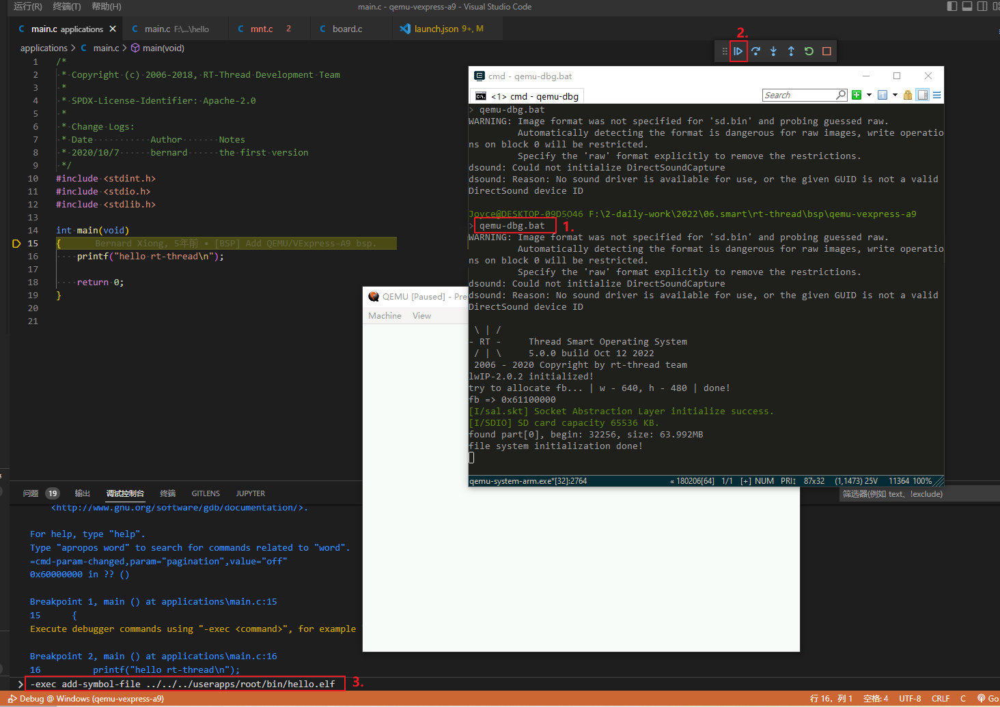
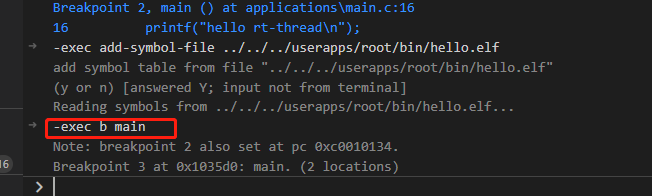
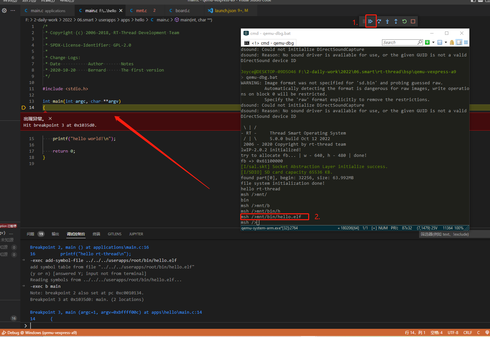
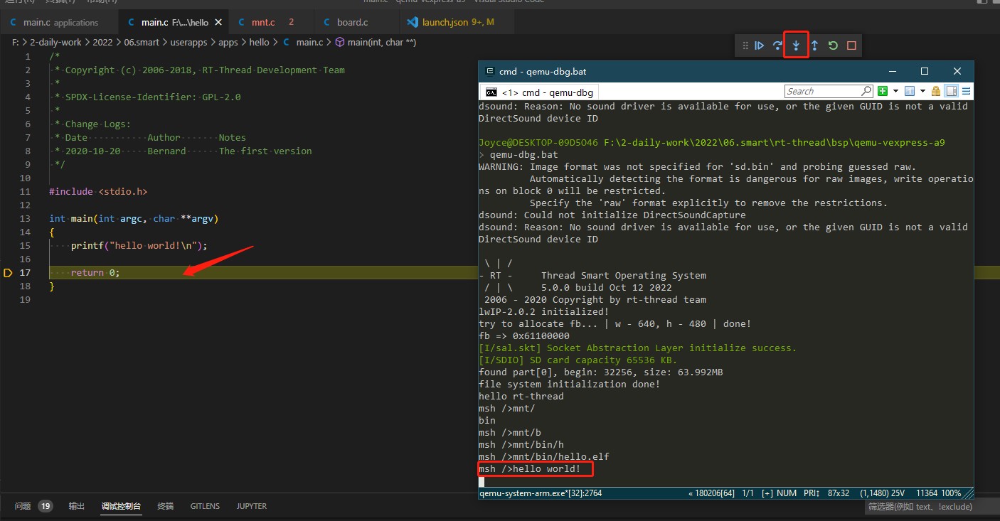

# 使用 VSCode 调试用户态应用 (arm-Windows)
本教程的内容是如何在 Windows 上使用 VSCode 调试 RT-Smart 内核及用户态应用，基于 qemu-vexpress-a9 BSP 完成。

## 准备工作

下载源码：
- rt-thread： https://github.com/RT-Thread/rt-thread ，需要切换到 rt-smart 分支
- 用户态应用程序： https://github.com/RT-Thread/userapps

安装 VSCode：

- 安装 VSCode 并安装 c/c++ 扩展插件

## 编译 userapps 与内核

> 这部分内容详细步骤请参考 [QEMU 快速上手](https://www.rt-thread.org/document/site/#/rt-thread-version/rt-thread-smart/quick-start/qemu-win/quickstart)，本篇只做简单介绍。

在 userapps 中，配置 gcc 工具链并编译 app：
1. 在 `userapps\tools` 目录下，使用 python 命令 `python get_toolchain.py arm` 下载工具链（若之前执行过则无需再次执行）；
2. 在 `userapps` 目录下，使用命令 `smart-env.bat arm` 设置工具链路径；
3. 在 `userapps` 目录下， 使用命令 `scons` 编译。编译顺利的话，将在 `userapps\root` 文件夹中得到一系列可执行 elf 文件。

按照 [QEMU 快速上手](https://www.rt-thread.org/document/site/#/rt-thread-version/rt-thread-smart/quick-start/qemu-win/quickstart) 教程中的 “制作 QEMU SD 卡章节” 将 root 文件夹中的 elf 打包进 sd.bin，并将新生成的 sd.bin 更新到内核仓库的 `\rt-thread\bsp\qemu-vexpress-a9`  目录。

在 `\rt-thread\bsp\qemu-vexpress-a9` 目录下，编译系统内核：
1. 使用命令 `scons` 编译，会生成 rtthread.elf 与 rtthread.bin；
2. 输入 `qemu-nographic.bat`，测试 qemu 正常运行后，使用 `ctrl c` 结束运行；

## 添加 VSCode 调试配置

要想使用 VSCode 调试用户态应用，需要先在工程路径下添加调试配置。

1. 首先在 Env 工具里使用命令 `code . `，使用 VSCode 打开该目录。
2. 修改 `\rt-thread\bsp\qemu-vexpress-a9` 目录下 `.vscode` 文件夹中的 `launch.json` 配置，如下所示：

```json
{
    "version": "0.2.0",
    "configurations": [
        {
            "name": "Debug @ Windows",
            "type": "cppdbg",
            "request": "launch",
            "program": "${workspaceRoot}\\rtthread.elf",
            "args": [],
            "stopAtEntry": true,
            "cwd": "${workspaceRoot}",
            "environment": [],
            "externalConsole": true,
            "miDebuggerServerAddress": "localhost:1234",
            "serverLaunchTimeout": 2000,
            "targetArchitecture": "ARM",
            "MIMode": "gdb",
            "miDebuggerPath": "arm-none-eabi-gdb.exe",
            "customLaunchSetupCommands": [],
            "launchCompleteCommand": "exec-run",
        },
    ]
}
```

## 调试用户态应用

这部分开始正式调试用户态应用，先进入内核的调试界面，然后添加用户态应用的符号表，再在内核中运行用户态应用即可进入用户态应用调试，具体步骤如下：

1. 在 Env 工具中运行命令 `qemu-dbg.bat` ：此时弹出 qemu 窗口，可以看到启动过程被挂起，等待调试前端来连接。
2. 切换到 vscode，按下 F5 开始调试内核，运行的代码将停在 main 断点处，并且控制台打印 rt-thread logo，表示系统已经正常启动，文件系统也已经成功挂载。



3. 断点在 main 处时，可以通过 VSCode 的调试控制台加载待调试应用程序的符号。如调试 hello.elf，在 VSCode 调试控制台输入如下命令后回车（注意调整正确的路径，支持相对和绝对路径） `-exec add-symbol-file ../../../userapps/root/bin/hello.elf`，之后输入命令 `-exec b main` 在应用 hello.elf 的入口添加断点。



4. 按下 F5 全速运行程序，这时系统正常运行，可以在 Env 的终端输入 MSH 调试命令。在终端输入用户态应用的文件路径执行相应的用户态应用，如 `mnt/bin/hello.elf`。应用会被加载运行，并自动停在应用程序入口处。从 VSCode 可以看到应用的源码文件被打开，并且断点停在应用入口 main 处。



5. 后续就可以单步调试用户态应用了。单步运行后，应用代码执行的打印将显示在终端上。



