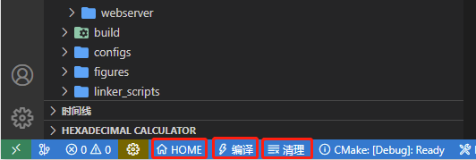
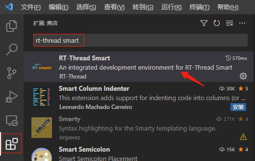
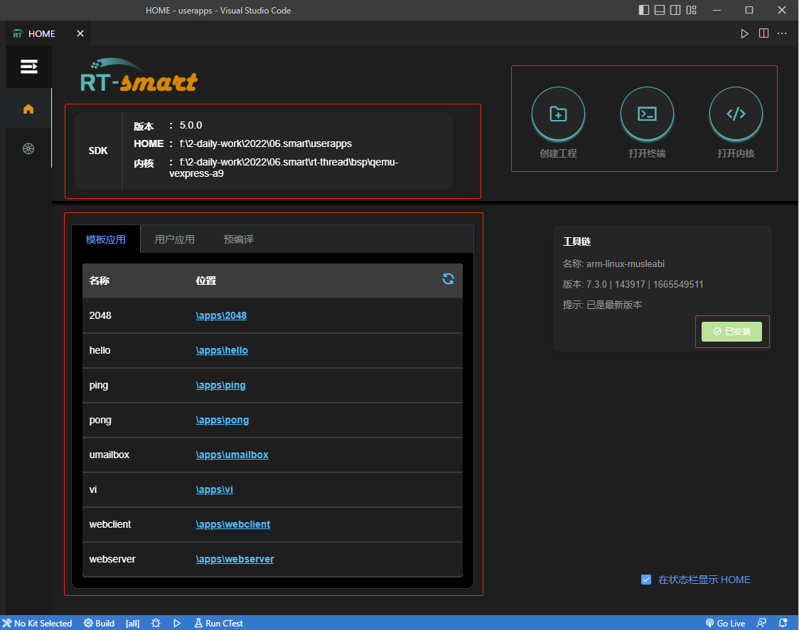
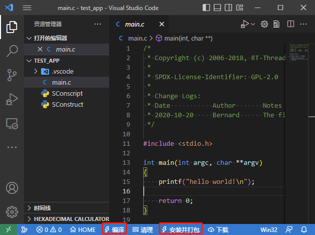
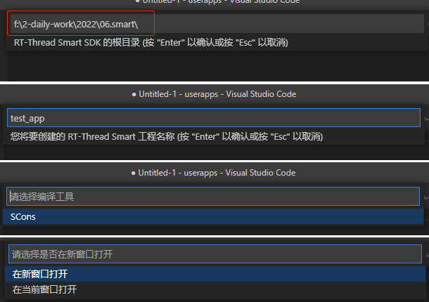
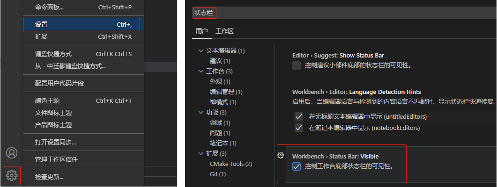

# RT-Thread Smart 插件

为了使 RT-Thread Smart 开发者更方便的开发用户态应用，RT-Thread 开发了 VSCode 插件。包括下面的功能：

- SDK 管理界面（提供应用列表展示、下载工具链、创建应用工程等功能）

- 针对不用工程的快捷操作（如：编译工程、清理工程、安装并打包等）

这些功能都以按钮的形式存在于 VSCode 的底部状态栏上，如下图所示：

  

其中 HOME 按钮对应的就是 SDK 管理界面，右侧的两个按钮（编译、清理）是针对 SDK 工程提供的快捷操作，对于不同的项目工程，右侧的快捷操作按钮可以自由定制。下面来详细介绍 Vscode 插件的各项功能。

## 准备工作

- 下载 rt-thread： https://github.com/RT-Thread/rt-thread ，需要切换到 rt-smart 分支；

- 下载用户态应用程序： https://github.com/RT-Thread/userapps ；

- 打开 VSCode，在扩展 (Ctrl+Shift+X) 中查找 RT-Thread Smart 插件并安装：

  

## SDK 管理界面

使用 VSCode 打开 userapps 目录（将打开该 userapps 目录的窗口称为主窗口），在底部的状态栏中有一些功能按钮，这里介绍常用的三个：


1. HOME：点击进入SDK 管理界面，该界面包含一些信息展示及常用功能，例如版本展示、创建工程等。
2. 编译：点击编译，将执行 `scons` 命令，会编译 userapps/app 下所有的 app，并在 root/bin 中生成所有 app 的 `.elf` 可执行文件。
3. 清理：点击清理，将执行 `scons -c` 命令，清除之前编译生成的文件。

点击状态栏的 HOME 功能按钮后，将显示 SDK 管理界面，如下所示：



**SDK 信息展示区**：

- 版本：RT-Smart 版本显示。
- HOME：userapps 的路径，即用户态应用路径。
- 内核：rt-thread 内核的路径，即可以编译 smart 的 bsp 路径，例如当前使用的 bsp 为：rt-thread\bsp\qemu-vexpress-a9，那么应当显示为该 bsp 的路径。

若内核路径不正确，请在 `userapps/.vscode/home.json` 中修改 kernel 项的文件路径，填入相对路径与绝对路径均可。

```json
"kernel": {
    "folder": "/../rt-thread/bsp/qemu-vexpress-a9"
}
```

**功能区**：

- 创建工程：点击创建工程按钮创建新的工程，详见创建工程示例。
- 打开终端：创建一个新的终端并打开。
- 打开内核：打开内核代码。

**工具链**：

- 点击下载按钮，自动下载安装 Windows 下所需的工具链。

**应用列表区**：

- 模板应用：展示 userapps/app 目录下的模板应用。
- 用户应用：展示使用 VSCode 新建在 userapps/workspse 目录下的用户应用。
- 预编译：展示 userapps/prebuilt 目录下的已经预编译好的 bsp 文件，如 qemu-vexpress-a9 和 qemu-virt64-riscv。

应用列表区的应用都可以通过点击位置在 VSCode 新窗口中打开。

## 快捷操作按钮

在不同的工程下，VSCode 底部的快捷按钮是不同的，在主窗口，提供的是针对 userapps sdk 的一些快捷操作，编译所有应用，清理所有应用等。在每个具体的应用工程下，也提供类似的快捷操作。

在应用列表区打开模板应用或者用户应用，会创建一个新的 VSCode 窗口（将该窗口称为应用窗口），可以把应用窗口底部的状态栏称为应用窗口状态栏。如点击模板应用中的 hello（或者其他均可）：



该应用窗口的状态栏有 HOME、编译、清理、安装并打包、下载功能按钮：
- 编译：仅编译当前 app，点击编译后，在当前 app 路径下生成对应的单个 `.elf` 文件。
- 安装并打包：将上述编译的单个 `.elf` 文件复制一份到 root/bin 路径下。
- 下载：针对拥有 udb 服务的内核提供下载功能，一般用户用不到。

用户也可以自定义当前工程的快捷操作按钮，通过修改当前工程目录下 `.vscode/smart.json` 文件。

## 创建工程

在 SDK 管理界面，点击创建工程。

填入 SDK 根目录，即 userapps 用户态应用的上级目录（例如：实际路径为 `F:\2-daily-work\2022\06.smart\userapps`，则填入 `F:\2-daily-work\2022\06.smart`），回车；之后输入工程名如 test_app，回车；选择编译工具为 SCons；选择在新窗口或当前窗口打开应用。



这样就在 `userapps\workspace` 中创建了一个 test_app 工程，用户可以在该工程中开发应用。

## FAQ

Q: VSCode 底部状态栏未显示。

A: 如果下方没有显示状态栏，可以通过左下角 “管理 - 设置”，在搜索栏输入 “状态栏” 并重新勾选, 这样状态栏将重新显示在底部。




