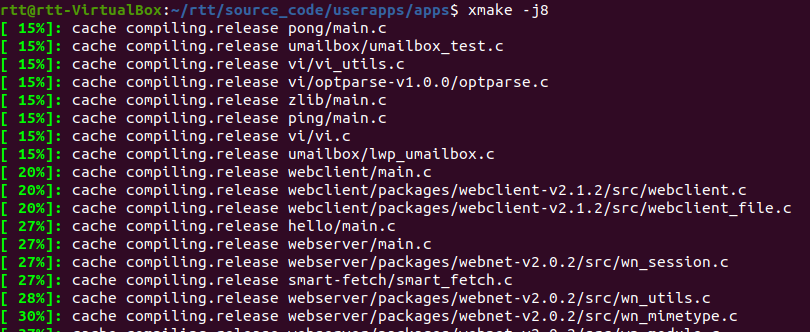
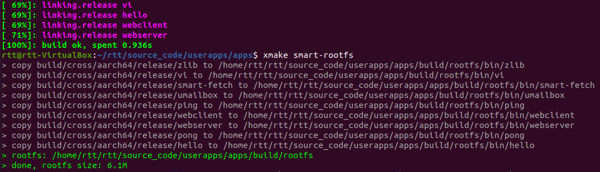
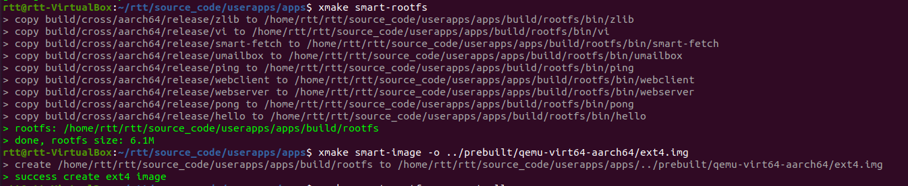
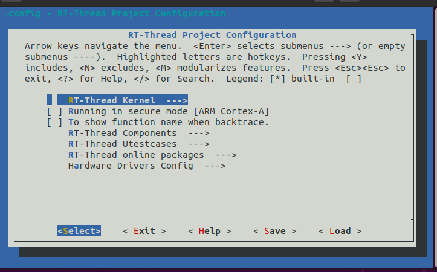
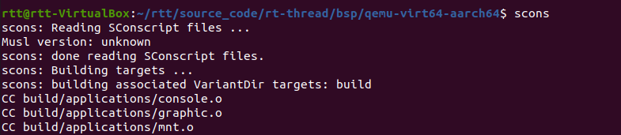
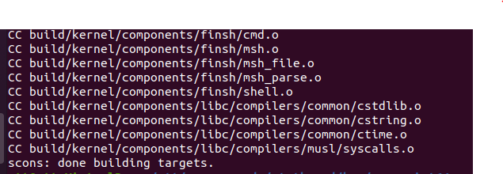
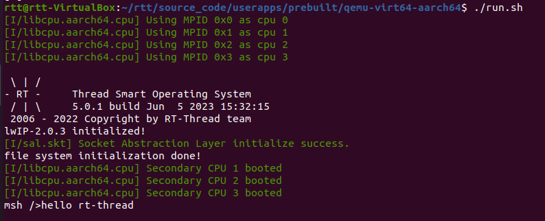

# QEMU 快速上手 (Linux)

本教程在 Ubuntu 平台上使用 QEMU 快速上手 RT-Smart，运行 RT-Smart 用户态应用，内核基于 qemu-virt64-aarch64 ，其他内核可以用同样的方式运行。

> 注意：运行环境的 QEMU 版本太低会导致执行脚本后终端无输出。

## 如何构建用户态应用

### 下载代码

下载 smart 用户态应用代码：

```
git clone https://github.com/RT-Thread/userapps.git
```

源码目录说明：

```
.
├── apps                  ---- app 体验示例
├── prebuilt              ---- 预编译好的内核镜像
├── repo				  ---- packages 配置
├── sdk                   ---- 开发 app 使用的 sdk
├── env.sh          ---- 配置 Linux 上环境变量的脚本
└── tools                 ---- 编译好的工具包
```

### 安装 xmake 和 scons 工具

```bash
sudo add-apt-repository ppa:xmake-io/xmake
sudo apt update
sudo apt install xmake

sudo apt-get install scons
```

### 配置工具链

工具链可以通过 [Downloads | GNU-A Downloads – Arm Developer](https://developer.arm.com/downloads/-/gnu-a)  网址下载，(aarch64 位)

下载完成之后，解压，然后打开 `~/.bashrc` 文件，添加环境变量：

```
export PATH="/opt/gcc_tool/gcc-arm-10_3_2021_07_x86_64-aarch64-none-elf/bin:$PATH"
```

编译内核的时候需要用到 aarch64-linux-musleabi- 工具链，可在 userapps/apps 目录下通过 `xmake smart-rootfs --export=all` 命令导出。导出的目录为 `userapps/apps/build/packages/a/aarch64-smart-musleabi/176897/efeb359e05d0431ea1fd8843dccf6d8f/bin`


环境变量配置为：

```shell
export RTT_CC="gcc"
export RTT_EXEC_PATH="/opt/aarch64-linux-musleabi/bin/"
export RTT_CC_PREFIX="aarch64-linux-musleabi-"
export PATH="$RTT_EXEC_PATH:$PATH"
```


### 编译用户态应用

在 userapps/apps 目录下使用 `xmake -j8` 编译，生成的可执行文件在 userapps/apps/build/cross/aarch64 目录中的 debug 和 release 目录下。





### 制作 img 镜像

执行以下命令制作镜像：

```
xmake smart-rootfs
xmake smart-image -o ../prebuilt/qemu-virt64-aarch64-ext4/ext4.img # 将镜像输出至 qemu-virt64-aarch64-ext4 目录
```




## 构建内核镜像

```
cd ./rt-thread/bsp/qemu-virt64-aarch64/  #打开 rt-thread 项目目录中的 bsp/qemu-virt64-aarch64 目录
scons --menuconfig
```

基于 rt-thread 仓库的  qemu-virt64-aarch64 构建内核镜像：

1. 选择 RT-Thread Kernel 选项

   

2. 使能 Smart 内核

   

3. 然后在该目录下执行 scons 编译

   

   

4. 将生成的内核镜像 rtthread.bin 更新到 userapps\prebuilt\qemu-virt64-aarch64 目录即可。

## 运行用户态应用

在本仓库的 prebuilt 目录下存放有预构建好的针对 QEMU ARM 平台的内核镜像 qemu-virt64-aarch64\rtthread.bin，可以直接运行体验。

### 运行 QEMU

执行 `./run.sh`



在最后执行了 hello 示例，输出 "hello world!"。

执行 ctrl a,x 可退出 QEMU。


