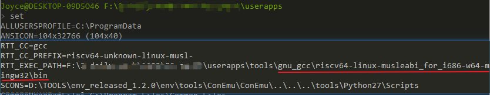
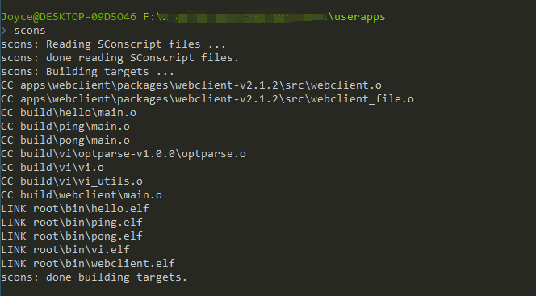
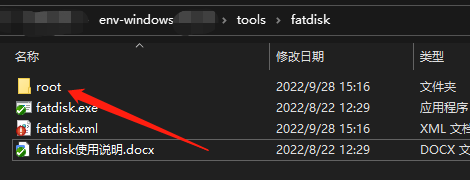
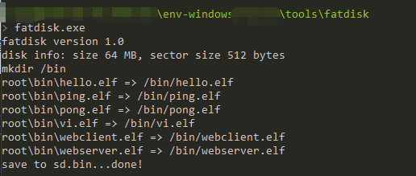
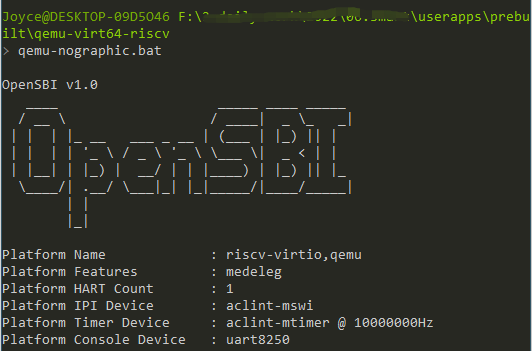
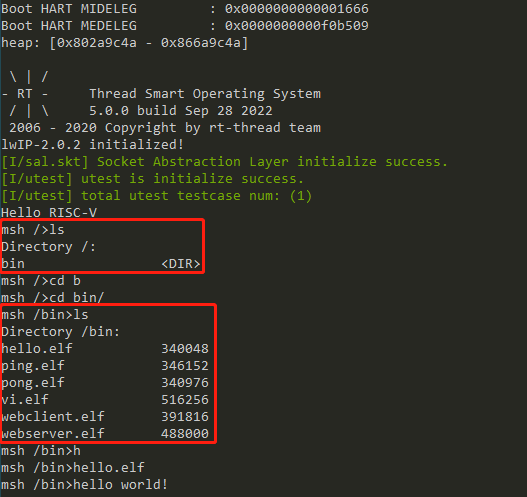
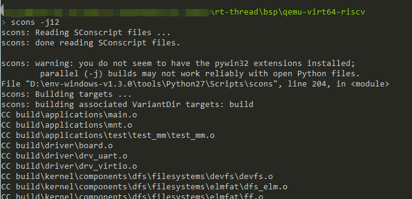
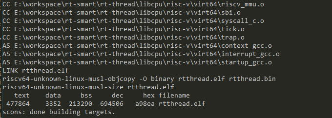
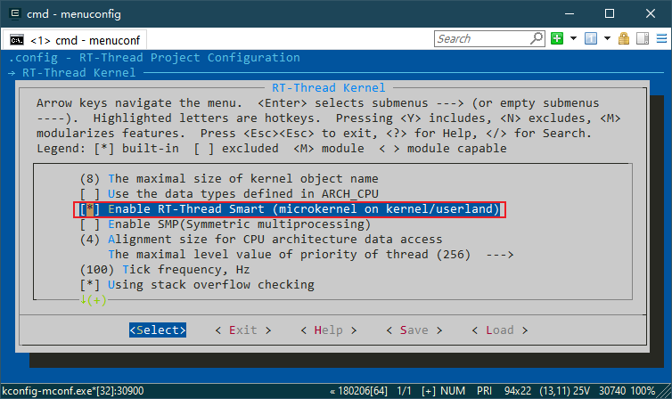
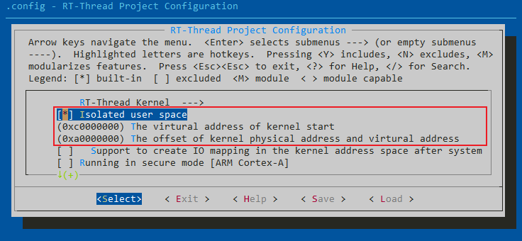

# QEMU 快速上手 (Windows)

本教程在 Windows 平台上使用 QEMU 快速上手 RT-Smart，运行 RT-Smart 用户态应用。

## 如何构建用户态应用

### 下载代码

下载 smart 用户态应用代码：

```
git clone https://github.com/RT-Thread/userapps.git
```

源码目录说明：

```
.
├── apps                  ---- app 体验示例
├── configs               ---- 不同平台 app 的通用配置
├── linker_scripts        ---- 编译 app 使用的链接脚本
├── prebuilt              ---- 预编译好的内核镜像
├── rtconfig.h            ---- app 使用的公共配置文件
├── sdk                   ---- 开发 app 使用的 sdk
├── smart-env.bat         ---- 配置 Win 上环境变量的脚本
├── smart-env.sh          ---- 配置 Linux 上环境变量的脚本
└── tools                 ---- 开发 app 使用的脚本工具
     ├── get_toolchain.py ---- 下载工具链的脚本
     └── gnu_gcc          ---- 下载下来的工具链存放的路径
```

### 配置工具链

在 userapps\tools 目录下运行 get_toolchain.py 的脚本，会下载对应的工具链并展开到 userapps\tools\gun_gcc 目录。后面的工具链名称可以是 arm | riscv64。

本文以 RISC-V 平台为例，输入下面的命令：

```
python get_toolchain.py riscv64
```

在 userapps 目录下, 运行 smart-env.bat 配置工具链路径

```
smart-env.bat riscv64
```

可使用 set 命令检查 RTT_EXEC_PATH 是否设置成功



### 编译用户态应用

在 userapps 目录下使用 scons 编译，编译顺利的话，将在 root 文件夹中得到一系列可执行 elf 文件。



## 运行用户态应用

在本仓库的 prebuilt 目录下存放有预构建好的针对 QEMU RISC-V 平台的内核镜像 qemu-virt64-riscv\rtthread.bin，可以直接运行体验。

### 更新 Env

将 Env 工具更新到新版本（[V1.3.5](https://github.com/RT-Thread/env-windows/releases/tag/v1.3.5) 或更高版本），该版本对 QEMU 进行了升级。

### 制作 QEMU SD 卡

在 Env 工具的 tools\fatdisk 目录下有一个打包 FAT 格式文件的工具 fatdisk.exe，我们可以利用这个工具将我们要存储到 QEMU SD 卡里的文件打包成 sd.bin 文件。

1. 将 userapps 下的 root 目录复制到 env\tools\fatdisk 目录下



2. 修改 env\tools\fatdisk 目录下 fatdisk.xml 文件为下面的内容

```
<?xml version="1.0" encoding="UTF-8"?>
<fatdisk>
   <disk_size>65536</disk_size>
   <sector_size>512</sector_size>
   <root_dir>root</root_dir>
   <output>sd.bin</output>
   <strip>0</strip>
</fatdisk>
```

3. 在 env\tools\fatdisk 目录下右键打开 Env 工具，输入命令 fatdisk 运行，就会在当前目录下生成 sd.bin 文件了。



4. 将新生成的 sd.bin 放入 userapps\prebuilt\qemu-virt64-riscv 目录。

### 运行 QEMU

在 userapps\prebuilt\qemu-virt64-riscv 目录下打开 Env，执行 qemu-norgraphic.bat 运行 QEMU。



Smart 运行起来后输入 ls 可以看到我们存储到 QEMU SD 卡里的文件和文件夹了。



在最后执行了 hello 示例，输出 "hello world!"。

执行 ctrl c 可退出 QEMU。

## 构建内核镜像

当需要更新内核镜像文件时，查看本节内容。

下载 rt-thread 源码（如有则跳过），之后切换到 rt-smart 分支并从远端同步更新。（RT-Thread 版本大于等于 5.0.0 时，直接查看下面的注意事项）

```
git clone https://github.com/RT-Thread/rt-thread.git

git checkout rt-smart
# update kernel's rt-smart branch to the latest version
git pull origin rt-smart
```

基于 rt-thread 仓库 rt-smart 分支的 qemu-virt64-riscv BSP 构建内核镜像。





将生成的内核镜像 rtthread.bin 更新到 userapps\prebuilt\qemu-virt64-riscv 目录即可。

> 注意事项：
> 
> RT-Thread 版本大于等于 5.0.0 时，rt-smart 分支合并进 master 分支，下载 rt-thread 源码（如有则跳过）。
>
> ```
> git clone https://github.com/RT-Thread/rt-thread.git
>
> ```
>
> 基于 rt-thread 仓库的 qemu-virt64-riscv BSP 构建内核镜像：
>
> 1. 首先是使能 Smart 内核
>
>    
>
> 2. 打开 Isolated user space 选项，之后退出并保存
>
>    
>
> 3. 然后在该目录下执行 scons 编译
>
>    
>
>    
>
> 将生成的内核镜像 rtthread.bin 更新到 userapps\prebuilt\qemu-virt64-riscv 目录即可。

## QA

### scons 时找不到工具链

编译时出现如下信息：

```
> scons
scons: Reading SConscript files ...
scons: done reading SConscript files.
scons: Building targets ...
CC apps\webclient\packages\webclient-v2.1.2\src\webclient.o
Error in calling command:riscv64-unknown-linux-musl-gcc
Exception: No such file or directory

Please check Toolchains PATH setting.

scons: *** [apps\webclient\packages\webclient-v2.1.2\src\webclient.o] Error 2
scons: building terminated because of errors.
```

请检查工具链路径是否设置正确，按照文中步骤进行设置。

### scons 时出现 zlib1.dll 丢失的弹窗

重新下载 [zlib1.dll 文件](https://www.dlldownloader.com/zlib1-dll/) 并分别放在 C:\Windows\System32 与 C:\Windows\SysWOW64 文件夹中。
