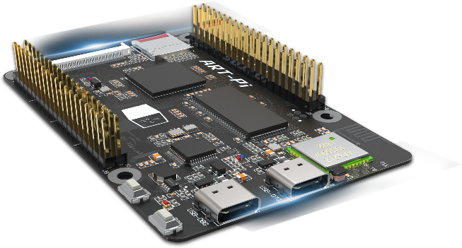
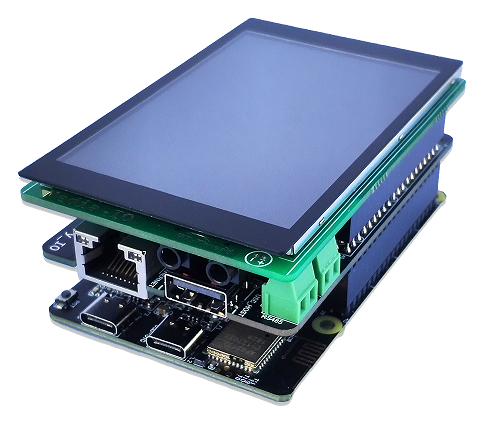
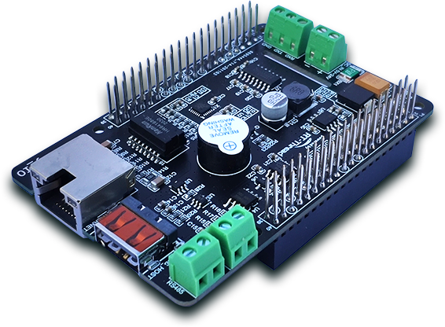

# ART-PI 开发板

ART-PI 是 RT-Thread 团队经过半年的精心准备，专门为嵌入式软件工程师、开源创客设计的一款极具扩展功的的 DIY 开源硬件。

- ART-PI 开源网站：[https://art-pi.gitee.io/website/](https://art-pi.gitee.io/website/)
- ART-PI github 仓库地址 ： [https://github.com/RT-Thread-Studio/sdk-bsp-stm32h750-realthread-artpi](https://github.com/RT-Thread-Studio/sdk-bsp-stm32h750-realthread-artpi)
- ART-PI gitee 仓库地址 ： [https://gitee.com/mirrors/ART-Pi](https://gitee.com/mirrors/ART-Pi)

## 开发板资源

板载资源：

- STM32H750XBH6 微控制器，TFBGA240 封装，具有 128Kbytes FLASH，1024Kbytes  RAM
- 板载 ST-LINK V2.1
- 带 Type-C 接口的 USB OTG
- SDlO TF 卡插槽
- SDIO WIFI：AP6212
- HDC UART 蓝牙：AP6212
- RGB888 FPC 连接器
- 32-Mbytes SDRAM
- 16-Mbytes SPI FLASH
- 8-Mbytes QSPI FLASH
- D3(蓝色)：3.3 V 电源指示
- 两个用户 led：D2(蓝色)，D2(红色)
- 两个 ST-LINK led：D4(蓝色)，D4(红色)
- 两个按钮：用户和复位

扩展接口：

- 4 路 UART(LPUART)
- 3 路 SPI
- 2 路 hardware iic
- 1 路 USB-FS
- 1 路 ETH
- 1 路 SAI
- 1 路 DCMI
- 2 路 CANFD
- 超过 5 路 ADC (支持差分输入 ADC)
- 超过 15 路 PWM(支持高精度定时器 HRTIM)
- [查看更多的扩展接口](https://art-pi.gitee.io/website/docs/#/tutorial/pin-description)

驱动支持：

- UART
- SPI
- SDMMC
- CAN
- QSPI
- ADC
- PWM
- DCMI
- SAI
- LTDC
- USB
- ETH
- SDRAM
- HRTIM
- I2C

## ART-PI 配套开发板

ART-PI 多媒体口展板

ART-PI 工业扩展板

