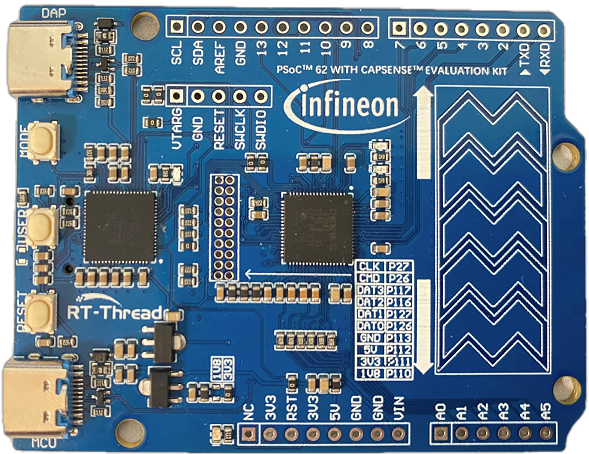
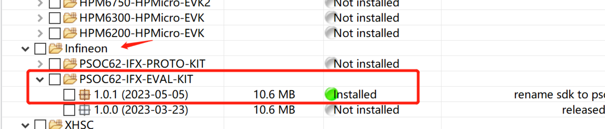
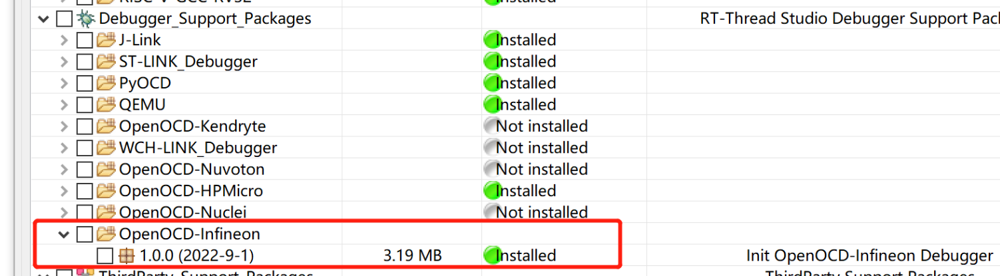

# 英飞凌评估套件

Psoc6-evaluationkit-062S2 是 RT-Thread 联合英飞凌推出的一款集成 32 位双核 CPU 子系统（ ARM Cortex-M4 和 ARM Cortex-M0）的开发板，其具有单周期乘法的150-MHz Arm Cortex-M4F CPU (浮点和存储器保护单元)，100-MHz Cortex M0+ CPU，带单周期乘法和 MPU，可以充分发挥 PSoC6 双核芯片性能。



开发板的原理图和 MDK 安装包地址：[https://gitee.com/rt-thread-board/ifx-psoc62-evalkit](https://gitee.com/rt-thread-board/ifx-psoc62-evalkit)

该开发板核心 **板载资源** 如下：

- MCU：CY8C624ABZI-S2D44，Cortex-M4主频 150MHz，Cortex-M0主频 100MHz，2MB Flash 和 1MB SRAM。    MCU手册更多详细信息请参考文档 [PSoC 6 MCU: CY8C62x8, CY8C62xA Datasheet (infineon.com)](https://www.infineon.com/dgdl/Infineon-PSOC_6_MCU_CY8C62X8_CY8C62XA-DataSheet-v17_00-EN.pdf?fileId=8ac78c8c7d0d8da4017d0ee7d03a70b1)
- 板载资源：microSD card , 触摸滑条，Arduino 接口
- 开发环境：ModusToolbox 2.0/MDK V5
    PSoC® Creator™ 下载链接 [ModusToolbox™ Software - Infineon Technologies](https://www.infineon.com/cms/en/design-support/tools/sdk/modustoolbox-software/)

## 外设支持

Studio BSP 目前对外设的支持情况如下：

| **片上外设** | **支持情况** | **备注** |
| :----------: | :----------: | :------: |
|  USB 转串口  |     支持     |  UART0   |
|     GPIO     |     支持     |    —     |
|     UART     |     支持     | UART0-5  |
|    Touch     |     支持     | 触摸滑条 |

## 使用 RT-Thread Studio 开发

在 RT-Thread Studio 的 SDK 管理器中安装该 BSP 资源包，然后基于该资源包新建工程。



如要要使用板载 DAP-Link下载程序，还需安装 OpenOCD 资源包。



### 编译下载

* 点击 IDE 左上角的构建选项进行工程的编译。

    

* 当编译无错误警告时，点击 `Debug` 或 `Download` 选项进行调试/下载。

    注：若点击下载并下载成功后串口终端无显示信息，请手动按下复位按键进行重启运行。
   
   

### 运行结果

下载程序成功之后，系统会自动运行。打开终端工具串口助手，选择波特率为 115200。复位设备后，LED 将会以一秒 2 次的频率闪烁，而且在终端上可以看到 `RT-Thread` 的输出信息：

注：推荐使用串口调试助手如：`MobaXterm`

```
 \ | /
- RT -     Thread Operating System
 / | \     4.1.1 build Jul 25 2022 18:03:35
 2006 - 2022 Copyright by RT-Thread team
msh >
```

### 其他资料

- [PSoC6开发实践指南(电子书)](https://docs.qq.com/doc/DZmpvR0xocFpVVGhQ)