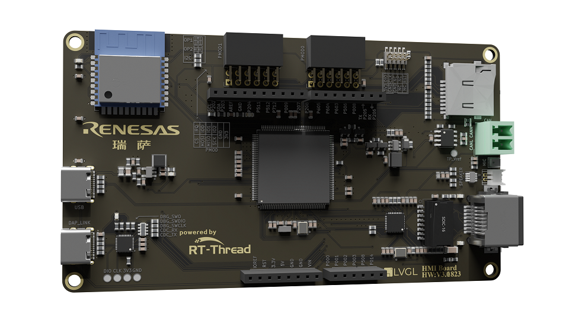
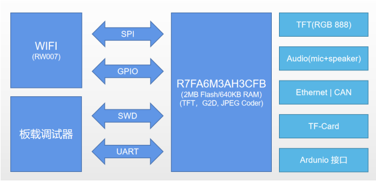
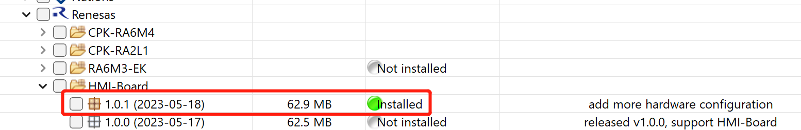
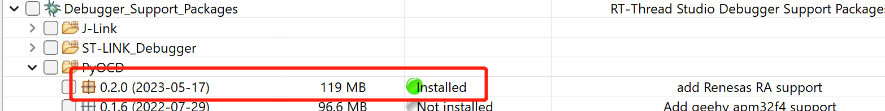
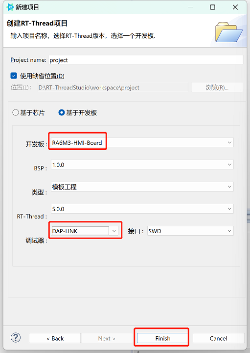
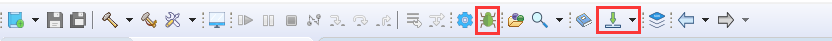
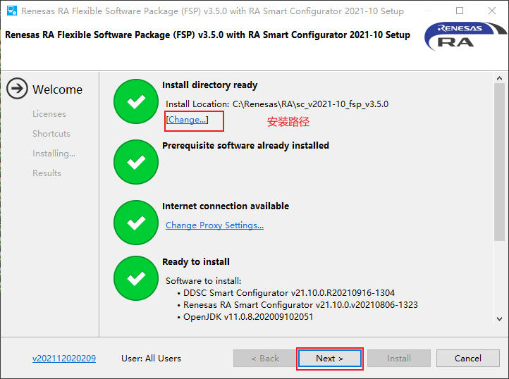
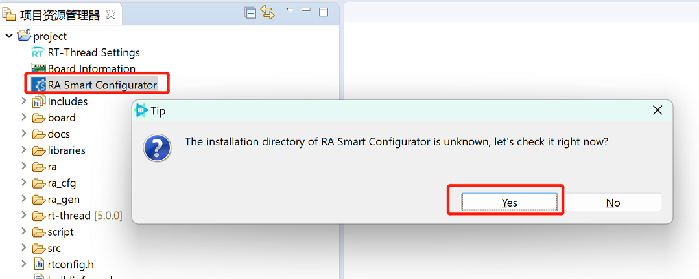

# 瑞萨 RA6M3-HMI-Board

## 简介

本文档为 RA6M3-HMI-Board 快速上手指南。通过阅读快速上手章节开发者可以快速地上手该开发板，将 RT-Thread 运行在开发板上。

主要内容如下：

- 开发板介绍
- 快速上手指南
- 进阶使用

## 开发板介绍

HMI-Board 为 RT-Thread 联合瑞萨推出的高性价比图形评估套件，取代传统的 HMI + 主控板 硬件，一套硬件即可实现 HMI + IoT + 控制 的全套能力。依托于瑞萨高性能芯片 RA6M3 及 RT-Thread 软件生态，HMI Board 不仅硬件性能强劲，同时软件生态丰富，助力开发者快速开发出 GUI 智能硬件产品。

开发板正面外观如下图： 


开发板背面外观如下图： 



该开发板常用 **板载资源** 如下，搭载 2M Flash 大容量主控芯片 RA6M3，内置 2D 加速、JPEG 编解码器、LCD控制器等模块，助力图形应用开发，并且板载TFT显示屏和音频接口，可以让开发者在 HMI 领域大展身手；此外，HMI-Board 还支持 IoT 连接，板载以太网接口、高速WIFI模块，让开发板无时无刻连接云端；同时，HMI-Board 还支持多种控制方式，包括 CAN 接口、Arduino 接口以及两路 PMOD 接口等，可以让开发者方便地扩展各种外设，从而实现更加灵活的控制方式。



通过 HMI-Board 开发板，开发者可以轻松实现 GUI 智能硬件产品。

## 外设支持

本 BSP 目前对外设的支持情况如下：

| **片上外设** | **支持情况** | **备注** |
| :----------------: | :----------------: | :------------- |
| UART               | 支持               | UART9 为默认日志输出端口 |
| GPIO               | 支持               |                |
| LCD          | 支持         |                          |
| SDHI | 支持 | |
| JPEG | 支持 | |
| G2D | 支持 | |
| RW007 | 支持 | |
| ETH | 支持 | |
| SPI | 支持 | |
| I2C | 支持 | |
| CAN | 支持 | |

* 注意：BSP默认是最小系统，若需添加/使能其他外设需参考：[外设驱动使用教程 (rt-thread.org)](https://www.rt-thread.org/document/site/#/rt-thread-version/rt-thread-standard/tutorial/make-bsp/renesas-ra/RA系列BSP外设驱动使用教程)

## 使用说明

使用说明分为如下两个章节：

- 快速上手

  本章节是为刚接触 RT-Thread 的新手准备的使用说明，遵循简单的步骤即可将 RT-Thread 操作系统运行在该开发板上，看到实验效果 。
- 进阶使用

  本章节是为需要在 RT-Thread 操作系统上使用更多开发板资源的开发者准备的。通过使用 Studio 和芯片配置工具对 BSP 进行配置，可以开启更多板载资源，实现更多高级功能。

### 快速上手

本 BSP 目前支持RT-Thread Studio、MDK5 工程。下面以 RT-Thread Studio 开发环境为例，介绍如何将系统运行起来。

**环境搭建**

在 RT-Thread Studio 的 SDK 管理器中安装该 BSP 资源包，然后基于该资源包新建工程。

> 注：下载最新发布版本



如要使用 DAP-Link 调试瑞萨开发板，还需要下载最新的 pyocd 资源包。



基于开发板创建项目。



**硬件连接**

使用 USB 数据线连接开发板到 PC，使用 DAP-link 接口下载和 DEBUG 程序。

**编译下载**


* 点击 IDE 左上角的构建选项进行工程的编译。

    

* 当编译无错误警告时，点击 `Debug` 或 `Download` 选项进行调试/下载。

    注：若点击下载并下载成功后串口终端无显示信息，请手动按下复位按键进行重启运行。
   
   

**查看运行结果**

下载程序成功之后，系统会自动运行并打印系统信息。

连接开发板对应串口到 PC , 在终端工具里打开相应的串口（115200-8-1-N），复位设备后，可以看到 RT-Thread 的输出信息。输入 help 命令可查看系统中支持的命令。

>  注：推荐使用串口调试助手如：`MobaXterm`

```bash
 \ | /
- RT -     Thread Operating System
 / | \     5.0.0 build Jan  4 2023 10:14:56
 2006 - 2022 Copyright by RT-Thread team
Hello RT-Thread!
msh >
msh >help
help             - RT-Thread shell help.
ps               - List threads in the system.
free             - Show the memory usage in the system.
clear            - clear the terminal screen
version          - show RT-Thread version information
list             - list objects

msh > 
```

**应用入口函数**

应用层的入口函数在 **bsp\ra6m3-ek\src\hal_emtry.c** 中 的 `void hal_entry(void)` 。用户编写的源文件可直接放在 src 目录下。

```c
void hal_entry(void)
{
    rt_kprintf("\nHello RT-Thread!\n");

    while (1)
    {
        rt_pin_write(LED3_PIN, PIN_HIGH);
        rt_thread_mdelay(500);
        rt_pin_write(LED3_PIN, PIN_LOW);
        rt_thread_mdelay(500);
    }
}
```

### 进阶使用

**资料及文档**

- [瑞萨RA MCU 基础知识](https://www2.renesas.cn/cn/zh/document/gde/1520091)
- [RA6 MCU 快速设计指南](https://www2.renesas.cn/cn/zh/document/apn/ra6-quick-design-guide)

**FSP 配置**

要修改瑞萨的 BSP 外设配置或添加新的外设端口，需要用到瑞萨的 [FSP](https://www2.renesas.cn/jp/zh/software-tool/flexible-software-package-fsp#document) 配置工具。请务必按照如下步骤完成配置。FSP 配置工具使用 v3.5.0 版本，目前可在github上下载3.5.0版本（下载地址：https://github.com/renesas/fsp/releases/tag/v3.5.0

（注意文件名称为：setup_fsp_v3_5_0_rasc_v2021-10.exe）

<注意官网为3.6.0版本，不向前兼容，使用3.6.0版本会会导致本工程不可用>

安装过程中，记录下**安装路径**，后面会用到。



安装完成后，即可通过RT-Thread Studio调用此 FSP配置工具，配置开发板硬件。双击工程中的 RA Smart Configurator 图标，第一次打开需要配置正确的 FSP 安装路径。




至此，就可以通过FSP配置工具，配置开发板硬件外设了，详细的配置方法参考：[RA系列BSP外设驱动使用教程](https://www.rt-thread.org/document/site/#/rt-thread-version/rt-thread-standard/tutorial/make-bsp/renesas-ra/RA%E7%B3%BB%E5%88%97%E4%BD%BF%E7%94%A8FSP%E9%85%8D%E7%BD%AE%E5%A4%96%E8%AE%BE%E9%A9%B1%E5%8A%A8?id=ra%e7%b3%bb%e5%88%97%e4%bd%bf%e7%94%a8-fsp-%e9%85%8d%e7%bd%ae%e5%a4%96%e8%ae%be%e9%a9%b1%e5%8a%a8)。

## 其他资料

- [瑞萨RA6M3开发实践指南(电子书)]( https://docs.qq.com/doc/DQmVYUEN1dHVyd0hi)
- SDK 及原理图仓库：https://github.com/RT-Thread-Studio/sdk-bsp-ra6m3-hmi-board
