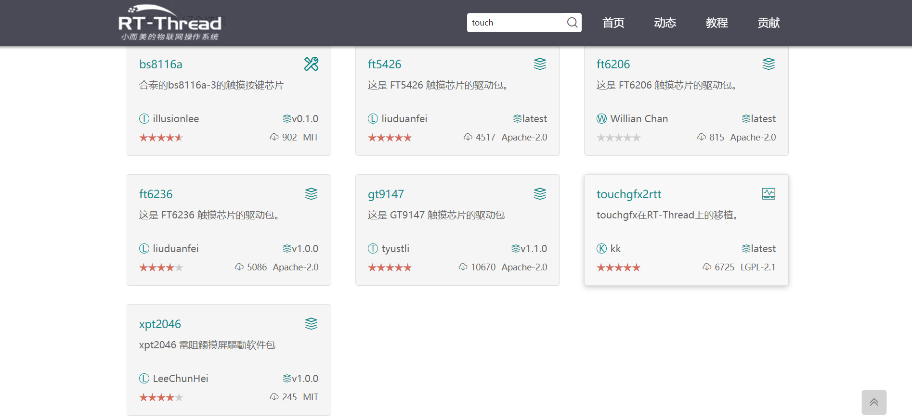
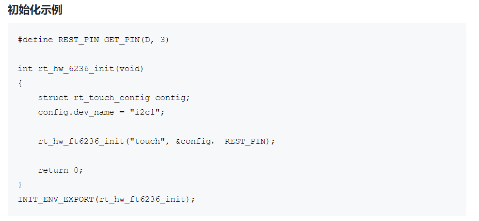
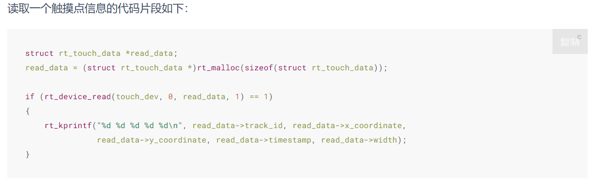

# LVGL触摸屏驱动的对接与移植

## 1 介绍

本章节介绍如何使用RT-Thread的Touch框架来讲触摸屏驱动对接到LVGL输入设备框架上。

目前RT-Thread的Touch框架以及触摸驱动软件包已经很完善，囊括了多种常用的触摸芯片：



## 2 前期准备

这里我以 [stm32f469-st-disco](https://github.com/RT-Thread/rt-thread/blob/master/bsp/stm32/stm32f469-st-disco/applications/lvgl/lv_port_indev.c) BSP为例。该开发板不同批次有两种两种触摸芯片，分别是 FT6336 和 FT6206，这里以 FT6336 为例。首先我们应该查询一下芯片的手册：


这里为什么要叫大家先看一下数据手册呢，显然，目前软件包还没有支持 FT6336 这个触摸芯片，当我们查找数据手册知道，原来他们属于 FT6x36 系列的触摸芯片。那我们可以知道软件包里面是有 FT6236 这个触摸驱动的。所以，我们可以使用这个触摸驱动来移植。


详细内容参考：[软件包介绍](https://packages.rt-thread.org/detail.html?package=ft6236)

## 3 正式移植

### 3.1 编写Kconfig文件

```Kconfig
config BSP_USING_TOUCH_FT6X36
    bool "FT6x36"
    select BSP_USING_I2C1
    select PKG_USING_TOUCH_DRIVERS
    select PKG_USING_FT6236
```

- 根据原理图选择具体的I2C总线（根据自己BSP的通信方式）
- 开启软件包的触摸驱动框架
- 选择一款具体的触摸驱动软件包

```Kconfig
config BSP_USING_LVGL
    bool "Enable LVGL for LCD"
    select BSP_USING_LCD_OTM8009A
    select PKG_USING_LVGL
    select BSP_USING_TOUCH_FT6X36
    default n
```

- 在LVGL的配置项添加 `select BSP_USING_TOUCH_FT6X36`

### 3.2 修改 lv_port_indev.c 文件

#### 3.2.1 Touch的硬件初始化

```c
static int lv_hw_touch_init(void)
{
    struct rt_touch_config cfg;

    cfg.dev_name = BSP_TOUCH_I2C_BUS_NAME;/* 使用的I2C设备名 */
#ifdef BSP_USING_TOUCH_FT6X36
    rt_hw_ft6236_init(TOUCH_DEV_NAME, &cfg, BSP_TOUCH_I2C_RESET_PIN); /* 软件包提供的初始化函数 */
#endif /* BSP_USING_TOUCH_FT6X36 */

    touch_dev = rt_device_find(TOUCH_DEV_NAME);
    if (rt_device_open(touch_dev, RT_DEVICE_FLAG_RDONLY) != RT_EOK)
    {
        LOG_E("Can't open touch device:%s", TOUCH_DEV_NAME);
        return -RT_ERROR;
    }

    return RT_EOK;
}

INIT_COMPONENT_EXPORT(lv_hw_touch_init);
```

这里就参考软件包的使用方法：



#### 3.2.2 LVGL的输出设备初始化

```c
void lv_port_indev_init(void)
{
    static lv_indev_drv_t indev_drv;

    lv_indev_drv_init(&indev_drv); /*Basic initialization*/
    indev_drv.type = LV_INDEV_TYPE_POINTER;
    indev_drv.read_cb = input_read;

    /*Register the driver in LVGL and save the created input device object*/
    touch_indev = lv_indev_drv_register(&indev_drv);
}
```

#### 3.2.3 完成LVGL的读取回调函数 input_read

```c
static void input_read(lv_indev_drv_t *indev_drv, lv_indev_data_t *data)
{
    struct rt_touch_data *read_data;
    /* 可以将内存分配这个步骤改为全局变量，以提高读取效率 */
    read_data = (struct rt_touch_data *)rt_calloc(1, sizeof(struct rt_touch_data));

    rt_device_read(touch_dev, 0, read_data, 1);
	
    /* 如果没有触摸事件，直接返回 */
    if (read_data->event == RT_TOUCH_EVENT_NONE)
        return;
    
    /* 这里需要注意的是：触摸驱动的原点可能和LCD的原点不一致，所以需要我们进行一些处理 */
#ifdef BSP_USING_TOUCH_FT6X36
    data->point.x = read_data->y_coordinate;
    data->point.y = LCD_HEIGHT - read_data->x_coordinate;
#endif /* BSP_USING_TOUCH_FT6X36 */

    if (read_data->event == RT_TOUCH_EVENT_DOWN)
        data->state = LV_INDEV_STATE_PR;
    if (read_data->event == RT_TOUCH_EVENT_MOVE)
        data->state = LV_INDEV_STATE_PR;
    if (read_data->event == RT_TOUCH_EVENT_UP)
        data->state = LV_INDEV_STATE_REL;
}
```

这个可以参考[RT-Thread 文档中心](https://www.rt-thread.org/document/site/#/rt-thread-version/rt-thread-standard/programming-manual/device/touch/touch?id=%e8%af%bb%e5%8f%96%e8%a7%a6%e6%91%b8%e7%82%b9%e4%bf%a1%e6%81%af%e6%8e%a5%e5%8f%a3)的Touch框架的使用 ：


