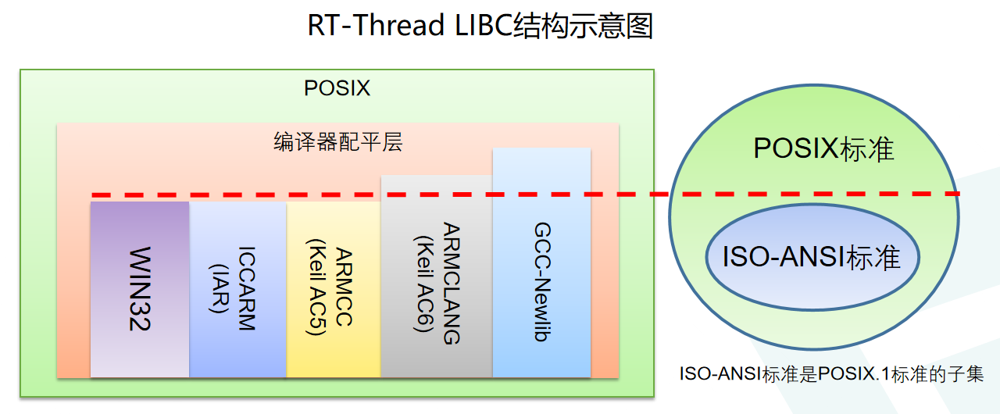

# LIBC 简介

RT-Thread 提供的 LIBC (C library, C库)，包含编译器内置LIBC、编译器配平层和 POSIX 层三部分。布局如下图所示：

## 1 编译器配平层

编译器配平层负责对接编译器的底层桩函数以及平衡不同编译器内置C库函数的差异而设计，为上层 POSIX 层提供功能统一的接口，位于 [components/libc/compiler](https://github.com/RT-Thread/rt-thread/tree/master/components/libc/compilers) 文件目录下。之所以需要配平，是由于 GCC (newlib)、Keil-MDK、IAR、Visual Studio (WIN32) 四个编译工具链内置 LIBC 所提供的标准 C 库函数支持程度不一样，编译器配平层负责将四种不同的编译链所提供的标准 C 库平衡到相同的水平。编译器配平层无需用户手动干预，会在编译工程时，根据用户所使用的的编译平台和工具链自动进行配平。保证上层无需区分使用何种编译平台和工具链的 LIBC ，使用通用的头文件即可引用 LIBC 的相关函数。

## 2 ISO/ANSI C 标准

ANSI C、ISO C、Standard C是指美国国家标准协会（ANSI）和国际标准化组织（ISO）对C语言发布的标准。历史上，这个名字专门用于指代此标准的原始版本，也是支持最好的版本（称为C89或C90）。使用C的软件开发者被鼓励遵循标准的要求，因为它鼓励使用跨平台的代码。C的第一个标准是由ANSI发布的。虽然这份文档后来被国际标准化组织（ISO）采纳并且ISO发布的修订版亦被ANSI采纳，但名称ANSI C（而不是ISO C）仍被广泛使用。一些软件开发者使用名称ISO C，还有一些使用中立的名称Standard C。例如常说的C89 (ANSI X3.159-1989)、C99 (ISO/IEC 9899:1999)、C11 (ISO/IEC 9899:2011) 实际都是指该标准的不同版本。

该标准通常被编译器/工具链内置 LIBC 所支持，例如 Keil-MDK、IAR 等所提供的的内置 LIBC 都是满足该标准的。

## 3 POSIX 标准

可移植操作系统接口（英语：Portable Operating System Interface，缩写为POSIX）是IEEE为要在各种UNIX操作系统上运行软件，而定义API的一系列互相关联的标准的总称，其正式称呼为IEEE Std 1003，而国际标准名称为ISO/IEC 9945。ISO/ANSI C 是 POSIX 的子集。

### 3.1 IEEE Std 1003.1

针对LIBC，目前广泛使用的 POSIX 标准是 1003.1 标准，全称为IEEE Std 1003.1（缩写写法为 POSIX.1）。IEEE Std 1003.1-2001、IEEE Std 1003.1-2008 等为 POSIX.1 在不同时期更新发布的版本。

### 3.2 IEEE Std. 1003.13

该标准是 POSIX 针对实时规范 (reatime profiles)。该标准是由 IEEE Std 1003.1 筛选而来，因此是其子集。IEEE Std. 1003.13 定义了四个子集：

- Minimal：最小嵌入式子集规范 —— PSE51
- Controller：工业控制器子集规范 —— PSE52
- Dedicated：较大规模的嵌入式系统子集规范 —— PSE53
- Multi-Purpose：具有实时性要求的大规模通用系统子集规范 —— PSE54

目前 RT-Thread 已经实现 PSE51 规范以及部分 PSE52 规范的内容。

### 3.3 POSIX标准及RT-Thread实现情况

| File                                                         | API                                                          | PSE51 | PSE52 | PSE53 | PSE54 | RT-Thread |
| ------------------------------------------------------------ | ------------------------------------------------------------ | :---: | :---: | :---: | :---: | :-------: |
| [<ctype.h>](https://pubs.opengroup.org/onlinepubs/9699919799/basedefs/ctype.h.html) |                                                              |       |       |       |       |           |
|                                                              | [isalnum()](https://pubs.opengroup.org/onlinepubs/9699919799/functions/isalnum.html) |   *   |   *   |   *   |   *   |     √     |
|                                                              | [isalpha()](https://pubs.opengroup.org/onlinepubs/9699919799/functions/isalpha.html) |   *   |   *   |   *   |   *   |     √     |
|                                                              | [isblank()](https://pubs.opengroup.org/onlinepubs/9699919799/functions/isblank.html) |   *   |   *   |   *   |   *   |     √     |
|                                                              | [iscntrl()](https://pubs.opengroup.org/onlinepubs/9699919799/functions/iscntrl.html) |   *   |   *   |   *   |   *   |     √     |
|                                                              | [isdigit()](https://pubs.opengroup.org/onlinepubs/9699919799/functions/isdigit.html) |   *   |   *   |   *   |   *   |     √     |
|                                                              | [isgraph()](https://pubs.opengroup.org/onlinepubs/9699919799/functions/isgraph.html) |   *   |   *   |   *   |   *   |     √     |
|                                                              | [islower()](https://pubs.opengroup.org/onlinepubs/9699919799/functions/islower.html) |   *   |   *   |   *   |   *   |     √     |
|                                                              | [isprint()](https://pubs.opengroup.org/onlinepubs/9699919799/functions/isprint.html) |   *   |   *   |   *   |   *   |     √     |
|                                                              | [ispunct()](https://pubs.opengroup.org/onlinepubs/9699919799/functions/ispunct.html) |   *   |   *   |   *   |   *   |     √     |
|                                                              | [isspace()](https://pubs.opengroup.org/onlinepubs/9699919799/functions/isspace.html) |   *   |   *   |   *   |   *   |     √     |
|                                                              | [isupper()](https://pubs.opengroup.org/onlinepubs/9699919799/functions/isupper.html) |   *   |   *   |   *   |   *   |     √     |
|                                                              | [isxdigit()](https://pubs.opengroup.org/onlinepubs/9699919799/functions/isxdigit.html) |   *   |   *   |   *   |   *   |     √     |
|                                                              | [tolower()](https://pubs.opengroup.org/onlinepubs/9699919799/functions/tolower.html) |   *   |   *   |   *   |   *   |     √     |
|                                                              | [toupper()](https://pubs.opengroup.org/onlinepubs/9699919799/functions/toupper.html) |   *   |   *   |   *   |   *   |     √     |
| [<errno.h>](https://pubs.opengroup.org/onlinepubs/9699919799/basedefs/errno.h.html) |                                                              |       |       |       |       |           |
|                                                              | [errno](https://pubs.opengroup.org/onlinepubs/9699919799/functions/errno.html) |   *   |   *   |   *   |   *   |     √     |
| [<fcntl.h>](https://pubs.opengroup.org/onlinepubs/9699919799/basedefs/fcntl.h.html) |                                                              |       |       |       |       |           |
|                                                              | [open()](https://pubs.opengroup.org/onlinepubs/9699919799/functions/open.html) |   *   |   *   |   *   |   *   |     √     |
|                                                              | [creat()](https://pubs.opengroup.org/onlinepubs/9699919799/functions/creat.html) |       |   *   |   *   |   *   |     √     |
|                                                              | [fcntl()](https://pubs.opengroup.org/onlinepubs/9699919799/functions/fcntl.html) |       |   *   |   *   |   *   |     √     |
|                                                              | [posix_fadvise()](https://pubs.opengroup.org/onlinepubs/9699919799/functions/posix_fadvise.html) |       |       |       |   *   |           |
|                                                              | [posix_fallocate()](https://pubs.opengroup.org/onlinepubs/9699919799/functions/posix_fallocate.html) |       |       |       |   *   |           |
| [<fenv.h>](https://pubs.opengroup.org/onlinepubs/9699919799/basedefs/fenv.h.html) |                                                              |       |       |       |       |           |
|                                                              | [feclearexcept()](https://pubs.opengroup.org/onlinepubs/9699919799/functions/feclearexcept.html) |   *   |   *   |   *   |   *   |     √     |
|                                                              | [fegetenv()](https://pubs.opengroup.org/onlinepubs/9699919799/functions/fegetenv.html) |   *   |   *   |   *   |   *   |     √     |
|                                                              | [fegetexceptflag()](https://pubs.opengroup.org/onlinepubs/9699919799/functions/fegetexceptflag.html) |   *   |   *   |   *   |   *   |     √     |
|                                                              | [fegetround()](https://pubs.opengroup.org/onlinepubs/9699919799/functions/fegetround.html) |   *   |   *   |   *   |   *   |     √     |
|                                                              | [feholdexcept()](https://pubs.opengroup.org/onlinepubs/9699919799/functions/feholdexcept.html) |   *   |   *   |   *   |   *   |     √     |
|                                                              | [feraiseexcept()](https://pubs.opengroup.org/onlinepubs/9699919799/functions/feraiseexcept.html) |   *   |   *   |   *   |   *   |     √     |
|                                                              | [fesetenv()](https://pubs.opengroup.org/onlinepubs/9699919799/functions/fesetenv.html) |   *   |   *   |   *   |   *   |     √     |
|                                                              | [fesetexceptflag()](https://pubs.opengroup.org/onlinepubs/9699919799/functions/fesetexceptflag.html) |   *   |   *   |   *   |   *   |     √     |
|                                                              | [fesetround()](https://pubs.opengroup.org/onlinepubs/9699919799/functions/fesetround.html) |   *   |   *   |   *   |   *   |     √     |
|                                                              | [fetestexcept()](https://pubs.opengroup.org/onlinepubs/9699919799/functions/fetestexcept.html) |   *   |   *   |   *   |   *   |     √     |
|                                                              | [feupdateenv()](https://pubs.opengroup.org/onlinepubs/9699919799/functions/feupdateenv.html) |   *   |   *   |   *   |   *   |     √     |
| [<inttypes.h>](https://pubs.opengroup.org/onlinepubs/9699919799/basedefs/inttypes.h.html) |                                                              |       |       |       |       |           |
|                                                              | [imaxabs()](https://pubs.opengroup.org/onlinepubs/9699919799/functions/imaxabs.html) |   *   |   *   |   *   |   *   |     √     |
|                                                              | [imaxdiv()](https://pubs.opengroup.org/onlinepubs/9699919799/functions/imaxdiv.html) |   *   |   *   |   *   |   *   |     √     |
|                                                              | [strtoimax()](https://pubs.opengroup.org/onlinepubs/9699919799/functions/strtoimax.html) |   *   |   *   |   *   |   *   |     √     |
|                                                              | [strtoumax()](https://pubs.opengroup.org/onlinepubs/9699919799/functions/strtoumax.html) |   *   |   *   |   *   |   *   |     √     |
|                                                              | [wcstoimax()](https://pubs.opengroup.org/onlinepubs/9699919799/functions/wcstoimax.html) |       |       |       |   *   |           |
|                                                              | [wcstoumax()](https://pubs.opengroup.org/onlinepubs/9699919799/functions/wcstoumax.html) |       |       |       |   *   |           |
| [<locale.h>](https://pubs.opengroup.org/onlinepubs/9699919799/basedefs/locale.h.html) |                                                              |       |       |       |       |           |
|                                                              | [localeconv()](https://pubs.opengroup.org/onlinepubs/9699919799/functions/localeconv.html) |   *   |   *   |   *   |   *   |     √     |
|                                                              | [setlocale()](https://pubs.opengroup.org/onlinepubs/9699919799/functions/setlocale.html) |   *   |   *   |   *   |   *   |     √     |
| [<pthread.h>](https://pubs.opengroup.org/onlinepubs/9699919799/basedefs/pthread.h.html) |                                                              |       |       |       |       |           |
|                                                              | [pthread_attr_destroy()](https://pubs.opengroup.org/onlinepubs/9699919799/functions/pthread_attr_destroy.html) |   *   |   *   |   *   |   *   |     √     |
|                                                              | [pthread_attr_getdetachstate()](https://pubs.opengroup.org/onlinepubs/9699919799/functions/pthread_attr_getdetachstate.html) |   *   |   *   |   *   |   *   |     √     |
|                                                              | [pthread_attr_getguardsize()](https://pubs.opengroup.org/onlinepubs/9699919799/functions/pthread_attr_getguardsize.html) |   *   |   *   |   *   |   *   |     √     |
|                                                              | [pthread_attr_getinheritsched()](https://pubs.opengroup.org/onlinepubs/9699919799/functions/pthread_attr_getinheritsched.html) |   *   |   *   |   *   |   *   |     √     |
|                                                              | [pthread_attr_getschedparam()](https://pubs.opengroup.org/onlinepubs/9699919799/functions/pthread_attr_getschedparam.html) |   *   |   *   |   *   |   *   |     √     |
|                                                              | [pthread_attr_getschedpolicy()](https://pubs.opengroup.org/onlinepubs/9699919799/functions/pthread_attr_getschedpolicy.html) |   *   |   *   |   *   |   *   |     √     |
|                                                              | [pthread_attr_getscope()](https://pubs.opengroup.org/onlinepubs/9699919799/functions/pthread_attr_getscope.html) |   *   |   *   |   *   |   *   |     √     |
|                                                              | [pthread_attr_getstack()](https://pubs.opengroup.org/onlinepubs/9699919799/functions/pthread_attr_getstack.html) |   *   |   *   |   *   |   *   |     √     |
|                                                              | [pthread_attr_getstackaddr()](https://pubs.opengroup.org/onlinepubs/009696799/functions/pthread_attr_getstackaddr.html) |   *   |   *   |   *   |   *   |     √     |
|                                                              | [pthread_attr_getstacksize()](https://pubs.opengroup.org/onlinepubs/9699919799/functions/pthread_attr_getstacksize.html) |   *   |   *   |   *   |   *   |     √     |
|                                                              | [pthread_attr_init()](https://pubs.opengroup.org/onlinepubs/9699919799/functions/pthread_attr_init.html) |   *   |   *   |   *   |   *   |     √     |
|                                                              | [pthread_attr_setdetachstate()](https://pubs.opengroup.org/onlinepubs/9699919799/functions/pthread_attr_setdetachstate.html) |   *   |   *   |   *   |   *   |     √     |
|                                                              | [pthread_attr_setguardsize()](https://pubs.opengroup.org/onlinepubs/9699919799/functions/pthread_attr_setguardsize.html) |   *   |   *   |   *   |   *   |     √     |
|                                                              | [pthread_attr_setinheritsched()](https://pubs.opengroup.org/onlinepubs/9699919799/functions/pthread_attr_setinheritsched.html) |   *   |   *   |   *   |   *   |     √     |
|                                                              | [pthread_attr_setschedparam()](https://pubs.opengroup.org/onlinepubs/9699919799/functions/pthread_attr_setschedparam.html) |   *   |   *   |   *   |   *   |     √     |
|                                                              | [pthread_attr_setschedpolicy()](https://pubs.opengroup.org/onlinepubs/9699919799/functions/pthread_attr_setschedpolicy.html) |   *   |   *   |   *   |   *   |     √     |
|                                                              | [pthread_attr_setscope()](https://pubs.opengroup.org/onlinepubs/9699919799/functions/pthread_attr_setscope.html) |   *   |   *   |   *   |   *   |     √     |
|                                                              | [pthread_attr_setstack()](https://pubs.opengroup.org/onlinepubs/9699919799/functions/pthread_attr_setstack.html) |   *   |   *   |   *   |   *   |     √     |
|                                                              | [pthread_attr_setstackaddr()](https://pubs.opengroup.org/onlinepubs/9699919799/functions/pthread_attr_setstackaddr.html) |   *   |   *   |   *   |   *   |     √     |
|                                                              | [pthread_attr_setstacksize()](https://pubs.opengroup.org/onlinepubs/9699919799/functions/pthread_attr_setstacksize.html) |   *   |   *   |   *   |   *   |     √     |
|                                                              | [pthread_cancel()](https://pubs.opengroup.org/onlinepubs/9699919799/functions/pthread_cancel.html) |   *   |   *   |   *   |   *   |     √     |
|                                                              | [pthread_cleanup_pop()](https://pubs.opengroup.org/onlinepubs/9699919799/functions/pthread_cleanup_pop.html) |   *   |   *   |   *   |   *   |     √     |
|                                                              | [pthread_cleanup_push()](https://pubs.opengroup.org/onlinepubs/9699919799/functions/pthread_cleanup_push.html) |   *   |   *   |   *   |   *   |     √     |
|                                                              | [pthread_cond_broadcast()](https://pubs.opengroup.org/onlinepubs/9699919799/functions/pthread_cond_broadcast.html) |   *   |   *   |   *   |   *   |     √     |
|                                                              | [pthread_cond_destroy()](https://pubs.opengroup.org/onlinepubs/9699919799/functions/pthread_cond_destroy.html) |   *   |   *   |   *   |   *   |     √     |
|                                                              | [pthread_cond_init()](https://pubs.opengroup.org/onlinepubs/9699919799/functions/pthread_cond_init.html) |   *   |   *   |   *   |   *   |     √     |
|                                                              | [pthread_cond_signal()](https://pubs.opengroup.org/onlinepubs/9699919799/functions/pthread_cond_signal.html) |   *   |   *   |   *   |   *   |     √     |
|                                                              | [pthread_cond_timedwait()](https://pubs.opengroup.org/onlinepubs/9699919799/functions/pthread_cond_timedwait.html) |   *   |   *   |   *   |   *   |     √     |
|                                                              | [pthread_cond_wait()](https://pubs.opengroup.org/onlinepubs/9699919799/functions/pthread_cond_wait.html) |   *   |   *   |   *   |   *   |     √     |
|                                                              | [pthread_condattr_destroy()](https://pubs.opengroup.org/onlinepubs/9699919799/functions/pthread_condattr_destroy.html) |   *   |   *   |   *   |   *   |     √     |
|                                                              | [pthread_condattr_getclock()](https://pubs.opengroup.org/onlinepubs/9699919799/functions/pthread_condattr_getclock.html) |   *   |   *   |   *   |   *   |     √     |
|                                                              | [pthread_condattr_init()](https://pubs.opengroup.org/onlinepubs/9699919799/functions/pthread_condattr_init.html) |   *   |   *   |   *   |   *   |     √     |
|                                                              | [pthread_condattr_setclock()](https://pubs.opengroup.org/onlinepubs/9699919799/functions/pthread_condattr_setclock.html) |   *   |   *   |   *   |   *   |     √     |
|                                                              | [pthread_create()](https://pubs.opengroup.org/onlinepubs/9699919799/functions/pthread_create.html) |   *   |   *   |   *   |   *   |     √     |
|                                                              | [pthread_detach()](https://pubs.opengroup.org/onlinepubs/9699919799/functions/pthread_detach.html) |   *   |   *   |   *   |   *   |     √     |
|                                                              | [pthread_equal()](https://pubs.opengroup.org/onlinepubs/9699919799/functions/pthread_equal.html) |   *   |   *   |   *   |   *   |     √     |
|                                                              | [pthread_exit()](https://pubs.opengroup.org/onlinepubs/9699919799/functions/pthread_exit.html) |   *   |   *   |   *   |   *   |     √     |
|                                                              | [pthread_getconcurrency()](https://pubs.opengroup.org/onlinepubs/9699919799/functions/pthread_getconcurrency.html) |   *   |   *   |   *   |   *   |     √     |
|                                                              | [pthread_getschedparam()](https://pubs.opengroup.org/onlinepubs/9699919799/functions/pthread_getschedparam.html) |   *   |   *   |   *   |   *   |     √     |
|                                                              | [pthread_getspecific()](https://pubs.opengroup.org/onlinepubs/9699919799/functions/pthread_getspecific.html) |   *   |   *   |   *   |   *   |     √     |
|                                                              | [pthread_join()](https://pubs.opengroup.org/onlinepubs/9699919799/functions/pthread_join.html) |   *   |   *   |   *   |   *   |     √     |
|                                                              | [pthread_key_create()](https://pubs.opengroup.org/onlinepubs/9699919799/functions/pthread_key_create.html) |   *   |   *   |   *   |   *   |     √     |
|                                                              | [pthread_key_delete()](https://pubs.opengroup.org/onlinepubs/9699919799/functions/pthread_key_delete.html) |   *   |   *   |   *   |   *   |     √     |
|                                                              | [pthread_mutex_destroy()](https://pubs.opengroup.org/onlinepubs/9699919799/functions/pthread_mutex_destroy.html) |   *   |   *   |   *   |   *   |     √     |
|                                                              | [pthread_mutex_getprioceiling()](https://pubs.opengroup.org/onlinepubs/9699919799/functions/pthread_mutex_getprioceiling.html) |   *   |   *   |   *   |   *   |     √     |
|                                                              | [pthread_mutex_init()](https://pubs.opengroup.org/onlinepubs/9699919799/functions/pthread_mutex_init.html) |   *   |   *   |   *   |   *   |     √     |
|                                                              | [pthread_mutex_lock()](https://pubs.opengroup.org/onlinepubs/9699919799/functions/pthread_mutex_lock.html) |   *   |   *   |   *   |   *   |     √     |
|                                                              | [pthread_mutex_setprioceiling()](https://pubs.opengroup.org/onlinepubs/9699919799/functions/pthread_mutex_setprioceiling.html) |   *   |   *   |   *   |   *   |     √     |
|                                                              | [pthread_mutex_trylock()](https://pubs.opengroup.org/onlinepubs/9699919799/functions/pthread_mutex_trylock.html) |   *   |   *   |   *   |   *   |     √     |
|                                                              | [pthread_mutex_unlock()](https://pubs.opengroup.org/onlinepubs/9699919799/functions/pthread_mutex_unlock.html) |   *   |   *   |   *   |   *   |     √     |
|                                                              | [pthread_mutexattr_destroy()](https://pubs.opengroup.org/onlinepubs/9699919799/functions/pthread_mutexattr_destroy.html) |   *   |   *   |   *   |   *   |     √     |
|                                                              | [pthread_mutexattr_getprioceiling()](https://pubs.opengroup.org/onlinepubs/9699919799/functions/pthread_mutexattr_getprioceiling.html) |   *   |   *   |   *   |   *   |     √     |
|                                                              | [pthread_mutexattr_getprotocol()](https://pubs.opengroup.org/onlinepubs/9699919799/functions/pthread_mutexattr_getprotocol.html) |   *   |   *   |   *   |   *   |     √     |
|                                                              | [pthread_mutexattr_gettype()](https://pubs.opengroup.org/onlinepubs/9699919799/functions/pthread_mutexattr_gettype.html) |   *   |   *   |   *   |   *   |     √     |
|                                                              | [pthread_mutexattr_init()](https://pubs.opengroup.org/onlinepubs/9699919799/functions/pthread_mutexattr_init.html) |   *   |   *   |   *   |   *   |     √     |
|                                                              | [pthread_mutexattr_setprioceiling()](https://pubs.opengroup.org/onlinepubs/9699919799/functions/pthread_mutexattr_setprioceiling.html) |   *   |   *   |   *   |   *   |     √     |
|                                                              | [pthread_mutexattr_setprotocol()](https://pubs.opengroup.org/onlinepubs/9699919799/functions/pthread_mutexattr_setprotocol.html) |   *   |   *   |   *   |   *   |     √     |
|                                                              | [pthread_mutexattr_settype()](https://pubs.opengroup.org/onlinepubs/9699919799/functions/pthread_mutexattr_settype.html) |   *   |   *   |   *   |   *   |     √     |
|                                                              | [pthread_once()](https://pubs.opengroup.org/onlinepubs/9699919799/functions/pthread_once.html) |   *   |   *   |   *   |   *   |     √     |
|                                                              | [pthread_self()](https://pubs.opengroup.org/onlinepubs/9699919799/functions/pthread_self.html) |   *   |   *   |   *   |   *   |     √     |
|                                                              | [pthread_setcancelstate()](https://pubs.opengroup.org/onlinepubs/9699919799/functions/pthread_setcancelstate.html) |   *   |   *   |   *   |   *   |     √     |
|                                                              | [pthread_setcanceltype()](https://pubs.opengroup.org/onlinepubs/9699919799/functions/pthread_setcanceltype.html) |   *   |   *   |   *   |   *   |     √     |
|                                                              | [pthread_setconcurrency()](https://pubs.opengroup.org/onlinepubs/9699919799/functions/pthread_setconcurrency.html) |   *   |   *   |   *   |   *   |     √     |
|                                                              | [pthread_setschedparam()](https://pubs.opengroup.org/onlinepubs/9699919799/functions/pthread_setschedparam.html) |   *   |   *   |   *   |   *   |     √     |
|                                                              | [pthread_setschedprio()](https://pubs.opengroup.org/onlinepubs/9699919799/functions/pthread_setschedprio.html) |   *   |   *   |   *   |   *   |     √     |
|                                                              | [pthread_setspecific()](https://pubs.opengroup.org/onlinepubs/9699919799/functions/pthread_setspecific.html) |   *   |   *   |   *   |   *   |     √     |
|                                                              | [pthread_testcancel()](https://pubs.opengroup.org/onlinepubs/9699919799/functions/pthread_testcancel.html) |   *   |   *   |   *   |   *   |     √     |
|                                                              | [pthread_atfork()](https://pubs.opengroup.org/onlinepubs/9699919799/functions/pthread_atfork.html) |   *   |   *   |   *   |   *   |     √     |
|                                                              | [pthread_getcpuclockid()](https://pubs.opengroup.org/onlinepubs/9699919799/functions/pthread_getcpuclockid.html) |   *   |   *   |   *   |   *   |     √     |
|                                                              | [pthread_condattr_getpshared()](https://pubs.opengroup.org/onlinepubs/9699919799/functions/pthread_condattr_getpshared.html) |       |       |   *   |   *   |     √     |
|                                                              | [pthread_condattr_setpshared()](https://pubs.opengroup.org/onlinepubs/9699919799/functions/pthread_condattr_setpshared.html) |       |       |   *   |   *   |     √     |
|                                                              | [pthread_mutexattr_getpshared()](https://pubs.opengroup.org/onlinepubs/9699919799/functions/pthread_mutexattr_getpshared.html) |       |       |   *   |   *   |     √     |
|                                                              | [pthread_mutexattr_setpshared()](https://pubs.opengroup.org/onlinepubs/9699919799/functions/pthread_mutexattr_setpshared.html) |       |       |   *   |   *   |     √     |
| [<sched.h>](https://pubs.opengroup.org/onlinepubs/9699919799/basedefs/sched.h.html) |                                                              |       |       |       |       |           |
|                                                              | [sched_get_priority_max()](https://pubs.opengroup.org/onlinepubs/9699919799/functions/sched_get_priority_max.html) |   *   |   *   |   *   |   *   |     √     |
|                                                              | [sched_get_priority_min()](https://pubs.opengroup.org/onlinepubs/9699919799/functions/sched_get_priority_min.html) |   *   |   *   |   *   |   *   |     √     |
|                                                              | [sched_rr_get_interval()](https://pubs.opengroup.org/onlinepubs/9699919799/functions/sched_rr_get_interval.html) |   *   |   *   |   *   |   *   |     √     |
|                                                              | [sched_yield()](https://pubs.opengroup.org/onlinepubs/9699919799/functions/sched_yield.html) |       |       |   *   |   *   |     √     |
|                                                              | [sched_getparam()](https://pubs.opengroup.org/onlinepubs/9699919799/functions/sched_getparam.html) |       |       |   *   |   *   |           |
|                                                              | [sched_getscheduler()](https://pubs.opengroup.org/onlinepubs/9699919799/functions/sched_getscheduler.html) |       |       |   *   |   *   |           |
|                                                              | [sched_setparam()](https://pubs.opengroup.org/onlinepubs/9699919799/functions/sched_setparam.html) |       |       |   *   |   *   |           |
|                                                              | [sched_setscheduler()](https://pubs.opengroup.org/onlinepubs/9699919799/functions/sched_setscheduler.html) |       |       |   *   |   *   |     √     |
| [<semaphore.h>](https://pubs.opengroup.org/onlinepubs/9699919799/basedefs/semaphore.h.html) |                                                              |       |       |       |       |           |
|                                                              | [sem_close()](https://pubs.opengroup.org/onlinepubs/9699919799/functions/sem_close.html) |   *   |   *   |   *   |   *   |     √     |
|                                                              | [sem_destroy()](https://pubs.opengroup.org/onlinepubs/9699919799/functions/sem_destroy.html) |   *   |   *   |   *   |   *   |     √     |
|                                                              | [sem_getvalue()](https://pubs.opengroup.org/onlinepubs/9699919799/functions/sem_getvalue.html) |   *   |   *   |   *   |   *   |     √     |
|                                                              | [sem_init()](https://pubs.opengroup.org/onlinepubs/9699919799/functions/sem_init.html) |   *   |   *   |   *   |   *   |     √     |
|                                                              | [sem_open()](https://pubs.opengroup.org/onlinepubs/9699919799/functions/sem_open.html) |   *   |   *   |   *   |   *   |     √     |
|                                                              | [sem_post()](https://pubs.opengroup.org/onlinepubs/9699919799/functions/sem_post.html) |   *   |   *   |   *   |   *   |     √     |
|                                                              | [sem_timedwait()](https://pubs.opengroup.org/onlinepubs/9699919799/functions/sem_timedwait.html) |   *   |   *   |   *   |   *   |     √     |
|                                                              | [sem_trywait()](https://pubs.opengroup.org/onlinepubs/9699919799/functions/sem_trywait.html) |   *   |   *   |   *   |   *   |     √     |
|                                                              | [sem_unlink()](https://pubs.opengroup.org/onlinepubs/9699919799/functions/sem_unlink.html) |   *   |   *   |   *   |   *   |     √     |
|                                                              | [sem_wait()](https://pubs.opengroup.org/onlinepubs/9699919799/functions/sem_wait.html) |   *   |   *   |   *   |   *   |     √     |
| [<setjmp.h>](https://pubs.opengroup.org/onlinepubs/9699919799/basedefs/setjmp.h.html) |                                                              |       |       |       |       |           |
|                                                              | [longjmp()](https://pubs.opengroup.org/onlinepubs/9699919799/functions/longjmp.html) |   *   |   *   |   *   |   *   |     √     |
|                                                              | [setjmp()](https://pubs.opengroup.org/onlinepubs/9699919799/functions/setjmp.html) |   *   |   *   |   *   |   *   |     √     |
|                                                              | [siglongjmp()](https://pubs.opengroup.org/onlinepubs/9699919799/functions/siglongjmp.html) |       |       |   *   |   *   |           |
|                                                              | [sigsetjmp()](https://pubs.opengroup.org/onlinepubs/9699919799/functions/sigsetjmp.html) |       |       |   *   |   *   |           |
| [<signal.h>](https://pubs.opengroup.org/onlinepubs/9699919799/basedefs/signal.h.html) |                                                              |       |       |       |       |           |
|                                                              | [kill()](https://pubs.opengroup.org/onlinepubs/9699919799/functions/kill.html) |   *   |   *   |   *   |       |     √     |
|                                                              | [pthread_kill()](https://pubs.opengroup.org/onlinepubs/9699919799/functions/pthread_kill.html) |   *   |   *   |   *   |   *   |     √     |
|                                                              | [pthread_sigmask()](https://pubs.opengroup.org/onlinepubs/9699919799/functions/pthread_sigmask.html) |   *   |   *   |   *   |   *   |     √     |
|                                                              | [raise()](https://pubs.opengroup.org/onlinepubs/9699919799/functions/raise.html) |   *   |   *   |   *   |   *   |     √     |
|                                                              | [sigaction()](https://pubs.opengroup.org/onlinepubs/9699919799/functions/sigaction.html) |   *   |   *   |   *   |   *   |     √     |
|                                                              | [sigaddset()](https://pubs.opengroup.org/onlinepubs/9699919799/functions/sigaddset.html) |   *   |   *   |   *   |   *   |     √     |
|                                                              | [sigdelset()](https://pubs.opengroup.org/onlinepubs/9699919799/functions/sigdelset.html) |   *   |   *   |   *   |   *   |     √     |
|                                                              | [sigemptyset()](https://pubs.opengroup.org/onlinepubs/9699919799/functions/sigemptyset.html) |   *   |   *   |   *   |   *   |     √     |
|                                                              | [sigfillset()](https://pubs.opengroup.org/onlinepubs/9699919799/functions/sigfillset.html) |   *   |   *   |   *   |   *   |     √     |
|                                                              | [sigismember()](https://pubs.opengroup.org/onlinepubs/9699919799/functions/sigismember.html) |   *   |   *   |   *   |   *   |     √     |
|                                                              | [signal()](https://pubs.opengroup.org/onlinepubs/9699919799/functions/signal.html) |   *   |   *   |   *   |   *   |     √     |
|                                                              | [sigpending()](https://pubs.opengroup.org/onlinepubs/9699919799/functions/sigpending.html) |   *   |   *   |   *   |   *   |     √     |
|                                                              | [sigprocmask()](https://pubs.opengroup.org/onlinepubs/9699919799/functions/sigprocmask.html) |   *   |   *   |   *   |   *   |     √     |
|                                                              | [sigqueue()](https://pubs.opengroup.org/onlinepubs/9699919799/functions/sigqueue.html) |   *   |   *   |   *   |   *   |           |
|                                                              | [sigsuspend()](https://pubs.opengroup.org/onlinepubs/9699919799/functions/sigsuspend.html) |   *   |   *   |   *   |   *   |     √     |
|                                                              | [sigtimedwait()](https://pubs.opengroup.org/onlinepubs/9699919799/functions/sigtimedwait.html) |   *   |   *   |   *   |   *   |     √     |
|                                                              | [sigwait()](https://pubs.opengroup.org/onlinepubs/9699919799/functions/sigwait.html) |   *   |   *   |   *   |   *   |     √     |
|                                                              | [sigwaitinfo()](https://pubs.opengroup.org/onlinepubs/9699919799/functions/sigwaitinfo.html) |   *   |   *   |   *   |   *   |     √     |
| [<stdarg.h>](https://pubs.opengroup.org/onlinepubs/9699919799/basedefs/stdarg.h.html) |                                                              |       |       |       |       |           |
|                                                              | [va_arg()](https://pubs.opengroup.org/onlinepubs/9699919799/functions/va_arg.html) |   *   |   *   |   *   |   *   |     √     |
|                                                              | [va_copy()](https://pubs.opengroup.org/onlinepubs/9699919799/functions/va_copy.html) |   *   |   *   |   *   |   *   |     √     |
|                                                              | [va_end()](https://pubs.opengroup.org/onlinepubs/9699919799/functions/va_end.html) |   *   |   *   |   *   |   *   |     √     |
|                                                              | [va_start()](https://pubs.opengroup.org/onlinepubs/9699919799/functions/va_start.html) |   *   |   *   |   *   |   *   |     √     |
| [<stdio.h>](https://pubs.opengroup.org/onlinepubs/9699919799/basedefs/stdio.h.html) |                                                              |       |       |       |       |           |
|                                                              | [clearerr()](https://pubs.opengroup.org/onlinepubs/9699919799/functions/clearerr.html) |   *   |   *   |   *   |   *   |     √     |
|                                                              | [fclose()](https://pubs.opengroup.org/onlinepubs/9699919799/functions/fclose.html) |   *   |   *   |   *   |   *   |     √     |
|                                                              | [fdopen()](https://pubs.opengroup.org/onlinepubs/9699919799/functions/fdopen.html) |   *   |   *   |   *   |   *   |     √     |
|                                                              | [feof()](https://pubs.opengroup.org/onlinepubs/9699919799/functions/feof.html) |   *   |   *   |   *   |   *   |     √     |
|                                                              | [ferror()](https://pubs.opengroup.org/onlinepubs/9699919799/functions/ferror.html) |   *   |   *   |   *   |   *   |     √     |
|                                                              | [fflush()](https://pubs.opengroup.org/onlinepubs/9699919799/functions/fflush.html) |   *   |   *   |   *   |   *   |     √     |
|                                                              | [fgetc()](https://pubs.opengroup.org/onlinepubs/9699919799/functions/fgetc.html) |   *   |   *   |   *   |   *   |     √     |
|                                                              | [fgets()](https://pubs.opengroup.org/onlinepubs/9699919799/functions/fgets.html) |   *   |   *   |   *   |   *   |     √     |
|                                                              | [fileno()](https://pubs.opengroup.org/onlinepubs/9699919799/functions/fileno.html) |   *   |   *   |   *   |   *   |           |
|                                                              | [flockfile()](https://pubs.opengroup.org/onlinepubs/9699919799/functions/flockfile.html) |   *   |   *   |   *   |   *   |           |
|                                                              | [fopen()](https://pubs.opengroup.org/onlinepubs/9699919799/functions/fopen.html) |   *   |   *   |   *   |   *   |     √     |
|                                                              | [fprintf()](https://pubs.opengroup.org/onlinepubs/9699919799/functions/fprintf.html) |   *   |   *   |   *   |   *   |     √     |
|                                                              | [fputc()](https://pubs.opengroup.org/onlinepubs/9699919799/functions/fputc.html) |   *   |   *   |   *   |   *   |     √     |
|                                                              | [fputs()](https://pubs.opengroup.org/onlinepubs/9699919799/functions/fputs.html) |   *   |   *   |   *   |   *   |     √     |
|                                                              | [fread()](https://pubs.opengroup.org/onlinepubs/9699919799/functions/fread.html) |   *   |   *   |   *   |   *   |     √     |
|                                                              | [freopen()](https://pubs.opengroup.org/onlinepubs/9699919799/functions/freopen.html) |   *   |   *   |   *   |   *   |     √     |
|                                                              | [fscanf()](https://pubs.opengroup.org/onlinepubs/9699919799/functions/fscanf.html) |   *   |   *   |   *   |   *   |     √     |
|                                                              | [ftrylockfile()](https://pubs.opengroup.org/onlinepubs/9699919799/functions/ftrylockfile.html) |   *   |   *   |   *   |   *   |           |
|                                                              | [funlockfile()](https://pubs.opengroup.org/onlinepubs/9699919799/functions/funlockfile.html) |   *   |   *   |   *   |   *   |           |
|                                                              | [fwrite()](https://pubs.opengroup.org/onlinepubs/9699919799/functions/fwrite.html) |   *   |   *   |   *   |   *   |     √     |
|                                                              | [getc()](https://pubs.opengroup.org/onlinepubs/9699919799/functions/getc.html) |   *   |   *   |   *   |   *   |     √     |
|                                                              | [getc_unlocked()](https://pubs.opengroup.org/onlinepubs/9699919799/functions/getc_unlocked.html) |   *   |   *   |   *   |   *   |     √     |
|                                                              | [getchar()](https://pubs.opengroup.org/onlinepubs/9699919799/functions/getchar.html) |   *   |   *   |   *   |   *   |     √     |
|                                                              | [getchar_unlocked()](https://pubs.opengroup.org/onlinepubs/9699919799/functions/getchar_unlocked.html) |   *   |   *   |   *   |   *   |     √     |
|                                                              | [gets()](https://pubs.opengroup.org/onlinepubs/9699919799/functions/gets.html) |   *   |   *   |   *   |   *   |     √     |
|                                                              | [perror()](https://pubs.opengroup.org/onlinepubs/9699919799/functions/perror.html) |   *   |   *   |   *   |   *   |     √     |
|                                                              | [printf()](https://pubs.opengroup.org/onlinepubs/9699919799/functions/printf.html) |   *   |   *   |   *   |   *   |     √     |
|                                                              | [putc()](https://pubs.opengroup.org/onlinepubs/9699919799/functions/putc.html) |   *   |   *   |   *   |   *   |     √     |
|                                                              | [putc_unlocked()](https://pubs.opengroup.org/onlinepubs/9699919799/functions/putc_unlocked.html) |   *   |   *   |   *   |   *   |           |
|                                                              | [putchar()](https://pubs.opengroup.org/onlinepubs/9699919799/functions/putchar.html) |   *   |   *   |   *   |   *   |     √     |
|                                                              | [putchar_unlocked()](https://pubs.opengroup.org/onlinepubs/9699919799/functions/putchar_unlocked.html) |   *   |   *   |   *   |   *   |           |
|                                                              | [puts()](https://pubs.opengroup.org/onlinepubs/9699919799/functions/puts.html) |   *   |   *   |   *   |   *   |     √     |
|                                                              | [scanf()](https://pubs.opengroup.org/onlinepubs/9699919799/functions/scanf.html) |   *   |   *   |   *   |   *   |     √     |
|                                                              | [setbuf()](https://pubs.opengroup.org/onlinepubs/9699919799/functions/setbuf.html) |   *   |   *   |   *   |   *   |     √     |
|                                                              | [setvbuf()](https://pubs.opengroup.org/onlinepubs/9699919799/functions/setvbuf.html) |   *   |   *   |   *   |   *   |     √     |
|                                                              | [snprintf()](https://pubs.opengroup.org/onlinepubs/9699919799/functions/snprintf.html) |   *   |   *   |   *   |   *   |     √     |
|                                                              | [sprintf()](https://pubs.opengroup.org/onlinepubs/9699919799/functions/sprintf.html) |   *   |   *   |   *   |   *   |     √     |
|                                                              | [sscanf()](https://pubs.opengroup.org/onlinepubs/9699919799/functions/sscanf.html) |   *   |   *   |   *   |   *   |     √     |
|                                                              | [stderr](https://pubs.opengroup.org/onlinepubs/9699919799/functions/stderr.html) |   *   |   *   |   *   |   *   |     √     |
|                                                              | [stdin](https://pubs.opengroup.org/onlinepubs/9699919799/functions/stdin.html) |   *   |   *   |   *   |   *   |     √     |
|                                                              | [stdout](https://pubs.opengroup.org/onlinepubs/9699919799/functions/stdout.html) |   *   |   *   |   *   |   *   |     √     |
|                                                              | [ungetc()](https://pubs.opengroup.org/onlinepubs/9699919799/functions/ungetc.html) |   *   |   *   |   *   |   *   |     √     |
|                                                              | [vfprintf()](https://pubs.opengroup.org/onlinepubs/9699919799/functions/vfprintf.html) |   *   |   *   |   *   |   *   |     √     |
|                                                              | [vfscanf()](https://pubs.opengroup.org/onlinepubs/9699919799/functions/vfscanf.html) |   *   |   *   |   *   |   *   |     √     |
|                                                              | [vprintf()](https://pubs.opengroup.org/onlinepubs/9699919799/functions/vprintf.html) |   *   |   *   |   *   |   *   |     √     |
|                                                              | [vscanf()](https://pubs.opengroup.org/onlinepubs/9699919799/functions/vscanf.html) |   *   |   *   |   *   |   *   |     √     |
|                                                              | [vsnprintf()](https://pubs.opengroup.org/onlinepubs/9699919799/functions/vsnprintf.html) |   *   |   *   |   *   |   *   |     √     |
|                                                              | [vsprintf()](https://pubs.opengroup.org/onlinepubs/9699919799/functions/vsprintf.html) |   *   |   *   |   *   |   *   |     √     |
|                                                              | [vsscanf()](https://pubs.opengroup.org/onlinepubs/9699919799/functions/vsscanf.html) |   *   |   *   |   *   |   *   |     √     |
|                                                              | [fgetpos()](https://pubs.opengroup.org/onlinepubs/9699919799/functions/fgetpos.html) |       |   *   |   *   |   *   |           |
|                                                              | [fseek()](https://pubs.opengroup.org/onlinepubs/9699919799/functions/fseek.html) |       |   *   |   *   |   *   |           |
|                                                              | [fseeko()](https://pubs.opengroup.org/onlinepubs/9699919799/functions/fseeko.html) |       |   *   |   *   |   *   |           |
|                                                              | [fsetpos()](https://pubs.opengroup.org/onlinepubs/9699919799/functions/fsetpos.html) |       |   *   |   *   |   *   |           |
|                                                              | [ftell()](https://pubs.opengroup.org/onlinepubs/9699919799/functions/ftell.html) |       |   *   |   *   |   *   |           |
|                                                              | [ftello()](https://pubs.opengroup.org/onlinepubs/9699919799/functions/ftello.html) |       |   *   |   *   |   *   |           |
|                                                              | [remove()](https://pubs.opengroup.org/onlinepubs/9699919799/functions/remove.html) |       |   *   |   *   |   *   |           |
|                                                              | [rename()](https://pubs.opengroup.org/onlinepubs/9699919799/functions/rename.html) |       |   *   |   *   |   *   |           |
|                                                              | [rewind()](https://pubs.opengroup.org/onlinepubs/9699919799/functions/rewind.html) |       |   *   |   *   |   *   |           |
|                                                              | [tmpfile()](https://pubs.opengroup.org/onlinepubs/9699919799/functions/tmpfile.html) |       |   *   |   *   |   *   |           |
|                                                              | [tmpnam()](https://pubs.opengroup.org/onlinepubs/9699919799/functions/tmpnam.html) |       |   *   |   *   |   *   |           |
|                                                              | [ctermid()](https://pubs.opengroup.org/onlinepubs/9699919799/functions/ctermid.html) |       |       |       |   *   |           |
|                                                              | [pclose()](https://pubs.opengroup.org/onlinepubs/9699919799/functions/pclose.html) |       |       |       |   *   |           |
|                                                              | [popen()](https://pubs.opengroup.org/onlinepubs/9699919799/functions/popen.html) |       |       |       |   *   |           |
| [<stdlib.h>](https://pubs.opengroup.org/onlinepubs/9699919799/basedefs/stdlib.h.html) |                                                              |       |       |       |       |           |
|                                                              | [abort()](https://pubs.opengroup.org/onlinepubs/9699919799/functions/abort.html) |   *   |   *   |   *   |   *   |     √     |
|                                                              | [abs()](https://pubs.opengroup.org/onlinepubs/9699919799/functions/abs.html) |   *   |   *   |   *   |   *   |     √     |
|                                                              | [atof()](https://pubs.opengroup.org/onlinepubs/9699919799/functions/atof.html) |   *   |   *   |   *   |   *   |     √     |
|                                                              | [atoi()](https://pubs.opengroup.org/onlinepubs/9699919799/functions/atoi.html) |   *   |   *   |   *   |   *   |     √     |
|                                                              | [atol()](https://pubs.opengroup.org/onlinepubs/9699919799/functions/atol.html) |   *   |   *   |   *   |   *   |     √     |
|                                                              | [atoll()](https://pubs.opengroup.org/onlinepubs/9699919799/functions/atoll.html) |   *   |   *   |   *   |   *   |     √     |
|                                                              | [bsearch()](https://pubs.opengroup.org/onlinepubs/9699919799/functions/bsearch.html) |   *   |   *   |   *   |   *   |     √     |
|                                                              | [calloc()](https://pubs.opengroup.org/onlinepubs/9699919799/functions/calloc.html) |   *   |   *   |   *   |   *   |     √     |
|                                                              | [div()](https://pubs.opengroup.org/onlinepubs/9699919799/functions/div.html) |   *   |   *   |   *   |   *   |     √     |
|                                                              | [free()](https://pubs.opengroup.org/onlinepubs/9699919799/functions/free.html) |   *   |   *   |   *   |   *   |     √     |
|                                                              | [getenv()](https://pubs.opengroup.org/onlinepubs/9699919799/functions/getenv.html) |   *   |   *   |   *   |   *   |     √     |
|                                                              | [labs()](https://pubs.opengroup.org/onlinepubs/9699919799/functions/labs.html) |   *   |   *   |   *   |   *   |     √     |
|                                                              | [ldiv()](https://pubs.opengroup.org/onlinepubs/9699919799/functions/ldiv.html) |   *   |   *   |   *   |   *   |     √     |
|                                                              | [llabs()](https://pubs.opengroup.org/onlinepubs/9699919799/functions/llabs.html) |   *   |   *   |   *   |   *   |     √     |
|                                                              | [lldiv()](https://pubs.opengroup.org/onlinepubs/9699919799/functions/lldiv.html) |   *   |   *   |   *   |   *   |     √     |
|                                                              | [malloc()](https://pubs.opengroup.org/onlinepubs/9699919799/functions/malloc.html) |   *   |   *   |   *   |   *   |     √     |
|                                                              | [mktime()](https://pubs.opengroup.org/onlinepubs/9699919799/functions/mktime.html) |   *   |   *   |   *   |   *   |     √     |
|                                                              | [qsort()](https://pubs.opengroup.org/onlinepubs/9699919799/functions/qsort.html) |   *   |   *   |   *   |   *   |     √     |
|                                                              | [rand()](https://pubs.opengroup.org/onlinepubs/9699919799/functions/rand.html) |   *   |   *   |   *   |   *   |     √     |
|                                                              | [rand_r()](https://pubs.opengroup.org/onlinepubs/9699919799/functions/rand_r.html) |   *   |   *   |   *   |   *   |     √     |
|                                                              | [realloc()](https://pubs.opengroup.org/onlinepubs/9699919799/functions/realloc.html) |   *   |   *   |   *   |   *   |     √     |
|                                                              | [setenv()](https://pubs.opengroup.org/onlinepubs/9699919799/functions/setenv.html) |   *   |   *   |   *   |   *   |           |
|                                                              | [srand()](https://pubs.opengroup.org/onlinepubs/9699919799/functions/srand.html) |   *   |   *   |   *   |   *   |     √     |
|                                                              | [strtod()](https://pubs.opengroup.org/onlinepubs/9699919799/functions/strtod.html) |   *   |   *   |   *   |   *   |     √     |
|                                                              | [strtof()](https://pubs.opengroup.org/onlinepubs/9699919799/functions/strtof.html) |   *   |   *   |   *   |   *   |     √     |
|                                                              | [strtol()](https://pubs.opengroup.org/onlinepubs/9699919799/functions/strtol.html) |   *   |   *   |   *   |   *   |     √     |
|                                                              | [strtold()](https://pubs.opengroup.org/onlinepubs/9699919799/functions/strtold.html) |   *   |   *   |   *   |   *   |     √     |
|                                                              | [strtoll()](https://pubs.opengroup.org/onlinepubs/9699919799/functions/strtoll.html) |   *   |   *   |   *   |   *   |     √     |
|                                                              | [strtoul()](https://pubs.opengroup.org/onlinepubs/9699919799/functions/strtoul.html) |   *   |   *   |   *   |   *   |     √     |
|                                                              | [strtoull()](https://pubs.opengroup.org/onlinepubs/9699919799/functions/strtoull.html) |   *   |   *   |   *   |   *   |     √     |
|                                                              | [unsetenv()](https://pubs.opengroup.org/onlinepubs/9699919799/functions/unsetenv.html) |   *   |   *   |   *   |   *   |           |
|                                                              | [_Exit()](https://pubs.opengroup.org/onlinepubs/9699919799/functions/_Exit.html) |       |       |   *   |   *   |           |
|                                                              | [atexit()](https://pubs.opengroup.org/onlinepubs/9699919799/functions/atexit.html) |       |       |   *   |   *   |           |
|                                                              | [exit()](https://pubs.opengroup.org/onlinepubs/9699919799/functions/exit.html) |       |       |   *   |   *   |     √     |
|                                                              | [mblen()](https://pubs.opengroup.org/onlinepubs/9699919799/functions/mblen.html) |       |       |       |   *   |           |
|                                                              | [mbstowcs()](https://pubs.opengroup.org/onlinepubs/9699919799/functions/mbstowcs.html) |       |       |       |   *   |           |
|                                                              | [mbtowc()](https://pubs.opengroup.org/onlinepubs/9699919799/functions/mbtowc.html) |       |       |       |   *   |           |
|                                                              | [posix_memalign()](https://pubs.opengroup.org/onlinepubs/9699919799/functions/posix_memalign.html) |       |       |       |   *   |           |
|                                                              | [wcstombs()](https://pubs.opengroup.org/onlinepubs/9699919799/functions/wcstombs.html) |       |       |       |   *   |           |
|                                                              | [wctomb()](https://pubs.opengroup.org/onlinepubs/9699919799/functions/wctomb.html) |       |       |       |   *   |           |
|                                                              | [system()](https://pubs.opengroup.org/onlinepubs/9699919799/functions/system.html) |       |       |       |   *   |           |
| [<string.h>](https://pubs.opengroup.org/onlinepubs/9699919799/basedefs/string.h.html) |                                                              |       |       |       |       |           |
|                                                              | [memchr()](https://pubs.opengroup.org/onlinepubs/9699919799/functions/memchr.html) |   *   |   *   |   *   |   *   |     √     |
|                                                              | [memcmp()](https://pubs.opengroup.org/onlinepubs/9699919799/functions/memcmp.html) |   *   |   *   |   *   |   *   |     √     |
|                                                              | [memcpy()](https://pubs.opengroup.org/onlinepubs/9699919799/functions/memcpy.html) |   *   |   *   |   *   |   *   |     √     |
|                                                              | [memmove()](https://pubs.opengroup.org/onlinepubs/9699919799/functions/memmove.html) |   *   |   *   |   *   |   *   |     √     |
|                                                              | [memset()](https://pubs.opengroup.org/onlinepubs/9699919799/functions/memset.html) |   *   |   *   |   *   |   *   |     √     |
|                                                              | [strcat()](https://pubs.opengroup.org/onlinepubs/9699919799/functions/strcat.html) |   *   |   *   |   *   |   *   |     √     |
|                                                              | [strchr()](https://pubs.opengroup.org/onlinepubs/9699919799/functions/strchr.html) |   *   |   *   |   *   |   *   |     √     |
|                                                              | [strcmp()](https://pubs.opengroup.org/onlinepubs/9699919799/functions/strcmp.html) |   *   |   *   |   *   |   *   |     √     |
|                                                              | [strcoll()](https://pubs.opengroup.org/onlinepubs/9699919799/functions/strcoll.html) |   *   |   *   |   *   |   *   |     √     |
|                                                              | [strcpy()](https://pubs.opengroup.org/onlinepubs/9699919799/functions/strcpy.html) |   *   |   *   |   *   |   *   |     √     |
|                                                              | [strcspn()](https://pubs.opengroup.org/onlinepubs/9699919799/functions/strcspn.html) |   *   |   *   |   *   |   *   |     √     |
|                                                              | [strerror()](https://pubs.opengroup.org/onlinepubs/9699919799/functions/strerror.html) |   *   |   *   |   *   |   *   |     √     |
|                                                              | [strerror_r()](https://pubs.opengroup.org/onlinepubs/9699919799/functions/strerror_r.html) |   *   |   *   |   *   |   *   |     √     |
|                                                              | [strlen()](https://pubs.opengroup.org/onlinepubs/9699919799/functions/strlen.html) |   *   |   *   |   *   |   *   |     √     |
|                                                              | [strncat()](https://pubs.opengroup.org/onlinepubs/9699919799/functions/strncat.html) |   *   |   *   |   *   |   *   |     √     |
|                                                              | [strncmp()](https://pubs.opengroup.org/onlinepubs/9699919799/functions/strncmp.html) |   *   |   *   |   *   |   *   |     √     |
|                                                              | [strncpy()](https://pubs.opengroup.org/onlinepubs/9699919799/functions/strncpy.html) |   *   |   *   |   *   |   *   |     √     |
|                                                              | [strpbrk()](https://pubs.opengroup.org/onlinepubs/9699919799/functions/strpbrk.html) |   *   |   *   |   *   |   *   |     √     |
|                                                              | [strrchr()](https://pubs.opengroup.org/onlinepubs/9699919799/functions/strrchr.html) |   *   |   *   |   *   |   *   |     √     |
|                                                              | [strspn()](https://pubs.opengroup.org/onlinepubs/9699919799/functions/strspn.html) |   *   |   *   |   *   |   *   |     √     |
|                                                              | [strstr()](https://pubs.opengroup.org/onlinepubs/9699919799/functions/strstr.html) |   *   |   *   |   *   |   *   |     √     |
|                                                              | [strtok()](https://pubs.opengroup.org/onlinepubs/9699919799/functions/strtok.html) |   *   |   *   |   *   |   *   |     √     |
|                                                              | [strtok_r()](https://pubs.opengroup.org/onlinepubs/9699919799/functions/strtok_r.html) |   *   |   *   |   *   |   *   |     √     |
|                                                              | [strxfrm()](https://pubs.opengroup.org/onlinepubs/9699919799/functions/strxfrm.html) |   *   |   *   |   *   |   *   |     √     |
| [<sys/mman.h>](https://pubs.opengroup.org/onlinepubs/9699919799/basedefs/sys_mman.h.html) |                                                              |       |       |       |       |           |
|                                                              | [mlockall()](https://pubs.opengroup.org/onlinepubs/9699919799/functions/mlockall.html) |   *   |   *   |   *   |   *   |           |
|                                                              | [mmap()](https://pubs.opengroup.org/onlinepubs/9699919799/functions/mmap.html) |   *   |   *   |   *   |   *   |     √     |
|                                                              | [munlock()](https://pubs.opengroup.org/onlinepubs/9699919799/functions/munlock.html) |   *   |   *   |   *   |   *   |           |
|                                                              | [munmap()](https://pubs.opengroup.org/onlinepubs/9699919799/functions/munmap.html) |   *   |   *   |   *   |   *   |     √     |
|                                                              | [shm_open()](https://pubs.opengroup.org/onlinepubs/9699919799/functions/shm_open.html) |   *   |   *   |   *   |   *   |           |
|                                                              | [shm_unlink()](https://pubs.opengroup.org/onlinepubs/9699919799/functions/shm_unlink.html) |   *   |   *   |   *   |   *   |           |
|                                                              | [msync()](https://pubs.opengroup.org/onlinepubs/9699919799/functions/msync.html) |       |   *   |   *   |   *   |           |
|                                                              | [mprotect()](https://pubs.opengroup.org/onlinepubs/9699919799/functions/mprotect.html) |       |       |   *   |   *   |           |
|                                                              | [posix_madvise()](https://pubs.opengroup.org/onlinepubs/9699919799/functions/posix_madvise.html) |       |       |       |   *   |           |
| [<sys/utsname.h>](https://pubs.opengroup.org/onlinepubs/9699919799/basedefs/sys_utsname.h.html) |                                                              |       |       |       |       |           |
|                                                              | [uname()](https://pubs.opengroup.org/onlinepubs/9699919799/functions/uname.html) |   *   |   *   |   *   |   *   |     √     |
| [<time.h>](https://pubs.opengroup.org/onlinepubs/9699919799/basedefs/time.h.html) |                                                              |       |       |       |       |           |
|                                                              | [asctime()](https://pubs.opengroup.org/onlinepubs/9699919799/functions/asctime.html) |   *   |   *   |   *   |   *   |     √     |
|                                                              | [asctime_r()](https://pubs.opengroup.org/onlinepubs/9699919799/functions/asctime_r.html) |   *   |   *   |   *   |   *   |     √     |
|                                                              | [clock_getres()](https://pubs.opengroup.org/onlinepubs/9699919799/functions/clock_getres.html) |   *   |   *   |   *   |   *   |     √     |
|                                                              | [clock_gettime()](https://pubs.opengroup.org/onlinepubs/9699919799/functions/clock_gettime.html) |   *   |   *   |   *   |   *   |     √     |
|                                                              | [clock_nanosleep()](https://pubs.opengroup.org/onlinepubs/9699919799/functions/clock_nanosleep.html) |   *   |   *   |   *   |   *   |     √     |
|                                                              | [clock_settime()](https://pubs.opengroup.org/onlinepubs/9699919799/functions/clock_settime.html) |   *   |   *   |   *   |   *   |     √     |
|                                                              | [ctime()](https://pubs.opengroup.org/onlinepubs/9699919799/functions/ctime.html) |   *   |   *   |   *   |   *   |     √     |
|                                                              | [ctime_r()](https://pubs.opengroup.org/onlinepubs/9699919799/functions/ctime_r.html) |   *   |   *   |   *   |   *   |     √     |
|                                                              | [difftime()](https://pubs.opengroup.org/onlinepubs/9699919799/functions/difftime.html) |   *   |   *   |   *   |   *   |     √     |
|                                                              | [gmtime()](https://pubs.opengroup.org/onlinepubs/9699919799/functions/gmtime.html) |   *   |   *   |   *   |   *   |     √     |
|                                                              | [gmtime_r()](https://pubs.opengroup.org/onlinepubs/9699919799/functions/gmtime_r.html) |   *   |   *   |   *   |   *   |     √     |
|                                                              | [localtime()](https://pubs.opengroup.org/onlinepubs/9699919799/functions/localtime.html) |   *   |   *   |   *   |   *   |     √     |
|                                                              | [localtime_r()](https://pubs.opengroup.org/onlinepubs/9699919799/functions/localtime_r.html) |   *   |   *   |   *   |   *   |     √     |
|                                                              | [nanosleep()](https://pubs.opengroup.org/onlinepubs/9699919799/functions/nanosleep.html) |   *   |   *   |   *   |   *   |     √     |
|                                                              | [strftime()](https://pubs.opengroup.org/onlinepubs/9699919799/functions/strftime.html) |   *   |   *   |   *   |   *   |     √     |
|                                                              | [time()](https://pubs.opengroup.org/onlinepubs/9699919799/functions/time.html) |   *   |   *   |   *   |   *   |     √     |
|                                                              | [timer_create()](https://pubs.opengroup.org/onlinepubs/9699919799/functions/timer_create.html) |   *   |   *   |   *   |   *   |     √     |
|                                                              | [timer_delete()](https://pubs.opengroup.org/onlinepubs/9699919799/functions/timer_delete.html) |   *   |   *   |   *   |   *   |     √     |
|                                                              | [timer_getoverrun()](https://pubs.opengroup.org/onlinepubs/9699919799/functions/timer_getoverrun.html) |   *   |   *   |   *   |   *   |     √     |
|                                                              | [timer_gettime()](https://pubs.opengroup.org/onlinepubs/9699919799/functions/timer_gettime.html) |   *   |   *   |   *   |   *   |     √     |
|                                                              | [timer_settime()](https://pubs.opengroup.org/onlinepubs/9699919799/functions/timer_settime.html) |   *   |   *   |   *   |   *   |     √     |
|                                                              | [tzname](https://pubs.opengroup.org/onlinepubs/9699919799/functions/tzname.html) |   *   |   *   |   *   |   *   |     √     |
|                                                              | [tzset()](https://pubs.opengroup.org/onlinepubs/9699919799/functions/tzset.html) |   *   |   *   |   *   |   *   |     √     |
|                                                              | [clock()](https://pubs.opengroup.org/onlinepubs/9699919799/functions/clock.html) |       |       |   *   |   *   |     √     |
|                                                              | [clock_getcpuclockid()](https://pubs.opengroup.org/onlinepubs/9699919799/functions/clock_getcpuclockid.html) |       |       |   *   |   *   |           |
| [<unistd.h>](https://pubs.opengroup.org/onlinepubs/9699919799/basedefs/unistd.h.html) |                                                              |       |       |       |       |           |
|                                                              | [alarm()](https://pubs.opengroup.org/onlinepubs/9699919799/functions/alarm.html) |   *   |   *   |   *   |       |     √     |
|                                                              | [close()](https://pubs.opengroup.org/onlinepubs/9699919799/functions/close.html) |   *   |   *   |   *   |   *   |     √     |
|                                                              | [environ](https://pubs.opengroup.org/onlinepubs/9699919799/functions/environ.html) |   *   |   *   |   *   |   *   |     √     |
|                                                              | [fdatasync()](https://pubs.opengroup.org/onlinepubs/9699919799/functions/fdatasync.html) |   *   |   *   |   *   |   *   |           |
|                                                              | [fsync()](https://pubs.opengroup.org/onlinepubs/9699919799/functions/fsync.html) |   *   |   *   |   *   |   *   |     √     |
|                                                              | [pause()](https://pubs.opengroup.org/onlinepubs/9699919799/functions/pause.html) |   *   |   *   |   *   |       |     √     |
|                                                              | [read()](https://pubs.opengroup.org/onlinepubs/9699919799/functions/read.html) |   *   |   *   |   *   |   *   |     √     |
|                                                              | [sysconf()](https://pubs.opengroup.org/onlinepubs/9699919799/functions/sysconf.html) |   *   |   *   |   *   |   *   |     √     |
|                                                              | [write()](https://pubs.opengroup.org/onlinepubs/9699919799/functions/write.html) |   *   |   *   |   *   |   *   |     √     |
|                                                              | [confstr()](https://pubs.opengroup.org/onlinepubs/9699919799/functions/confstr.html) |   *   |   *   |   *   |   *   |           |
|                                                              | [access()](https://pubs.opengroup.org/onlinepubs/9699919799/functions/access.html) |       |   *   |   *   |   *   |     √     |
|                                                              | [chdir()](https://pubs.opengroup.org/onlinepubs/9699919799/functions/chdir.html) |       |   *   |   *   |   *   |     √     |
|                                                              | [dup()](https://pubs.opengroup.org/onlinepubs/9699919799/functions/dup.html) |       |   *   |   *   |   *   |           |
|                                                              | [dup2()](https://pubs.opengroup.org/onlinepubs/9699919799/functions/dup2.html) |       |   *   |   *   |   *   |           |
|                                                              | [fpathconf()](https://pubs.opengroup.org/onlinepubs/9699919799/functions/fpathconf.html) |       |   *   |   *   |   *   |           |
|                                                              | [ftruncate()](https://pubs.opengroup.org/onlinepubs/9699919799/functions/ftruncate.html) |       |   *   |   *   |   *   |           |
|                                                              | [getcwd()](https://pubs.opengroup.org/onlinepubs/9699919799/functions/getcwd.html) |       |   *   |   *   |   *   |     √     |
|                                                              | [link()](https://pubs.opengroup.org/onlinepubs/9699919799/functions/link.html) |       |   *   |   *   |   *   |           |
|                                                              | [lseek()](https://pubs.opengroup.org/onlinepubs/9699919799/functions/lseek.html) |       |   *   |   *   |   *   |     √     |
|                                                              | [pathconf()](https://pubs.opengroup.org/onlinepubs/9699919799/functions/pathconf.html) |       |   *   |   *   |   *   |           |
|                                                              | [rmdir()](https://pubs.opengroup.org/onlinepubs/9699919799/functions/rmdir.html) |       |   *   |   *   |   *   |     √     |
|                                                              | [unlink()](https://pubs.opengroup.org/onlinepubs/9699919799/functions/unlink.html) |       |   *   |   *   |   *   |     √     |
|                                                              | [_exit()](https://pubs.opengroup.org/onlinepubs/9699919799/functions/_exit.html) |       |       |   *   |   *   |           |
|                                                              | [gethostname()](https://pubs.opengroup.org/onlinepubs/9699919799/functions/gethostname.html) |       |       |   *   |   *   |           |
|                                                              | [getpgrp()](https://pubs.opengroup.org/onlinepubs/9699919799/functions/getpgrp.html) |       |       |   *   |   *   |           |
|                                                              | [getpid()](https://pubs.opengroup.org/onlinepubs/9699919799/functions/getpid.html) |       |       |   *   |   *   |     √     |
|                                                              | [getppid()](https://pubs.opengroup.org/onlinepubs/9699919799/functions/getppid.html) |       |       |   *   |   *   |     √     |
|                                                              | [pipe()](https://pubs.opengroup.org/onlinepubs/9699919799/functions/pipe.html) |       |       |   *   |   *   |     √     |
|                                                              | [setsid()](https://pubs.opengroup.org/onlinepubs/9699919799/functions/setsid.html) |       |       |   *   |   *   |           |
|                                                              | [sleep()](https://pubs.opengroup.org/onlinepubs/9699919799/functions/sleep.html) |       |       |   *   |   *   |     √     |
|                                                              | [execl()](https://pubs.opengroup.org/onlinepubs/9699919799/functions/execl.html) |       |       |   *   |   *   |           |
|                                                              | [execle()](https://pubs.opengroup.org/onlinepubs/9699919799/functions/execle.html) |       |       |   *   |   *   |           |
|                                                              | [execlp()](https://pubs.opengroup.org/onlinepubs/9699919799/functions/execlp.html) |       |       |   *   |   *   |           |
|                                                              | [execv()](https://pubs.opengroup.org/onlinepubs/9699919799/functions/execv.html) |       |       |   *   |   *   |           |
|                                                              | [execve()](https://pubs.opengroup.org/onlinepubs/9699919799/functions/execve.html) |       |       |   *   |   *   |           |
|                                                              | [execvp()](https://pubs.opengroup.org/onlinepubs/9699919799/functions/execvp.html) |       |       |   *   |   *   |           |
|                                                              | [fork()](https://pubs.opengroup.org/onlinepubs/9699919799/functions/fork.html) |       |       |   *   |   *   |           |
|                                                              | [chown()](https://pubs.opengroup.org/onlinepubs/9699919799/functions/chown.html) |       |       |       |   *   |           |
|                                                              | [fchown()](https://pubs.opengroup.org/onlinepubs/9699919799/functions/fchown.html) |       |       |       |   *   |           |
|                                                              | [getegid()](https://pubs.opengroup.org/onlinepubs/9699919799/functions/getegid.html) |       |       |       |   *   |           |
|                                                              | [geteuid()](https://pubs.opengroup.org/onlinepubs/9699919799/functions/geteuid.html) |       |       |       |   *   |           |
|                                                              | [getgid()](https://pubs.opengroup.org/onlinepubs/9699919799/functions/getgid.html) |       |       |       |   *   |           |
|                                                              | [getgroups()](https://pubs.opengroup.org/onlinepubs/9699919799/functions/getgroups.html) |       |       |       |   *   |           |
|                                                              | [getlogin()](https://pubs.opengroup.org/onlinepubs/9699919799/functions/getlogin.html) |       |       |       |   *   |           |
|                                                              | [getlogin_r()](https://pubs.opengroup.org/onlinepubs/9699919799/functions/getlogin_r.html) |       |       |       |   *   |           |
|                                                              | [getopt()](https://pubs.opengroup.org/onlinepubs/9699919799/functions/getopt.html) |       |       |       |   *   |           |
|                                                              | [getuid()](https://pubs.opengroup.org/onlinepubs/9699919799/functions/getuid.html) |       |       |       |   *   |           |
|                                                              | [isatty()](https://pubs.opengroup.org/onlinepubs/9699919799/functions/isatty.html) |       |       |       |   *   |           |
|                                                              | [optarg](https://pubs.opengroup.org/onlinepubs/9699919799/functions/optarg.html) |       |       |       |   *   |           |
|                                                              | [opterr](https://pubs.opengroup.org/onlinepubs/9699919799/functions/opterr.html) |       |       |       |   *   |           |
|                                                              | [optind](https://pubs.opengroup.org/onlinepubs/9699919799/functions/optind.html) |       |       |       |   *   |           |
|                                                              | [optopt](https://pubs.opengroup.org/onlinepubs/9699919799/functions/optopt.html) |       |       |       |   *   |           |
|                                                              | [readlink()](https://pubs.opengroup.org/onlinepubs/9699919799/functions/readlink.html) |       |       |       |   *   |           |
|                                                              | [setegid()](https://pubs.opengroup.org/onlinepubs/9699919799/functions/setegid.html) |       |       |       |   *   |           |
|                                                              | [seteuid()](https://pubs.opengroup.org/onlinepubs/9699919799/functions/seteuid.html) |       |       |       |   *   |           |
|                                                              | [setgid()](https://pubs.opengroup.org/onlinepubs/9699919799/functions/setgid.html) |       |       |       |   *   |           |
|                                                              | [setpgid()](https://pubs.opengroup.org/onlinepubs/9699919799/functions/setpgid.html) |       |       |       |   *   |           |
|                                                              | [setuid()](https://pubs.opengroup.org/onlinepubs/9699919799/functions/setuid.html) |       |       |       |   *   |           |
|                                                              | [symlink()](https://pubs.opengroup.org/onlinepubs/9699919799/functions/symlink.html) |       |       |       |   *   |           |
|                                                              | [tcgetpgrp()](https://pubs.opengroup.org/onlinepubs/9699919799/functions/tcgetpgrp.html) |       |       |       |   *   |           |
|                                                              | [tcsetpgrp()](https://pubs.opengroup.org/onlinepubs/9699919799/functions/tcsetpgrp.html) |       |       |       |   *   |           |
|                                                              | [ttyname()](https://pubs.opengroup.org/onlinepubs/9699919799/functions/ttyname.html) |       |       |       |   *   |           |
|                                                              | [ttyname_r()](https://pubs.opengroup.org/onlinepubs/9699919799/functions/ttyname_r.html) |       |       |       |   *   |           |
| [<complex.h>](https://pubs.opengroup.org/onlinepubs/9699919799/basedefs/complex.h.html) |                                                              |       |       |       |       |           |
|                                                              | [cabs()](https://pubs.opengroup.org/onlinepubs/9699919799/functions/cabs.html) |       |   *   |   *   |   *   |           |
|                                                              | [cabsf()](https://pubs.opengroup.org/onlinepubs/9699919799/functions/cabsf.html) |       |   *   |   *   |   *   |           |
|                                                              | [cabsl()](https://pubs.opengroup.org/onlinepubs/9699919799/functions/cabsl.html) |       |   *   |   *   |   *   |           |
|                                                              | [cacos()](https://pubs.opengroup.org/onlinepubs/9699919799/functions/cacos.html) |       |   *   |   *   |   *   |           |
|                                                              | [cacosf()](https://pubs.opengroup.org/onlinepubs/9699919799/functions/cacosf.html) |       |   *   |   *   |   *   |           |
|                                                              | [cacosh()](https://pubs.opengroup.org/onlinepubs/9699919799/functions/cacosh.html) |       |   *   |   *   |   *   |           |
|                                                              | [cacoshf()](https://pubs.opengroup.org/onlinepubs/9699919799/functions/cacoshf.html) |       |   *   |   *   |   *   |           |
|                                                              | [cacoshl()](https://pubs.opengroup.org/onlinepubs/9699919799/functions/cacoshl.html) |       |   *   |   *   |   *   |           |
|                                                              | [cacosl()](https://pubs.opengroup.org/onlinepubs/9699919799/functions/cacosl.html) |       |   *   |   *   |   *   |           |
|                                                              | [carg()](https://pubs.opengroup.org/onlinepubs/9699919799/functions/carg.html) |       |   *   |   *   |   *   |           |
|                                                              | [cargf()](https://pubs.opengroup.org/onlinepubs/9699919799/functions/cargf.html) |       |   *   |   *   |   *   |           |
|                                                              | [cargl()](https://pubs.opengroup.org/onlinepubs/9699919799/functions/cargl.html) |       |   *   |   *   |   *   |           |
|                                                              | [casin()](https://pubs.opengroup.org/onlinepubs/9699919799/functions/casin.html) |       |   *   |   *   |   *   |           |
|                                                              | [casinf()](https://pubs.opengroup.org/onlinepubs/9699919799/functions/casinf.html) |       |   *   |   *   |   *   |           |
|                                                              | [casinh()](https://pubs.opengroup.org/onlinepubs/9699919799/functions/casinh.html) |       |   *   |   *   |   *   |           |
|                                                              | [casinhf()](https://pubs.opengroup.org/onlinepubs/9699919799/functions/casinhf.html) |       |   *   |   *   |   *   |           |
|                                                              | [casinhl()](https://pubs.opengroup.org/onlinepubs/9699919799/functions/casinhl.html) |       |   *   |   *   |   *   |           |
|                                                              | [casinl()](https://pubs.opengroup.org/onlinepubs/9699919799/functions/casinl.html) |       |   *   |   *   |   *   |           |
|                                                              | [catan()](https://pubs.opengroup.org/onlinepubs/9699919799/functions/catan.html) |       |   *   |   *   |   *   |           |
|                                                              | [catanf()](https://pubs.opengroup.org/onlinepubs/9699919799/functions/catanf.html) |       |   *   |   *   |   *   |           |
|                                                              | [catanh()](https://pubs.opengroup.org/onlinepubs/9699919799/functions/catanh.html) |       |   *   |   *   |   *   |           |
|                                                              | [catanhf()](https://pubs.opengroup.org/onlinepubs/9699919799/functions/catanhf.html) |       |   *   |   *   |   *   |           |
|                                                              | [catanhl()](https://pubs.opengroup.org/onlinepubs/9699919799/functions/catanhl.html) |       |   *   |   *   |   *   |           |
|                                                              | [catanl()](https://pubs.opengroup.org/onlinepubs/9699919799/functions/catanl.html) |       |   *   |   *   |   *   |           |
|                                                              | [ccos()](https://pubs.opengroup.org/onlinepubs/9699919799/functions/ccos.html) |       |   *   |   *   |   *   |           |
|                                                              | [ccosf()](https://pubs.opengroup.org/onlinepubs/9699919799/functions/ccosf.html) |       |   *   |   *   |   *   |           |
|                                                              | [ccosh()](https://pubs.opengroup.org/onlinepubs/9699919799/functions/ccosh.html) |       |   *   |   *   |   *   |           |
|                                                              | [ccoshf()](https://pubs.opengroup.org/onlinepubs/9699919799/functions/ccoshf.html) |       |   *   |   *   |   *   |           |
|                                                              | [ccoshl()](https://pubs.opengroup.org/onlinepubs/9699919799/functions/ccoshl.html) |       |   *   |   *   |   *   |           |
|                                                              | [ccosl()](https://pubs.opengroup.org/onlinepubs/9699919799/functions/ccosl.html) |       |   *   |   *   |   *   |           |
|                                                              | [cexp()](https://pubs.opengroup.org/onlinepubs/9699919799/functions/cexp.html) |       |   *   |   *   |   *   |           |
|                                                              | [cexpf()](https://pubs.opengroup.org/onlinepubs/9699919799/functions/cexpf.html) |       |   *   |   *   |   *   |           |
|                                                              | [cexpl()](https://pubs.opengroup.org/onlinepubs/9699919799/functions/cexpl.html) |       |   *   |   *   |   *   |           |
|                                                              | [cimag()](https://pubs.opengroup.org/onlinepubs/9699919799/functions/cimag.html) |       |   *   |   *   |   *   |           |
|                                                              | [cimagf()](https://pubs.opengroup.org/onlinepubs/9699919799/functions/cimagf.html) |       |   *   |   *   |   *   |           |
|                                                              | [cimagl()](https://pubs.opengroup.org/onlinepubs/9699919799/functions/cimagl.html) |       |   *   |   *   |   *   |           |
|                                                              | [clog()](https://pubs.opengroup.org/onlinepubs/9699919799/functions/clog.html) |       |   *   |   *   |   *   |           |
|                                                              | [clogf()](https://pubs.opengroup.org/onlinepubs/9699919799/functions/clogf.html) |       |   *   |   *   |   *   |           |
|                                                              | [clogl()](https://pubs.opengroup.org/onlinepubs/9699919799/functions/clogl.html) |       |   *   |   *   |   *   |           |
|                                                              | [conj()](https://pubs.opengroup.org/onlinepubs/9699919799/functions/conj.html) |       |   *   |   *   |   *   |           |
|                                                              | [conjf()](https://pubs.opengroup.org/onlinepubs/9699919799/functions/conjf.html) |       |   *   |   *   |   *   |           |
|                                                              | [conjl()](https://pubs.opengroup.org/onlinepubs/9699919799/functions/conjl.html) |       |   *   |   *   |   *   |           |
|                                                              | [cpow()](https://pubs.opengroup.org/onlinepubs/9699919799/functions/cpow.html) |       |   *   |   *   |   *   |           |
|                                                              | [cpowf()](https://pubs.opengroup.org/onlinepubs/9699919799/functions/cpowf.html) |       |   *   |   *   |   *   |           |
|                                                              | [cpowl()](https://pubs.opengroup.org/onlinepubs/9699919799/functions/cpowl.html) |       |   *   |   *   |   *   |           |
|                                                              | [cproj()](https://pubs.opengroup.org/onlinepubs/9699919799/functions/cproj.html) |       |   *   |   *   |   *   |           |
|                                                              | [cprojf()](https://pubs.opengroup.org/onlinepubs/9699919799/functions/cprojf.html) |       |   *   |   *   |   *   |           |
|                                                              | [cprojl()](https://pubs.opengroup.org/onlinepubs/9699919799/functions/cprojl.html) |       |   *   |   *   |   *   |           |
|                                                              | [creal()](https://pubs.opengroup.org/onlinepubs/9699919799/functions/creal.html) |       |   *   |   *   |   *   |           |
|                                                              | [crealf()](https://pubs.opengroup.org/onlinepubs/9699919799/functions/crealf.html) |       |   *   |   *   |   *   |           |
|                                                              | [creall()](https://pubs.opengroup.org/onlinepubs/9699919799/functions/creall.html) |       |   *   |   *   |   *   |           |
|                                                              | [csin()](https://pubs.opengroup.org/onlinepubs/9699919799/functions/csin.html) |       |   *   |   *   |   *   |           |
|                                                              | [csinf()](https://pubs.opengroup.org/onlinepubs/9699919799/functions/csinf.html) |       |   *   |   *   |   *   |           |
|                                                              | [csinh()](https://pubs.opengroup.org/onlinepubs/9699919799/functions/csinh.html) |       |   *   |   *   |   *   |           |
|                                                              | [csinhf()](https://pubs.opengroup.org/onlinepubs/9699919799/functions/csinhf.html) |       |   *   |   *   |   *   |           |
|                                                              | [csinhl()](https://pubs.opengroup.org/onlinepubs/9699919799/functions/csinhl.html) |       |   *   |   *   |   *   |           |
|                                                              | [csinl()](https://pubs.opengroup.org/onlinepubs/9699919799/functions/csinl.html) |       |   *   |   *   |   *   |           |
|                                                              | [csqrt()](https://pubs.opengroup.org/onlinepubs/9699919799/functions/csqrt.html) |       |   *   |   *   |   *   |           |
|                                                              | [csqrtf()](https://pubs.opengroup.org/onlinepubs/9699919799/functions/csqrtf.html) |       |   *   |   *   |   *   |           |
|                                                              | [csqrtl()](https://pubs.opengroup.org/onlinepubs/9699919799/functions/csqrtl.html) |       |   *   |   *   |   *   |           |
|                                                              | [ctan()](https://pubs.opengroup.org/onlinepubs/9699919799/functions/ctan.html) |       |   *   |   *   |   *   |           |
|                                                              | [ctanf()](https://pubs.opengroup.org/onlinepubs/9699919799/functions/ctanf.html) |       |   *   |   *   |   *   |           |
|                                                              | [ctanh()](https://pubs.opengroup.org/onlinepubs/9699919799/functions/ctanh.html) |       |   *   |   *   |   *   |           |
|                                                              | [ctanhf()](https://pubs.opengroup.org/onlinepubs/9699919799/functions/ctanhf.html) |       |   *   |   *   |   *   |           |
|                                                              | [ctanhl()](https://pubs.opengroup.org/onlinepubs/9699919799/functions/ctanhl.html) |       |   *   |   *   |   *   |           |
|                                                              | [ctanl()](https://pubs.opengroup.org/onlinepubs/9699919799/functions/ctanl.html) |       |   *   |   *   |   *   |           |
| [<dirent.h>](https://pubs.opengroup.org/onlinepubs/9699919799/basedefs/dirent.h.html) |                                                              |       |       |       |       |           |
|                                                              | [closedir()](https://pubs.opengroup.org/onlinepubs/9699919799/functions/closedir.html) |       |   *   |   *   |   *   |     √     |
|                                                              | [opendir()](https://pubs.opengroup.org/onlinepubs/9699919799/functions/opendir.html) |       |   *   |   *   |   *   |     √     |
|                                                              | [readdir()](https://pubs.opengroup.org/onlinepubs/9699919799/functions/readdir.html) |       |   *   |   *   |   *   |     √     |
|                                                              | [readdir_r()](https://pubs.opengroup.org/onlinepubs/9699919799/functions/readdir_r.html) |       |   *   |   *   |   *   |     √     |
|                                                              | [rewinddir()](https://pubs.opengroup.org/onlinepubs/9699919799/functions/rewinddir.html) |       |   *   |   *   |   *   |     √     |
| [<math.h>](https://pubs.opengroup.org/onlinepubs/9699919799/basedefs/math.h.html) |                                                              |       |       |       |       |           |
|                                                              | [acos()](https://pubs.opengroup.org/onlinepubs/9699919799/functions/acos.html) |       |   *   |   *   |   *   |           |
|                                                              | [acosf()](https://pubs.opengroup.org/onlinepubs/9699919799/functions/acosf.html) |       |   *   |   *   |   *   |           |
|                                                              | [acosh()](https://pubs.opengroup.org/onlinepubs/9699919799/functions/acosh.html) |       |   *   |   *   |   *   |           |
|                                                              | [acoshf()](https://pubs.opengroup.org/onlinepubs/9699919799/functions/acoshf.html) |       |   *   |   *   |   *   |           |
|                                                              | [acoshl()](https://pubs.opengroup.org/onlinepubs/9699919799/functions/acoshl.html) |       |   *   |   *   |   *   |           |
|                                                              | [acosl()](https://pubs.opengroup.org/onlinepubs/9699919799/functions/acosl.html) |       |   *   |   *   |   *   |           |
|                                                              | [asin()](https://pubs.opengroup.org/onlinepubs/9699919799/functions/asin.html) |       |   *   |   *   |   *   |           |
|                                                              | [asinf()](https://pubs.opengroup.org/onlinepubs/9699919799/functions/asinf.html) |       |   *   |   *   |   *   |           |
|                                                              | [asinh()](https://pubs.opengroup.org/onlinepubs/9699919799/functions/asinh.html) |       |   *   |   *   |   *   |           |
|                                                              | [asinhf()](https://pubs.opengroup.org/onlinepubs/9699919799/functions/asinhf.html) |       |   *   |   *   |   *   |           |
|                                                              | [asinhl()](https://pubs.opengroup.org/onlinepubs/9699919799/functions/asinhl.html) |       |   *   |   *   |   *   |           |
|                                                              | [asinl()](https://pubs.opengroup.org/onlinepubs/9699919799/functions/asinl.html) |       |   *   |   *   |   *   |           |
|                                                              | [atan()](https://pubs.opengroup.org/onlinepubs/9699919799/functions/atan.html) |       |   *   |   *   |   *   |           |
|                                                              | [atan2()](https://pubs.opengroup.org/onlinepubs/9699919799/functions/atan2.html) |       |   *   |   *   |   *   |           |
|                                                              | [atan2f()](https://pubs.opengroup.org/onlinepubs/9699919799/functions/atan2f.html) |       |   *   |   *   |   *   |           |
|                                                              | [atan2l()](https://pubs.opengroup.org/onlinepubs/9699919799/functions/atan2l.html) |       |   *   |   *   |   *   |           |
|                                                              | [atanf()](https://pubs.opengroup.org/onlinepubs/9699919799/functions/atanf.html) |       |   *   |   *   |   *   |           |
|                                                              | [atanh()](https://pubs.opengroup.org/onlinepubs/9699919799/functions/atanh.html) |       |   *   |   *   |   *   |           |
|                                                              | [atanhf()](https://pubs.opengroup.org/onlinepubs/9699919799/functions/atanhf.html) |       |   *   |   *   |   *   |           |
|                                                              | [atanhl()](https://pubs.opengroup.org/onlinepubs/9699919799/functions/atanhl.html) |       |   *   |   *   |   *   |           |
|                                                              | [atanl()](https://pubs.opengroup.org/onlinepubs/9699919799/functions/atanl.html) |       |   *   |   *   |   *   |           |
|                                                              | [cbrt()](https://pubs.opengroup.org/onlinepubs/9699919799/functions/cbrt.html) |       |   *   |   *   |   *   |           |
|                                                              | [cbrtf()](https://pubs.opengroup.org/onlinepubs/9699919799/functions/cbrtf.html) |       |   *   |   *   |   *   |           |
|                                                              | [cbrtl()](https://pubs.opengroup.org/onlinepubs/9699919799/functions/cbrtl.html) |       |   *   |   *   |   *   |           |
|                                                              | [ceil()](https://pubs.opengroup.org/onlinepubs/9699919799/functions/ceil.html) |       |   *   |   *   |   *   |           |
|                                                              | [ceilf()](https://pubs.opengroup.org/onlinepubs/9699919799/functions/ceilf.html) |       |   *   |   *   |   *   |           |
|                                                              | [ceill()](https://pubs.opengroup.org/onlinepubs/9699919799/functions/ceill.html) |       |   *   |   *   |   *   |           |
|                                                              | [copysign()](https://pubs.opengroup.org/onlinepubs/9699919799/functions/copysign.html) |       |   *   |   *   |   *   |           |
|                                                              | [copysignf()](https://pubs.opengroup.org/onlinepubs/9699919799/functions/copysignf.html) |       |   *   |   *   |   *   |           |
|                                                              | [copysignl()](https://pubs.opengroup.org/onlinepubs/9699919799/functions/copysignl.html) |       |   *   |   *   |   *   |           |
|                                                              | [cos()](https://pubs.opengroup.org/onlinepubs/9699919799/functions/cos.html) |       |   *   |   *   |   *   |           |
|                                                              | [cosf()](https://pubs.opengroup.org/onlinepubs/9699919799/functions/cosf.html) |       |   *   |   *   |   *   |           |
|                                                              | [cosh()](https://pubs.opengroup.org/onlinepubs/9699919799/functions/cosh.html) |       |   *   |   *   |   *   |           |
|                                                              | [coshf()](https://pubs.opengroup.org/onlinepubs/9699919799/functions/coshf.html) |       |   *   |   *   |   *   |           |
|                                                              | [coshl()](https://pubs.opengroup.org/onlinepubs/9699919799/functions/coshl.html) |       |   *   |   *   |   *   |           |
|                                                              | [cosl()](https://pubs.opengroup.org/onlinepubs/9699919799/functions/cosl.html) |       |   *   |   *   |   *   |           |
|                                                              | [erf()](https://pubs.opengroup.org/onlinepubs/9699919799/functions/erf.html) |       |   *   |   *   |   *   |           |
|                                                              | [erfc()](https://pubs.opengroup.org/onlinepubs/9699919799/functions/erfc.html) |       |   *   |   *   |   *   |           |
|                                                              | [erfcf()](https://pubs.opengroup.org/onlinepubs/9699919799/functions/erfcf.html) |       |   *   |   *   |   *   |           |
|                                                              | [erfcl()](https://pubs.opengroup.org/onlinepubs/9699919799/functions/erfcl.html) |       |   *   |   *   |   *   |           |
|                                                              | [erff()](https://pubs.opengroup.org/onlinepubs/9699919799/functions/erff.html) |       |   *   |   *   |   *   |           |
|                                                              | [erfl()](https://pubs.opengroup.org/onlinepubs/9699919799/functions/erfl.html) |       |   *   |   *   |   *   |           |
|                                                              | [exp()](https://pubs.opengroup.org/onlinepubs/9699919799/functions/exp.html) |       |   *   |   *   |   *   |           |
|                                                              | [exp2()](https://pubs.opengroup.org/onlinepubs/9699919799/functions/exp2.html) |       |   *   |   *   |   *   |           |
|                                                              | [exp2f()](https://pubs.opengroup.org/onlinepubs/9699919799/functions/exp2f.html) |       |   *   |   *   |   *   |           |
|                                                              | [exp2l()](https://pubs.opengroup.org/onlinepubs/9699919799/functions/exp2l.html) |       |   *   |   *   |   *   |           |
|                                                              | [expf()](https://pubs.opengroup.org/onlinepubs/9699919799/functions/expf.html) |       |   *   |   *   |   *   |           |
|                                                              | [expl()](https://pubs.opengroup.org/onlinepubs/9699919799/functions/expl.html) |       |   *   |   *   |   *   |           |
|                                                              | [expm1()](https://pubs.opengroup.org/onlinepubs/9699919799/functions/expm1.html) |       |   *   |   *   |   *   |           |
|                                                              | [expm1f()](https://pubs.opengroup.org/onlinepubs/9699919799/functions/expm1f.html) |       |   *   |   *   |   *   |           |
|                                                              | [expm1l()](https://pubs.opengroup.org/onlinepubs/9699919799/functions/expm1l.html) |       |   *   |   *   |   *   |           |
|                                                              | [fabs()](https://pubs.opengroup.org/onlinepubs/9699919799/functions/fabs.html) |       |   *   |   *   |   *   |           |
|                                                              | [fabsf()](https://pubs.opengroup.org/onlinepubs/9699919799/functions/fabsf.html) |       |   *   |   *   |   *   |           |
|                                                              | [fabsl()](https://pubs.opengroup.org/onlinepubs/9699919799/functions/fabsl.html) |       |   *   |   *   |   *   |           |
|                                                              | [fdim()](https://pubs.opengroup.org/onlinepubs/9699919799/functions/fdim.html) |       |   *   |   *   |   *   |           |
|                                                              | [fdimf()](https://pubs.opengroup.org/onlinepubs/9699919799/functions/fdimf.html) |       |   *   |   *   |   *   |           |
|                                                              | [fdiml()](https://pubs.opengroup.org/onlinepubs/9699919799/functions/fdiml.html) |       |   *   |   *   |   *   |           |
|                                                              | [floor()](https://pubs.opengroup.org/onlinepubs/9699919799/functions/floor.html) |       |   *   |   *   |   *   |           |
|                                                              | [floorf()](https://pubs.opengroup.org/onlinepubs/9699919799/functions/floorf.html) |       |   *   |   *   |   *   |           |
|                                                              | [floorl()](https://pubs.opengroup.org/onlinepubs/9699919799/functions/floorl.html) |       |   *   |   *   |   *   |           |
|                                                              | [fma()](https://pubs.opengroup.org/onlinepubs/9699919799/functions/fma.html) |       |   *   |   *   |   *   |           |
|                                                              | [fmaf()](https://pubs.opengroup.org/onlinepubs/9699919799/functions/fmaf.html) |       |   *   |   *   |   *   |           |
|                                                              | [fmal()](https://pubs.opengroup.org/onlinepubs/9699919799/functions/fmal.html) |       |   *   |   *   |   *   |           |
|                                                              | [fmax()](https://pubs.opengroup.org/onlinepubs/9699919799/functions/fmax.html) |       |   *   |   *   |   *   |           |
|                                                              | [fmaxf()](https://pubs.opengroup.org/onlinepubs/9699919799/functions/fmaxf.html) |       |   *   |   *   |   *   |           |
|                                                              | [fmaxl()](https://pubs.opengroup.org/onlinepubs/9699919799/functions/fmaxl.html) |       |   *   |   *   |   *   |           |
|                                                              | [fmin()](https://pubs.opengroup.org/onlinepubs/9699919799/functions/fmin.html) |       |   *   |   *   |   *   |           |
|                                                              | [fminf()](https://pubs.opengroup.org/onlinepubs/9699919799/functions/fminf.html) |       |   *   |   *   |   *   |           |
|                                                              | [fminl()](https://pubs.opengroup.org/onlinepubs/9699919799/functions/fminl.html) |       |   *   |   *   |   *   |           |
|                                                              | [fmod()](https://pubs.opengroup.org/onlinepubs/9699919799/functions/fmod.html) |       |   *   |   *   |   *   |           |
|                                                              | [fmodf()](https://pubs.opengroup.org/onlinepubs/9699919799/functions/fmodf.html) |       |   *   |   *   |   *   |           |
|                                                              | [fmodl()](https://pubs.opengroup.org/onlinepubs/9699919799/functions/fmodl.html) |       |   *   |   *   |   *   |           |
|                                                              | [fpclassify()](https://pubs.opengroup.org/onlinepubs/9699919799/functions/fpclassify.html) |       |   *   |   *   |   *   |           |
|                                                              | [frexp()](https://pubs.opengroup.org/onlinepubs/9699919799/functions/frexp.html) |       |   *   |   *   |   *   |           |
|                                                              | [frexpf()](https://pubs.opengroup.org/onlinepubs/9699919799/functions/frexpf.html) |       |   *   |   *   |   *   |           |
|                                                              | [frexpl()](https://pubs.opengroup.org/onlinepubs/9699919799/functions/frexpl.html) |       |   *   |   *   |   *   |           |
|                                                              | [hypot()](https://pubs.opengroup.org/onlinepubs/9699919799/functions/hypot.html) |       |   *   |   *   |   *   |           |
|                                                              | [hypotf()](https://pubs.opengroup.org/onlinepubs/9699919799/functions/hypotf.html) |       |   *   |   *   |   *   |           |
|                                                              | [hypotl()](https://pubs.opengroup.org/onlinepubs/9699919799/functions/hypotl.html) |       |   *   |   *   |   *   |           |
|                                                              | [ilogb()](https://pubs.opengroup.org/onlinepubs/9699919799/functions/ilogb.html) |       |   *   |   *   |   *   |           |
|                                                              | [ilogbf()](https://pubs.opengroup.org/onlinepubs/9699919799/functions/ilogbf.html) |       |   *   |   *   |   *   |           |
|                                                              | [ilogbl()](https://pubs.opengroup.org/onlinepubs/9699919799/functions/ilogbl.html) |       |   *   |   *   |   *   |           |
|                                                              | [isfinite()](https://pubs.opengroup.org/onlinepubs/9699919799/functions/isfinite.html) |       |   *   |   *   |   *   |           |
|                                                              | [isgreater()](https://pubs.opengroup.org/onlinepubs/9699919799/functions/isgreater.html) |       |   *   |   *   |   *   |           |
|                                                              | [isgreaterequal()](https://pubs.opengroup.org/onlinepubs/9699919799/functions/isgreaterequal.html) |       |   *   |   *   |   *   |           |
|                                                              | [isinf()](https://pubs.opengroup.org/onlinepubs/9699919799/functions/isinf.html) |       |   *   |   *   |   *   |           |
|                                                              | [isless()](https://pubs.opengroup.org/onlinepubs/9699919799/functions/isless.html) |       |   *   |   *   |   *   |           |
|                                                              | [islessequal()](https://pubs.opengroup.org/onlinepubs/9699919799/functions/islessequal.html) |       |   *   |   *   |   *   |           |
|                                                              | [islessgreater()](https://pubs.opengroup.org/onlinepubs/9699919799/functions/islessgreater.html) |       |   *   |   *   |   *   |           |
|                                                              | [isnan()](https://pubs.opengroup.org/onlinepubs/9699919799/functions/isnan.html) |       |   *   |   *   |   *   |           |
|                                                              | [isnormal()](https://pubs.opengroup.org/onlinepubs/9699919799/functions/isnormal.html) |       |   *   |   *   |   *   |           |
|                                                              | [isunordered()](https://pubs.opengroup.org/onlinepubs/9699919799/functions/isunordered.html) |       |   *   |   *   |   *   |           |
|                                                              | [ldexp()](https://pubs.opengroup.org/onlinepubs/9699919799/functions/ldexp.html) |       |   *   |   *   |   *   |           |
|                                                              | [ldexpf()](https://pubs.opengroup.org/onlinepubs/9699919799/functions/ldexpf.html) |       |   *   |   *   |   *   |           |
|                                                              | [ldexpl()](https://pubs.opengroup.org/onlinepubs/9699919799/functions/ldexpl.html) |       |   *   |   *   |   *   |           |
|                                                              | [lgamma()](https://pubs.opengroup.org/onlinepubs/9699919799/functions/lgamma.html) |       |   *   |   *   |   *   |           |
|                                                              | [lgammaf()](https://pubs.opengroup.org/onlinepubs/9699919799/functions/lgammaf.html) |       |   *   |   *   |   *   |           |
|                                                              | [lgammal()](https://pubs.opengroup.org/onlinepubs/9699919799/functions/lgammal.html) |       |   *   |   *   |   *   |           |
|                                                              | [llrint()](https://pubs.opengroup.org/onlinepubs/9699919799/functions/llrint.html) |       |   *   |   *   |   *   |           |
|                                                              | [llrintf()](https://pubs.opengroup.org/onlinepubs/9699919799/functions/llrintf.html) |       |   *   |   *   |   *   |           |
|                                                              | [llrintl()](https://pubs.opengroup.org/onlinepubs/9699919799/functions/llrintl.html) |       |   *   |   *   |   *   |           |
|                                                              | [llround()](https://pubs.opengroup.org/onlinepubs/9699919799/functions/llround.html) |       |   *   |   *   |   *   |           |
|                                                              | [llroundf()](https://pubs.opengroup.org/onlinepubs/9699919799/functions/llroundf.html) |       |   *   |   *   |   *   |           |
|                                                              | [llroundl()](https://pubs.opengroup.org/onlinepubs/9699919799/functions/llroundl.html) |       |   *   |   *   |   *   |           |
|                                                              | [log()](https://pubs.opengroup.org/onlinepubs/9699919799/functions/log.html) |       |   *   |   *   |   *   |           |
|                                                              | [log10()](https://pubs.opengroup.org/onlinepubs/9699919799/functions/log10.html) |       |   *   |   *   |   *   |           |
|                                                              | [log10f()](https://pubs.opengroup.org/onlinepubs/9699919799/functions/log10f.html) |       |   *   |   *   |   *   |           |
|                                                              | [log10l()](https://pubs.opengroup.org/onlinepubs/9699919799/functions/log10l.html) |       |   *   |   *   |   *   |           |
|                                                              | [log1p()](https://pubs.opengroup.org/onlinepubs/9699919799/functions/log1p.html) |       |   *   |   *   |   *   |           |
|                                                              | [log1pf()](https://pubs.opengroup.org/onlinepubs/9699919799/functions/log1pf.html) |       |   *   |   *   |   *   |           |
|                                                              | [log1pl()](https://pubs.opengroup.org/onlinepubs/9699919799/functions/log1pl.html) |       |   *   |   *   |   *   |           |
|                                                              | [log2()](https://pubs.opengroup.org/onlinepubs/9699919799/functions/log2.html) |       |   *   |   *   |   *   |           |
|                                                              | [log2f()](https://pubs.opengroup.org/onlinepubs/9699919799/functions/log2f.html) |       |   *   |   *   |   *   |           |
|                                                              | [log2l()](https://pubs.opengroup.org/onlinepubs/9699919799/functions/log2l.html) |       |   *   |   *   |   *   |           |
|                                                              | [logb()](https://pubs.opengroup.org/onlinepubs/9699919799/functions/logb.html) |       |   *   |   *   |   *   |           |
|                                                              | [logbf()](https://pubs.opengroup.org/onlinepubs/9699919799/functions/logbf.html) |       |   *   |   *   |   *   |           |
|                                                              | [logbl()](https://pubs.opengroup.org/onlinepubs/9699919799/functions/logbl.html) |       |   *   |   *   |   *   |           |
|                                                              | [logf()](https://pubs.opengroup.org/onlinepubs/9699919799/functions/logf.html) |       |   *   |   *   |   *   |           |
|                                                              | [logl()](https://pubs.opengroup.org/onlinepubs/9699919799/functions/logl.html) |       |   *   |   *   |   *   |           |
|                                                              | [lrint()](https://pubs.opengroup.org/onlinepubs/9699919799/functions/lrint.html) |       |   *   |   *   |   *   |           |
|                                                              | [lrintf()](https://pubs.opengroup.org/onlinepubs/9699919799/functions/lrintf.html) |       |   *   |   *   |   *   |           |
|                                                              | [lrintl()](https://pubs.opengroup.org/onlinepubs/9699919799/functions/lrintl.html) |       |   *   |   *   |   *   |           |
|                                                              | [lround()](https://pubs.opengroup.org/onlinepubs/9699919799/functions/lround.html) |       |   *   |   *   |   *   |           |
|                                                              | [lroundf()](https://pubs.opengroup.org/onlinepubs/9699919799/functions/lroundf.html) |       |   *   |   *   |   *   |           |
|                                                              | [lroundl()](https://pubs.opengroup.org/onlinepubs/9699919799/functions/lroundl.html) |       |   *   |   *   |   *   |           |
|                                                              | [modf()](https://pubs.opengroup.org/onlinepubs/9699919799/functions/modf.html) |       |   *   |   *   |   *   |           |
|                                                              | [modff()](https://pubs.opengroup.org/onlinepubs/9699919799/functions/modff.html) |       |   *   |   *   |   *   |           |
|                                                              | [modfl()](https://pubs.opengroup.org/onlinepubs/9699919799/functions/modfl.html) |       |   *   |   *   |   *   |           |
|                                                              | [nan()](https://pubs.opengroup.org/onlinepubs/9699919799/functions/nan.html) |       |   *   |   *   |   *   |           |
|                                                              | [nanf()](https://pubs.opengroup.org/onlinepubs/9699919799/functions/nanf.html) |       |   *   |   *   |   *   |           |
|                                                              | [nanl()](https://pubs.opengroup.org/onlinepubs/9699919799/functions/nanl.html) |       |   *   |   *   |   *   |           |
|                                                              | [nearbyint()](https://pubs.opengroup.org/onlinepubs/9699919799/functions/nearbyint.html) |       |   *   |   *   |   *   |           |
|                                                              | [nearbyintf()](https://pubs.opengroup.org/onlinepubs/9699919799/functions/nearbyintf.html) |       |   *   |   *   |   *   |           |
|                                                              | [nearbyintl()](https://pubs.opengroup.org/onlinepubs/9699919799/functions/nearbyintl.html) |       |   *   |   *   |   *   |           |
|                                                              | [nextafter()](https://pubs.opengroup.org/onlinepubs/9699919799/functions/nextafter.html) |       |   *   |   *   |   *   |           |
|                                                              | [nextafterf()](https://pubs.opengroup.org/onlinepubs/9699919799/functions/nextafterf.html) |       |   *   |   *   |   *   |           |
|                                                              | [nextafterl()](https://pubs.opengroup.org/onlinepubs/9699919799/functions/nextafterl.html) |       |   *   |   *   |   *   |           |
|                                                              | [nexttoward()](https://pubs.opengroup.org/onlinepubs/9699919799/functions/nexttoward.html) |       |   *   |   *   |   *   |           |
|                                                              | [nexttowardl()](https://pubs.opengroup.org/onlinepubs/9699919799/functions/nexttowardl.html) |       |   *   |   *   |   *   |           |
|                                                              | [pow()](https://pubs.opengroup.org/onlinepubs/9699919799/functions/pow.html) |       |   *   |   *   |   *   |           |
|                                                              | [powf()](https://pubs.opengroup.org/onlinepubs/9699919799/functions/powf.html) |       |   *   |   *   |   *   |           |
|                                                              | [powl()](https://pubs.opengroup.org/onlinepubs/9699919799/functions/powl.html) |       |   *   |   *   |   *   |           |
|                                                              | [remainder()](https://pubs.opengroup.org/onlinepubs/9699919799/functions/remainder.html) |       |   *   |   *   |   *   |           |
|                                                              | [remainderf()](https://pubs.opengroup.org/onlinepubs/9699919799/functions/remainderf.html) |       |   *   |   *   |   *   |           |
|                                                              | [remainderl()](https://pubs.opengroup.org/onlinepubs/9699919799/functions/remainderl.html) |       |   *   |   *   |   *   |           |
|                                                              | [remquo()](https://pubs.opengroup.org/onlinepubs/9699919799/functions/remquo.html) |       |   *   |   *   |   *   |           |
|                                                              | [remquof()](https://pubs.opengroup.org/onlinepubs/9699919799/functions/remquof.html) |       |   *   |   *   |   *   |           |
|                                                              | [remquol()](https://pubs.opengroup.org/onlinepubs/9699919799/functions/remquol.html) |       |   *   |   *   |   *   |           |
|                                                              | [rint()](https://pubs.opengroup.org/onlinepubs/9699919799/functions/rint.html) |       |   *   |   *   |   *   |           |
|                                                              | [rintf()](https://pubs.opengroup.org/onlinepubs/9699919799/functions/rintf.html) |       |   *   |   *   |   *   |           |
|                                                              | [rintl()](https://pubs.opengroup.org/onlinepubs/9699919799/functions/rintl.html) |       |   *   |   *   |   *   |           |
|                                                              | [round()](https://pubs.opengroup.org/onlinepubs/9699919799/functions/round.html) |       |   *   |   *   |   *   |           |
|                                                              | [roundf()](https://pubs.opengroup.org/onlinepubs/9699919799/functions/roundf.html) |       |   *   |   *   |   *   |           |
|                                                              | [roundl()](https://pubs.opengroup.org/onlinepubs/9699919799/functions/roundl.html) |       |   *   |   *   |   *   |           |
|                                                              | [scalbln()](https://pubs.opengroup.org/onlinepubs/9699919799/functions/scalbln.html) |       |   *   |   *   |   *   |           |
|                                                              | [scalblnf()](https://pubs.opengroup.org/onlinepubs/9699919799/functions/scalblnf.html) |       |   *   |   *   |   *   |           |
|                                                              | [scalblnl()](https://pubs.opengroup.org/onlinepubs/9699919799/functions/scalblnl.html) |       |   *   |   *   |   *   |           |
|                                                              | [scalbn()](https://pubs.opengroup.org/onlinepubs/9699919799/functions/scalbn.html) |       |   *   |   *   |   *   |           |
|                                                              | [scalbnf()](https://pubs.opengroup.org/onlinepubs/9699919799/functions/scalbnf.html) |       |   *   |   *   |   *   |           |
|                                                              | [scalbnl()](https://pubs.opengroup.org/onlinepubs/9699919799/functions/scalbnl.html) |       |   *   |   *   |   *   |           |
|                                                              | [sin()](https://pubs.opengroup.org/onlinepubs/9699919799/functions/sin.html) |       |   *   |   *   |   *   |           |
|                                                              | [sinf()](https://pubs.opengroup.org/onlinepubs/9699919799/functions/sinf.html) |       |   *   |   *   |   *   |           |
|                                                              | [sinh()](https://pubs.opengroup.org/onlinepubs/9699919799/functions/sinh.html) |       |   *   |   *   |   *   |           |
|                                                              | [sinhf()](https://pubs.opengroup.org/onlinepubs/9699919799/functions/sinhf.html) |       |   *   |   *   |   *   |           |
|                                                              | [sinhl()](https://pubs.opengroup.org/onlinepubs/9699919799/functions/sinhl.html) |       |   *   |   *   |   *   |           |
|                                                              | [sinl()](https://pubs.opengroup.org/onlinepubs/9699919799/functions/sinl.html) |       |   *   |   *   |   *   |           |
|                                                              | [sqrt()](https://pubs.opengroup.org/onlinepubs/9699919799/functions/sqrt.html) |       |   *   |   *   |   *   |           |
|                                                              | [sqrtf()](https://pubs.opengroup.org/onlinepubs/9699919799/functions/sqrtf.html) |       |   *   |   *   |   *   |           |
|                                                              | [sqrtl()](https://pubs.opengroup.org/onlinepubs/9699919799/functions/sqrtl.html) |       |   *   |   *   |   *   |           |
|                                                              | [tan()](https://pubs.opengroup.org/onlinepubs/9699919799/functions/tan.html) |       |   *   |   *   |   *   |           |
|                                                              | [tanf()](https://pubs.opengroup.org/onlinepubs/9699919799/functions/tanf.html) |       |   *   |   *   |   *   |           |
|                                                              | [tanh()](https://pubs.opengroup.org/onlinepubs/9699919799/functions/tanh.html) |       |   *   |   *   |   *   |           |
|                                                              | [tanhf()](https://pubs.opengroup.org/onlinepubs/9699919799/functions/tanhf.html) |       |   *   |   *   |   *   |           |
|                                                              | [tanhl()](https://pubs.opengroup.org/onlinepubs/9699919799/functions/tanhl.html) |       |   *   |   *   |   *   |           |
|                                                              | [tanl()](https://pubs.opengroup.org/onlinepubs/9699919799/functions/tanl.html) |       |   *   |   *   |   *   |           |
|                                                              | [tgamma()](https://pubs.opengroup.org/onlinepubs/9699919799/functions/tgamma.html) |       |   *   |   *   |   *   |           |
|                                                              | [tgammaf()](https://pubs.opengroup.org/onlinepubs/9699919799/functions/tgammaf.html) |       |   *   |   *   |   *   |           |
|                                                              | [tgammal()](https://pubs.opengroup.org/onlinepubs/9699919799/functions/tgammal.html) |       |   *   |   *   |   *   |           |
|                                                              | [trunc()](https://pubs.opengroup.org/onlinepubs/9699919799/functions/trunc.html) |       |   *   |   *   |   *   |           |
|                                                              | [truncf()](https://pubs.opengroup.org/onlinepubs/9699919799/functions/truncf.html) |       |   *   |   *   |   *   |           |
|                                                              | [truncl()](https://pubs.opengroup.org/onlinepubs/9699919799/functions/truncl.html) |       |   *   |   *   |   *   |           |
|                                                              | [nexttowardf()](https://pubs.opengroup.org/onlinepubs/9699919799/functions/nexttowardf.html) |       |   *   |   *   |   *   |           |
|                                                              | [signbit()](https://pubs.opengroup.org/onlinepubs/9699919799/functions/signbit.html) |       |   *   |   *   |   *   |           |
| [<mqueue.h>](https://pubs.opengroup.org/onlinepubs/9699919799/basedefs/mqueue.h.html) |                                                              |       |       |       |       |           |
|                                                              | [mq_close()](https://pubs.opengroup.org/onlinepubs/9699919799/functions/mq_close.html) |       |   *   |   *   |   *   |     √     |
|                                                              | [mq_getattr()](https://pubs.opengroup.org/onlinepubs/9699919799/functions/mq_getattr.html) |       |   *   |   *   |   *   |           |
|                                                              | [mq_notify()](https://pubs.opengroup.org/onlinepubs/9699919799/functions/mq_notify.html) |       |   *   |   *   |   *   |     √     |
|                                                              | [mq_open()](https://pubs.opengroup.org/onlinepubs/9699919799/functions/mq_open.html) |       |   *   |   *   |   *   |     √     |
|                                                              | [mq_receive()](https://pubs.opengroup.org/onlinepubs/9699919799/functions/mq_receive.html) |       |   *   |   *   |   *   |     √     |
|                                                              | [mq_send()](https://pubs.opengroup.org/onlinepubs/9699919799/functions/mq_send.html) |       |   *   |   *   |   *   |     √     |
|                                                              | [mq_setattr()](https://pubs.opengroup.org/onlinepubs/9699919799/functions/mq_setattr.html) |       |   *   |   *   |   *   |           |
|                                                              | [mq_timedreceive()](https://pubs.opengroup.org/onlinepubs/9699919799/functions/mq_timedreceive.html) |       |   *   |   *   |   *   |           |
|                                                              | [mq_timedsend()](https://pubs.opengroup.org/onlinepubs/9699919799/functions/mq_timedsend.html) |       |   *   |   *   |   *   |     √     |
|                                                              | [mq_unlink()](https://pubs.opengroup.org/onlinepubs/9699919799/functions/mq_unlink.html) |       |   *   |   *   |   *   |     √     |
| [<sys/stat.h>](https://pubs.opengroup.org/onlinepubs/9699919799/basedefs/sys_stat.h.html) |                                                              |       |       |       |       |           |
|                                                              | [fstat()](https://pubs.opengroup.org/onlinepubs/9699919799/functions/fstat.html) |       |   *   |   *   |   *   |     √     |
|                                                              | [mkdir()](https://pubs.opengroup.org/onlinepubs/9699919799/functions/mkdir.html) |       |   *   |   *   |   *   |     √     |
|                                                              | [stat()](https://pubs.opengroup.org/onlinepubs/9699919799/functions/stat.html) |       |   *   |   *   |   *   |     √     |
|                                                              | [chmod()](https://pubs.opengroup.org/onlinepubs/9699919799/functions/chmod.html) |       |       |       |   *   |           |
|                                                              | [fchmod()](https://pubs.opengroup.org/onlinepubs/9699919799/functions/fchmod.html) |       |       |       |   *   |           |
|                                                              | [lstat()](https://pubs.opengroup.org/onlinepubs/9699919799/functions/lstat.html) |       |       |       |   *   |           |
|                                                              | [mkfifo()](https://pubs.opengroup.org/onlinepubs/9699919799/functions/mkfifo.html) |       |       |       |   *   |           |
|                                                              | [umask()](https://pubs.opengroup.org/onlinepubs/9699919799/functions/umask.html) |       |       |       |   *   |           |
| [<trace.h>](https://pubs.opengroup.org/onlinepubs/9699919799/basedefs/trace.h.html) |                                                              |       |       |       |       |           |
|                                                              | [posix_trace_attr_destroy()](https://pubs.opengroup.org/onlinepubs/9699919799/functions/posix_trace_attr_destroy.html) |       |   *   |   *   |   *   |           |
|                                                              | [posix_trace_attr_getclockres()](https://pubs.opengroup.org/onlinepubs/9699919799/functions/posix_trace_attr_getclockres.html) |       |   *   |   *   |   *   |           |
|                                                              | [posix_trace_attr_getcreatetime()](https://pubs.opengroup.org/onlinepubs/9699919799/functions/posix_trace_attr_getcreatetime.html) |       |   *   |   *   |   *   |           |
|                                                              | [posix_trace_attr_getgenversion()](https://pubs.opengroup.org/onlinepubs/9699919799/functions/posix_trace_attr_getgenversion.html) |       |   *   |   *   |   *   |           |
|                                                              | [posix_trace_attr_getinherited()](https://pubs.opengroup.org/onlinepubs/9699919799/functions/posix_trace_attr_getinherited.html) |       |   *   |   *   |   *   |           |
|                                                              | [posix_trace_attr_getlogfullpolicy()](https://pubs.opengroup.org/onlinepubs/9699919799/functions/posix_trace_attr_getlogfullpolicy.html) |       |   *   |   *   |   *   |           |
|                                                              | [posix_trace_attr_getlogsize()](https://pubs.opengroup.org/onlinepubs/9699919799/functions/posix_trace_attr_getlogsize.html) |       |   *   |   *   |   *   |           |
|                                                              | [posix_trace_attr_getmaxdatasize()](https://pubs.opengroup.org/onlinepubs/9699919799/functions/posix_trace_attr_getmaxdatasize.html) |       |   *   |   *   |   *   |           |
|                                                              | [posix_trace_attr_getmaxsystemeventsize()](https://pubs.opengroup.org/onlinepubs/9699919799/functions/posix_trace_attr_getmaxsystemeventsize.html) |       |   *   |   *   |   *   |           |
|                                                              | [posix_trace_attr_getmaxusereventsize()](https://pubs.opengroup.org/onlinepubs/9699919799/functions/posix_trace_attr_getmaxusereventsize.html) |       |   *   |   *   |   *   |           |
|                                                              | [posix_trace_attr_getname()](https://pubs.opengroup.org/onlinepubs/9699919799/functions/posix_trace_attr_getname.html) |       |   *   |   *   |   *   |           |
|                                                              | [posix_trace_attr_getstreamfullpolicy()](https://pubs.opengroup.org/onlinepubs/9699919799/functions/posix_trace_attr_getstreamfullpolicy.html) |       |   *   |   *   |   *   |           |
|                                                              | [posix_trace_attr_getstreamsize()](https://pubs.opengroup.org/onlinepubs/9699919799/functions/posix_trace_attr_getstreamsize.html) |       |   *   |   *   |   *   |           |
|                                                              | [posix_trace_attr_init()](https://pubs.opengroup.org/onlinepubs/9699919799/functions/posix_trace_attr_init.html) |       |   *   |   *   |   *   |           |
|                                                              | [posix_trace_attr_setinherited()](https://pubs.opengroup.org/onlinepubs/9699919799/functions/posix_trace_attr_setinherited.html) |       |   *   |   *   |   *   |           |
|                                                              | [posix_trace_attr_setlogfullpolicy()](https://pubs.opengroup.org/onlinepubs/9699919799/functions/posix_trace_attr_setlogfullpolicy.html) |       |   *   |   *   |   *   |           |
|                                                              | [posix_trace_attr_setlogsize()](https://pubs.opengroup.org/onlinepubs/9699919799/functions/posix_trace_attr_setlogsize.html) |       |   *   |   *   |   *   |           |
|                                                              | [posix_trace_attr_setmaxdatasize()](https://pubs.opengroup.org/onlinepubs/9699919799/functions/posix_trace_attr_setmaxdatasize.html) |       |   *   |   *   |   *   |           |
|                                                              | [posix_trace_attr_setname()](https://pubs.opengroup.org/onlinepubs/9699919799/functions/posix_trace_attr_setname.html) |       |   *   |   *   |   *   |           |
|                                                              | [posix_trace_attr_setstreamfullpolicy()](https://pubs.opengroup.org/onlinepubs/9699919799/functions/posix_trace_attr_setstreamfullpolicy.html) |       |   *   |   *   |   *   |           |
|                                                              | [posix_trace_attr_setstreamsize()](https://pubs.opengroup.org/onlinepubs/9699919799/functions/posix_trace_attr_setstreamsize.html) |       |   *   |   *   |   *   |           |
|                                                              | [posix_trace_clear()](https://pubs.opengroup.org/onlinepubs/9699919799/functions/posix_trace_clear.html) |       |   *   |   *   |   *   |           |
|                                                              | [posix_trace_close()](https://pubs.opengroup.org/onlinepubs/9699919799/functions/posix_trace_close.html) |       |   *   |   *   |   *   |           |
|                                                              | [posix_trace_create()](https://pubs.opengroup.org/onlinepubs/9699919799/functions/posix_trace_create.html) |       |   *   |   *   |   *   |           |
|                                                              | [posix_trace_create_withlog()](https://pubs.opengroup.org/onlinepubs/9699919799/functions/posix_trace_create_withlog.html) |       |   *   |   *   |   *   |           |
|                                                              | [posix_trace_event()](https://pubs.opengroup.org/onlinepubs/9699919799/functions/posix_trace_event.html) |       |   *   |   *   |   *   |           |
|                                                              | [posix_trace_eventid_equal()](https://pubs.opengroup.org/onlinepubs/9699919799/functions/posix_trace_eventid_equal.html) |       |   *   |   *   |   *   |           |
|                                                              | [posix_trace_eventid_get_name()](https://pubs.opengroup.org/onlinepubs/9699919799/functions/posix_trace_eventid_get_name.html) |       |   *   |   *   |   *   |           |
|                                                              | [posix_trace_eventid_open()](https://pubs.opengroup.org/onlinepubs/9699919799/functions/posix_trace_eventid_open.html) |       |   *   |   *   |   *   |           |
|                                                              | [posix_trace_eventset_add()](https://pubs.opengroup.org/onlinepubs/9699919799/functions/posix_trace_eventset_add.html) |       |   *   |   *   |   *   |           |
|                                                              | [posix_trace_eventset_del()](https://pubs.opengroup.org/onlinepubs/9699919799/functions/posix_trace_eventset_del.html) |       |   *   |   *   |   *   |           |
|                                                              | [posix_trace_eventset_empty()](https://pubs.opengroup.org/onlinepubs/9699919799/functions/posix_trace_eventset_empty.html) |       |   *   |   *   |   *   |           |
|                                                              | [posix_trace_eventset_fill()](https://pubs.opengroup.org/onlinepubs/9699919799/functions/posix_trace_eventset_fill.html) |       |   *   |   *   |   *   |           |
|                                                              | [posix_trace_eventset_ismember()](https://pubs.opengroup.org/onlinepubs/9699919799/functions/posix_trace_eventset_ismember.html) |       |   *   |   *   |   *   |           |
|                                                              | [posix_trace_eventtypelist_getnext_id()](https://pubs.opengroup.org/onlinepubs/9699919799/functions/posix_trace_eventtypelist_getnext_id.html) |       |   *   |   *   |   *   |           |
|                                                              | [posix_trace_eventtypelist_rewind()](https://pubs.opengroup.org/onlinepubs/9699919799/functions/posix_trace_eventtypelist_rewind.html) |       |   *   |   *   |   *   |           |
|                                                              | [posix_trace_flush()](https://pubs.opengroup.org/onlinepubs/9699919799/functions/posix_trace_flush.html) |       |   *   |   *   |   *   |           |
|                                                              | [posix_trace_get_attr()](https://pubs.opengroup.org/onlinepubs/9699919799/functions/posix_trace_get_attr.html) |       |   *   |   *   |   *   |           |
|                                                              | [posix_trace_get_filter()](https://pubs.opengroup.org/onlinepubs/9699919799/functions/posix_trace_get_filter.html) |       |   *   |   *   |   *   |           |
|                                                              | [posix_trace_get_status()](https://pubs.opengroup.org/onlinepubs/9699919799/functions/posix_trace_get_status.html) |       |   *   |   *   |   *   |           |
|                                                              | [posix_trace_getnext_event()](https://pubs.opengroup.org/onlinepubs/9699919799/functions/posix_trace_getnext_event.html) |       |   *   |   *   |   *   |           |
|                                                              | [posix_trace_open()](https://pubs.opengroup.org/onlinepubs/9699919799/functions/posix_trace_open.html) |       |   *   |   *   |   *   |           |
|                                                              | [posix_trace_rewind()](https://pubs.opengroup.org/onlinepubs/9699919799/functions/posix_trace_rewind.html) |       |   *   |   *   |   *   |           |
|                                                              | [posix_trace_set_filter()](https://pubs.opengroup.org/onlinepubs/9699919799/functions/posix_trace_set_filter.html) |       |   *   |   *   |   *   |           |
|                                                              | [posix_trace_shutdown()](https://pubs.opengroup.org/onlinepubs/9699919799/functions/posix_trace_shutdown.html) |       |   *   |   *   |   *   |           |
|                                                              | [posix_trace_start()](https://pubs.opengroup.org/onlinepubs/9699919799/functions/posix_trace_start.html) |       |   *   |   *   |   *   |           |
|                                                              | [posix_trace_stop()](https://pubs.opengroup.org/onlinepubs/9699919799/functions/posix_trace_stop.html) |       |   *   |   *   |   *   |           |
|                                                              | [posix_trace_timedgetnext_event()](https://pubs.opengroup.org/onlinepubs/9699919799/functions/posix_trace_timedgetnext_event.html) |       |   *   |   *   |   *   |           |
|                                                              | [posix_trace_trid_eventid_open()](https://pubs.opengroup.org/onlinepubs/9699919799/functions/posix_trace_trid_eventid_open.html) |       |   *   |   *   |   *   |           |
|                                                              | [posix_trace_trygetnext_event()](https://pubs.opengroup.org/onlinepubs/9699919799/functions/posix_trace_trygetnext_event.html) |       |   *   |   *   |   *   |           |
| [<utime.h>](https://pubs.opengroup.org/onlinepubs/9699919799/basedefs/utime.h.html) |                                                              |       |       |       |       |           |
|                                                              | [utime()](https://pubs.opengroup.org/onlinepubs/9699919799/functions/utime.html) |       |   *   |   *   |   *   |           |
| [<aio.h>](https://pubs.opengroup.org/onlinepubs/9699919799/basedefs/aio.h.html) |                                                              |       |       |       |       |           |
|                                                              | [aio_cancel()](https://pubs.opengroup.org/onlinepubs/9699919799/functions/aio_cancel.html) |       |       |   *   |   *   |     √     |
|                                                              | [aio_error()](https://pubs.opengroup.org/onlinepubs/9699919799/functions/aio_error.html) |       |       |   *   |   *   |     √     |
|                                                              | [aio_fsync()](https://pubs.opengroup.org/onlinepubs/9699919799/functions/aio_fsync.html) |       |       |   *   |   *   |     √     |
|                                                              | [aio_read()](https://pubs.opengroup.org/onlinepubs/9699919799/functions/aio_read.html) |       |       |   *   |   *   |     √     |
|                                                              | [aio_return()](https://pubs.opengroup.org/onlinepubs/9699919799/functions/aio_return.html) |       |       |   *   |   *   |     √     |
|                                                              | [aio_write()](https://pubs.opengroup.org/onlinepubs/9699919799/functions/aio_write.html) |       |       |   *   |   *   |     √     |
|                                                              | [aio_suspend()](https://pubs.opengroup.org/onlinepubs/9699919799/functions/aio_suspend.html) |       |       |   *   |   *   |     √     |
|                                                              | [lio_listio()](https://pubs.opengroup.org/onlinepubs/9699919799/functions/lio_listio.html) |       |       |   *   |   *   |     √     |
| [<arpa/inet.h>](https://pubs.opengroup.org/onlinepubs/9699919799/basedefs/arpa_inet.h.html) |                                                              |       |       |       |       |           |
|                                                              | [htonl()](https://pubs.opengroup.org/onlinepubs/9699919799/functions/htonl.html) |       |       |   *   |   *   |     √     |
|                                                              | [htons()](https://pubs.opengroup.org/onlinepubs/9699919799/functions/htons.html) |       |       |   *   |   *   |     √     |
|                                                              | [inet_addr()](https://pubs.opengroup.org/onlinepubs/9699919799/functions/inet_addr.html) |       |       |   *   |   *   |     √     |
|                                                              | [inet_ntoa()](https://pubs.opengroup.org/onlinepubs/9699919799/functions/inet_ntoa.html) |       |       |   *   |   *   |     √     |
|                                                              | [inet_ntop()](https://pubs.opengroup.org/onlinepubs/9699919799/functions/inet_ntop.html) |       |       |   *   |   *   |     √     |
|                                                              | [inet_pton()](https://pubs.opengroup.org/onlinepubs/9699919799/functions/inet_pton.html) |       |       |   *   |   *   |     √     |
|                                                              | [ntohl()](https://pubs.opengroup.org/onlinepubs/9699919799/functions/ntohl.html) |       |       |   *   |   *   |     √     |
|                                                              | [ntohs()](https://pubs.opengroup.org/onlinepubs/9699919799/functions/ntohs.html) |       |       |   *   |   *   |     √     |
| [<assert.h>](https://pubs.opengroup.org/onlinepubs/9699919799/basedefs/assert.h.html) |                                                              |       |       |       |       |           |
|                                                              | [assert()](https://pubs.opengroup.org/onlinepubs/9699919799/functions/assert.html) |       |       |   *   |   *   |     √     |
| [<net/if.h>](https://pubs.opengroup.org/onlinepubs/9699919799/basedefs/net_if.h.html) |                                                              |       |       |       |       |           |
|                                                              | [if_freenameindex()](https://pubs.opengroup.org/onlinepubs/9699919799/functions/if_freenameindex.html) |       |       |   *   |   *   |     √     |
|                                                              | [if_indextoname()](https://pubs.opengroup.org/onlinepubs/9699919799/functions/if_indextoname.html) |       |       |   *   |   *   |     √     |
|                                                              | [if_nameindex()](https://pubs.opengroup.org/onlinepubs/9699919799/functions/if_nameindex.html) |       |       |   *   |   *   |     √     |
|                                                              | [if_nametoindex()](https://pubs.opengroup.org/onlinepubs/9699919799/functions/if_nametoindex.html) |       |       |   *   |   *   |     √     |
| [<netdb.h>](https://pubs.opengroup.org/onlinepubs/9699919799/basedefs/netdb.h.html) |                                                              |       |       |       |       |           |
|                                                              | [endhostent()](https://pubs.opengroup.org/onlinepubs/9699919799/functions/endhostent.html) |       |       |   *   |   *   |           |
|                                                              | [endnetent()](https://pubs.opengroup.org/onlinepubs/9699919799/functions/endnetent.html) |       |       |   *   |   *   |           |
|                                                              | [endprotoent()](https://pubs.opengroup.org/onlinepubs/9699919799/functions/endprotoent.html) |       |       |   *   |   *   |           |
|                                                              | [endservent()](https://pubs.opengroup.org/onlinepubs/9699919799/functions/endservent.html) |       |       |   *   |   *   |           |
|                                                              | [freeaddrinfo()](https://pubs.opengroup.org/onlinepubs/9699919799/functions/freeaddrinfo.html) |       |       |   *   |   *   |     √     |
|                                                              | [gai_strerror()](https://pubs.opengroup.org/onlinepubs/9699919799/functions/gai_strerror.html) |       |       |   *   |   *   |     √     |
|                                                              | [getaddrinfo()](https://pubs.opengroup.org/onlinepubs/9699919799/functions/getaddrinfo.html) |       |       |   *   |   *   |     √     |
|                                                              | [gethostent()](https://pubs.opengroup.org/onlinepubs/9699919799/functions/gethostent.html) |       |       |   *   |   *   |     √     |
|                                                              | [getnameinfo()](https://pubs.opengroup.org/onlinepubs/9699919799/functions/getnameinfo.html) |       |       |   *   |   *   |     √     |
|                                                              | [getnetbyaddr()](https://pubs.opengroup.org/onlinepubs/9699919799/functions/getnetbyaddr.html) |       |       |   *   |   *   |     √     |
|                                                              | [getnetbyname()](https://pubs.opengroup.org/onlinepubs/9699919799/functions/getnetbyname.html) |       |       |   *   |   *   |           |
|                                                              | [getnetent()](https://pubs.opengroup.org/onlinepubs/9699919799/functions/getnetent.html) |       |       |   *   |   *   |           |
|                                                              | [getprotobyname()](https://pubs.opengroup.org/onlinepubs/9699919799/functions/getprotobyname.html) |       |       |   *   |   *   |           |
|                                                              | [getprotobynumber()](https://pubs.opengroup.org/onlinepubs/9699919799/functions/getprotobynumber.html) |       |       |   *   |   *   |           |
|                                                              | [getprotoent()](https://pubs.opengroup.org/onlinepubs/9699919799/functions/getprotoent.html) |       |       |   *   |   *   |           |
|                                                              | [getservbyname()](https://pubs.opengroup.org/onlinepubs/9699919799/functions/getservbyname.html) |       |       |   *   |   *   |           |
|                                                              | [getservbyport()](https://pubs.opengroup.org/onlinepubs/9699919799/functions/getservbyport.html) |       |       |   *   |   *   |           |
|                                                              | [getservent()](https://pubs.opengroup.org/onlinepubs/9699919799/functions/getservent.html) |       |       |   *   |   *   |           |
|                                                              | [sethostent()](https://pubs.opengroup.org/onlinepubs/9699919799/functions/sethostent.html) |       |       |   *   |   *   |           |
|                                                              | [setnetent()](https://pubs.opengroup.org/onlinepubs/9699919799/functions/setnetent.html) |       |       |   *   |   *   |           |
|                                                              | [setprotoent()](https://pubs.opengroup.org/onlinepubs/9699919799/functions/setprotoent.html) |       |       |   *   |   *   |           |
|                                                              | [setservent()](https://pubs.opengroup.org/onlinepubs/9699919799/functions/setservent.html) |       |       |   *   |   *   |           |
| [<spawn.h>](https://pubs.opengroup.org/onlinepubs/9699919799/basedefs/spawn.h.html) |                                                              |       |       |       |       |           |
|                                                              | [posix_spawn()](https://pubs.opengroup.org/onlinepubs/9699919799/functions/posix_spawn.html) |       |       |   *   |   *   |           |
|                                                              | [posix_spawn_file_actions_addclose()](https://pubs.opengroup.org/onlinepubs/9699919799/functions/posix_spawn_file_actions_addclose.html) |       |       |   *   |   *   |           |
|                                                              | [posix_spawn_file_actions_adddup2()](https://pubs.opengroup.org/onlinepubs/9699919799/functions/posix_spawn_file_actions_adddup2.html) |       |       |   *   |   *   |           |
|                                                              | [posix_spawn_file_actions_addopen()](https://pubs.opengroup.org/onlinepubs/9699919799/functions/posix_spawn_file_actions_addopen.html) |       |       |   *   |   *   |           |
|                                                              | [posix_spawn_file_actions_destroy()](https://pubs.opengroup.org/onlinepubs/9699919799/functions/posix_spawn_file_actions_destroy.html) |       |       |   *   |   *   |           |
|                                                              | [posix_spawn_file_actions_init()](https://pubs.opengroup.org/onlinepubs/9699919799/functions/posix_spawn_file_actions_init.html) |       |       |   *   |   *   |           |
|                                                              | [posix_spawnattr_destroy()](https://pubs.opengroup.org/onlinepubs/9699919799/functions/posix_spawnattr_destroy.html) |       |       |   *   |   *   |           |
|                                                              | [posix_spawnattr_getflags()](https://pubs.opengroup.org/onlinepubs/9699919799/functions/posix_spawnattr_getflags.html) |       |       |   *   |   *   |           |
|                                                              | [posix_spawnattr_getpgroup()](https://pubs.opengroup.org/onlinepubs/9699919799/functions/posix_spawnattr_getpgroup.html) |       |       |   *   |   *   |           |
|                                                              | [posix_spawnattr_getschedparam()](https://pubs.opengroup.org/onlinepubs/9699919799/functions/posix_spawnattr_getschedparam.html) |       |       |   *   |   *   |           |
|                                                              | [posix_spawnattr_getschedpolicy()](https://pubs.opengroup.org/onlinepubs/9699919799/functions/posix_spawnattr_getschedpolicy.html) |       |       |   *   |   *   |           |
|                                                              | [posix_spawnattr_getsigdefault()](https://pubs.opengroup.org/onlinepubs/9699919799/functions/posix_spawnattr_getsigdefault.html) |       |       |   *   |   *   |           |
|                                                              | [posix_spawnattr_getsigmask()](https://pubs.opengroup.org/onlinepubs/9699919799/functions/posix_spawnattr_getsigmask.html) |       |       |   *   |   *   |           |
|                                                              | [posix_spawnattr_init()](https://pubs.opengroup.org/onlinepubs/9699919799/functions/posix_spawnattr_init.html) |       |       |   *   |   *   |           |
|                                                              | [posix_spawnattr_setflags()](https://pubs.opengroup.org/onlinepubs/9699919799/functions/posix_spawnattr_setflags.html) |       |       |   *   |   *   |           |
|                                                              | [posix_spawnattr_setpgroup()](https://pubs.opengroup.org/onlinepubs/9699919799/functions/posix_spawnattr_setpgroup.html) |       |       |   *   |   *   |           |
|                                                              | [posix_spawnattr_setschedparam()](https://pubs.opengroup.org/onlinepubs/9699919799/functions/posix_spawnattr_setschedparam.html) |       |       |   *   |   *   |           |
|                                                              | [posix_spawnattr_setschedpolicy()](https://pubs.opengroup.org/onlinepubs/9699919799/functions/posix_spawnattr_setschedpolicy.html) |       |       |   *   |   *   |           |
|                                                              | [posix_spawnattr_setsigdefault()](https://pubs.opengroup.org/onlinepubs/9699919799/functions/posix_spawnattr_setsigdefault.html) |       |       |   *   |   *   |           |
|                                                              | [posix_spawnattr_setsigmask()](https://pubs.opengroup.org/onlinepubs/9699919799/functions/posix_spawnattr_setsigmask.html) |       |       |   *   |   *   |           |
|                                                              | [posix_spawnp()](https://pubs.opengroup.org/onlinepubs/9699919799/functions/posix_spawnp.html) |       |       |   *   |   *   |           |
| [<sys/select.h>](https://pubs.opengroup.org/onlinepubs/9699919799/basedefs/sys_select.h.html) |                                                              |       |       |       |       |           |
|                                                              | [FD_CLR()](https://pubs.opengroup.org/onlinepubs/9699919799/functions/FD_CLR.html) |       |       |   *   |   *   |     √     |
|                                                              | [FD_ISSET()](https://pubs.opengroup.org/onlinepubs/9699919799/functions/FD_ISSET.html) |       |       |   *   |   *   |     √     |
|                                                              | [FD_SET()](https://pubs.opengroup.org/onlinepubs/9699919799/functions/FD_SET.html) |       |       |   *   |   *   |     √     |
|                                                              | [FD_ZERO()](https://pubs.opengroup.org/onlinepubs/9699919799/functions/FD_ZERO.html) |       |       |   *   |   *   |     √     |
|                                                              | [select()](https://pubs.opengroup.org/onlinepubs/9699919799/functions/select.html) |       |       |   *   |   *   |     √     |
|                                                              | [pselect()](https://pubs.opengroup.org/onlinepubs/9699919799/functions/pselect.html) |       |       |   *   |   *   |           |
| [<sys/socket.h>](https://pubs.opengroup.org/onlinepubs/9699919799/basedefs/sys_socket.h.html) |                                                              |       |       |       |       |           |
|                                                              | [accept()](https://pubs.opengroup.org/onlinepubs/9699919799/functions/accept.html) |       |       |   *   |   *   |     √     |
|                                                              | [bind()](https://pubs.opengroup.org/onlinepubs/9699919799/functions/bind.html) |       |       |   *   |   *   |     √     |
|                                                              | [connect()](https://pubs.opengroup.org/onlinepubs/9699919799/functions/connect.html) |       |       |   *   |   *   |     √     |
|                                                              | [getpeername()](https://pubs.opengroup.org/onlinepubs/9699919799/functions/getpeername.html) |       |       |   *   |   *   |     √     |
|                                                              | [getsockname()](https://pubs.opengroup.org/onlinepubs/9699919799/functions/getsockname.html) |       |       |   *   |   *   |     √     |
|                                                              | [getsockopt()](https://pubs.opengroup.org/onlinepubs/9699919799/functions/getsockopt.html) |       |       |   *   |   *   |     √     |
|                                                              | [listen()](https://pubs.opengroup.org/onlinepubs/9699919799/functions/listen.html) |       |       |   *   |   *   |     √     |
|                                                              | [recv()](https://pubs.opengroup.org/onlinepubs/9699919799/functions/recv.html) |       |       |   *   |   *   |     √     |
|                                                              | [recvfrom()](https://pubs.opengroup.org/onlinepubs/9699919799/functions/recvfrom.html) |       |       |   *   |   *   |     √     |
|                                                              | [recvmsg()](https://pubs.opengroup.org/onlinepubs/9699919799/functions/recvmsg.html) |       |       |   *   |   *   |           |
|                                                              | [send()](https://pubs.opengroup.org/onlinepubs/9699919799/functions/send.html) |       |       |   *   |   *   |     √     |
|                                                              | [sendmsg()](https://pubs.opengroup.org/onlinepubs/9699919799/functions/sendmsg.html) |       |       |   *   |   *   |           |
|                                                              | [sendto()](https://pubs.opengroup.org/onlinepubs/9699919799/functions/sendto.html) |       |       |   *   |   *   |     √     |
|                                                              | [setsockopt()](https://pubs.opengroup.org/onlinepubs/9699919799/functions/setsockopt.html) |       |       |   *   |   *   |     √     |
|                                                              | [shutdown()](https://pubs.opengroup.org/onlinepubs/9699919799/functions/shutdown.html) |       |       |   *   |   *   |     √     |
|                                                              | [socket()](https://pubs.opengroup.org/onlinepubs/9699919799/functions/socket.html) |       |       |   *   |   *   |     √     |
|                                                              | [socketpair()](https://pubs.opengroup.org/onlinepubs/9699919799/functions/socketpair.html) |       |       |   *   |   *   |           |
|                                                              | [sockatmark()](https://pubs.opengroup.org/onlinepubs/9699919799/functions/sockatmark.html) |       |       |   *   |   *   |           |
| [<sys/time.h>](https://pubs.opengroup.org/onlinepubs/9699919799/basedefs/sys_time.h.html) |                                                              |       |       |       |       |           |
|                                                              | [times()](https://pubs.opengroup.org/onlinepubs/9699919799/functions/times.html) |       |       |   *   |   *   |           |
|                                                              | [utimes()](https://pubs.opengroup.org/onlinepubs/9699919799/functions/utimes.html) |       |       |   *   |   *   |           |
| [<sys/wait.h>](https://pubs.opengroup.org/onlinepubs/9699919799/basedefs/sys_wait.h.html) |                                                              |       |       |       |       |           |
|                                                              | [wait()](https://pubs.opengroup.org/onlinepubs/9699919799/functions/wait.html) |       |       |   *   |   *   |           |
| [<dlfcn.h>](https://pubs.opengroup.org/onlinepubs/9699919799/basedefs/dlfcn.h.html) |                                                              |       |       |       |       |           |
|                                                              | [dlclose()](https://pubs.opengroup.org/onlinepubs/9699919799/functions/dlclose.html) |       |       |       |   *   |           |
|                                                              | [dlerror()](https://pubs.opengroup.org/onlinepubs/9699919799/functions/dlerror.html) |       |       |       |   *   |           |
|                                                              | [dlopen()](https://pubs.opengroup.org/onlinepubs/9699919799/functions/dlopen.html) |       |       |       |   *   |           |
|                                                              | [dlsym()](https://pubs.opengroup.org/onlinepubs/9699919799/functions/dlsym.html) |       |       |       |   *   |           |
| [<fnmatch.h>](https://pubs.opengroup.org/onlinepubs/9699919799/basedefs/fnmatch.h.html) |                                                              |       |       |       |       |           |
|                                                              | [fnmatch()](https://pubs.opengroup.org/onlinepubs/9699919799/functions/fnmatch.html) |       |       |       |   *   |           |
| [<glob.h>](https://pubs.opengroup.org/onlinepubs/9699919799/basedefs/glob.h.html) |                                                              |       |       |       |       |           |
|                                                              | [glob()](https://pubs.opengroup.org/onlinepubs/9699919799/functions/glob.html) |       |       |       |   *   |           |
|                                                              | [globfree()](https://pubs.opengroup.org/onlinepubs/9699919799/functions/globfree.html) |       |       |       |   *   |           |
| [<grp.h>](https://pubs.opengroup.org/onlinepubs/9699919799/basedefs/grp.h.html) |                                                              |       |       |       |       |           |
|                                                              | [getgrgid()](https://pubs.opengroup.org/onlinepubs/9699919799/functions/getgrgid.html) |       |       |       |   *   |           |
|                                                              | [getgrgid_r()](https://pubs.opengroup.org/onlinepubs/9699919799/functions/getgrgid_r.html) |       |       |       |   *   |           |
|                                                              | [getgrnam()](https://pubs.opengroup.org/onlinepubs/9699919799/functions/getgrnam.html) |       |       |       |   *   |           |
|                                                              | [getgrnam_r()](https://pubs.opengroup.org/onlinepubs/9699919799/functions/getgrnam_r.html) |       |       |       |   *   |           |
| [<pwd.h>](https://pubs.opengroup.org/onlinepubs/9699919799/basedefs/pwd.h.html) |                                                              |       |       |       |       |           |
|                                                              | [getpwnam()](https://pubs.opengroup.org/onlinepubs/9699919799/functions/getpwnam.html) |       |       |       |   *   |           |
|                                                              | [getpwnam_r()](https://pubs.opengroup.org/onlinepubs/9699919799/functions/getpwnam_r.html) |       |       |       |   *   |           |
|                                                              | [getpwuid()](https://pubs.opengroup.org/onlinepubs/9699919799/functions/getpwuid.html) |       |       |       |   *   |           |
|                                                              | [getpwuid_r()](https://pubs.opengroup.org/onlinepubs/9699919799/functions/getpwuid_r.html) |       |       |       |   *   |           |
| [<regex.h>](https://pubs.opengroup.org/onlinepubs/9699919799/basedefs/regex.h.html) |                                                              |       |       |       |       |           |
|                                                              | [regcomp()](https://pubs.opengroup.org/onlinepubs/9699919799/functions/regcomp.html) |       |       |       |   *   |           |
|                                                              | [regerror()](https://pubs.opengroup.org/onlinepubs/9699919799/functions/regerror.html) |       |       |       |   *   |           |
|                                                              | [regexec()](https://pubs.opengroup.org/onlinepubs/9699919799/functions/regexec.html) |       |       |       |   *   |           |
|                                                              | [regfree()](https://pubs.opengroup.org/onlinepubs/9699919799/functions/regfree.html) |       |       |       |   *   |           |
| [<syslog.h>](https://pubs.opengroup.org/onlinepubs/9699919799/basedefs/syslog.h.html) |                                                              |       |       |       |       |           |
|                                                              | [closelog()](https://pubs.opengroup.org/onlinepubs/9699919799/functions/closelog.html) |       |       |       |   *   |           |
|                                                              | [openlog()](https://pubs.opengroup.org/onlinepubs/9699919799/functions/openlog.html) |       |       |       |   *   |           |
|                                                              | [setlogmask()](https://pubs.opengroup.org/onlinepubs/9699919799/functions/setlogmask.html) |       |       |       |   *   |           |
|                                                              | [syslog()](https://pubs.opengroup.org/onlinepubs/9699919799/functions/syslog.html) |       |       |       |   *   |           |
| [<termios.h>](https://pubs.opengroup.org/onlinepubs/9699919799/basedefs/termios.h.html) |                                                              |       |       |       |       |           |
|                                                              | [cfgetispeed()](https://pubs.opengroup.org/onlinepubs/9699919799/functions/cfgetispeed.html) |       |       |       |   *   |           |
|                                                              | [cfgetospeed()](https://pubs.opengroup.org/onlinepubs/9699919799/functions/cfgetospeed.html) |       |       |       |   *   |           |
|                                                              | [cfsetispeed()](https://pubs.opengroup.org/onlinepubs/9699919799/functions/cfsetispeed.html) |       |       |       |   *   |           |
|                                                              | [cfsetospeed()](https://pubs.opengroup.org/onlinepubs/9699919799/functions/cfsetospeed.html) |       |       |       |   *   |           |
|                                                              | [tcdrain()](https://pubs.opengroup.org/onlinepubs/9699919799/functions/tcdrain.html) |       |       |       |   *   |           |
|                                                              | [tcflow()](https://pubs.opengroup.org/onlinepubs/9699919799/functions/tcflow.html) |       |       |       |   *   |           |
|                                                              | [tcflush()](https://pubs.opengroup.org/onlinepubs/9699919799/functions/tcflush.html) |       |       |       |   *   |           |
|                                                              | [tcgetattr()](https://pubs.opengroup.org/onlinepubs/9699919799/functions/tcgetattr.html) |       |       |       |   *   |           |
|                                                              | [tcsendbreak()](https://pubs.opengroup.org/onlinepubs/9699919799/functions/tcsendbreak.html) |       |       |       |   *   |           |
|                                                              | [tcsetattr()](https://pubs.opengroup.org/onlinepubs/9699919799/functions/tcsetattr.html) |       |       |       |   *   |           |
| [<wchar.h>](https://pubs.opengroup.org/onlinepubs/9699919799/basedefs/wchar.h.html) |                                                              |       |       |       |       |           |
|                                                              | [btowc()](https://pubs.opengroup.org/onlinepubs/9699919799/functions/btowc.html) |       |       |       |   *   |           |
|                                                              | [fgetwc()](https://pubs.opengroup.org/onlinepubs/9699919799/functions/fgetwc.html) |       |       |       |   *   |           |
|                                                              | [fgetws()](https://pubs.opengroup.org/onlinepubs/9699919799/functions/fgetws.html) |       |       |       |   *   |           |
|                                                              | [fputwc()](https://pubs.opengroup.org/onlinepubs/9699919799/functions/fputwc.html) |       |       |       |   *   |           |
|                                                              | [fputws()](https://pubs.opengroup.org/onlinepubs/9699919799/functions/fputws.html) |       |       |       |   *   |           |
|                                                              | [fwide()](https://pubs.opengroup.org/onlinepubs/9699919799/functions/fwide.html) |       |       |       |   *   |           |
|                                                              | [fwprintf()](https://pubs.opengroup.org/onlinepubs/9699919799/functions/fwprintf.html) |       |       |       |   *   |           |
|                                                              | [fwscanf()](https://pubs.opengroup.org/onlinepubs/9699919799/functions/fwscanf.html) |       |       |       |   *   |           |
|                                                              | [getwc()](https://pubs.opengroup.org/onlinepubs/9699919799/functions/getwc.html) |       |       |       |   *   |           |
|                                                              | [getwchar()](https://pubs.opengroup.org/onlinepubs/9699919799/functions/getwchar.html) |       |       |       |   *   |           |
|                                                              | [mbrlen()](https://pubs.opengroup.org/onlinepubs/9699919799/functions/mbrlen.html) |       |       |       |   *   |           |
|                                                              | [mbrtowc()](https://pubs.opengroup.org/onlinepubs/9699919799/functions/mbrtowc.html) |       |       |       |   *   |           |
|                                                              | [mbsinit()](https://pubs.opengroup.org/onlinepubs/9699919799/functions/mbsinit.html) |       |       |       |   *   |           |
|                                                              | [mbsrtowcs()](https://pubs.opengroup.org/onlinepubs/9699919799/functions/mbsrtowcs.html) |       |       |       |   *   |           |
|                                                              | [putwc()](https://pubs.opengroup.org/onlinepubs/9699919799/functions/putwc.html) |       |       |       |   *   |           |
|                                                              | [putwchar()](https://pubs.opengroup.org/onlinepubs/9699919799/functions/putwchar.html) |       |       |       |   *   |           |
|                                                              | [swprintf()](https://pubs.opengroup.org/onlinepubs/9699919799/functions/swprintf.html) |       |       |       |   *   |           |
|                                                              | [swscanf()](https://pubs.opengroup.org/onlinepubs/9699919799/functions/swscanf.html) |       |       |       |   *   |           |
|                                                              | [ungetwc()](https://pubs.opengroup.org/onlinepubs/9699919799/functions/ungetwc.html) |       |       |       |   *   |           |
|                                                              | [vfwprintf()](https://pubs.opengroup.org/onlinepubs/9699919799/functions/vfwprintf.html) |       |       |       |   *   |           |
|                                                              | [vfwscanf()](https://pubs.opengroup.org/onlinepubs/9699919799/functions/vfwscanf.html) |       |       |       |   *   |           |
|                                                              | [vswprintf()](https://pubs.opengroup.org/onlinepubs/9699919799/functions/vswprintf.html) |       |       |       |   *   |           |
|                                                              | [vswscanf()](https://pubs.opengroup.org/onlinepubs/9699919799/functions/vswscanf.html) |       |       |       |   *   |           |
|                                                              | [vwprintf()](https://pubs.opengroup.org/onlinepubs/9699919799/functions/vwprintf.html) |       |       |       |   *   |           |
|                                                              | [vwscanf()](https://pubs.opengroup.org/onlinepubs/9699919799/functions/vwscanf.html) |       |       |       |   *   |           |
|                                                              | [wcrtomb()](https://pubs.opengroup.org/onlinepubs/9699919799/functions/wcrtomb.html) |       |       |       |   *   |           |
|                                                              | [wcscat()](https://pubs.opengroup.org/onlinepubs/9699919799/functions/wcscat.html) |       |       |       |   *   |           |
|                                                              | [wcschr()](https://pubs.opengroup.org/onlinepubs/9699919799/functions/wcschr.html) |       |       |       |   *   |           |
|                                                              | [wcscmp()](https://pubs.opengroup.org/onlinepubs/9699919799/functions/wcscmp.html) |       |       |       |   *   |           |
|                                                              | [wcscoll()](https://pubs.opengroup.org/onlinepubs/9699919799/functions/wcscoll.html) |       |       |       |   *   |           |
|                                                              | [wcscpy()](https://pubs.opengroup.org/onlinepubs/9699919799/functions/wcscpy.html) |       |       |       |   *   |           |
|                                                              | [wcscspn()](https://pubs.opengroup.org/onlinepubs/9699919799/functions/wcscspn.html) |       |       |       |   *   |           |
|                                                              | [wcsftime()](https://pubs.opengroup.org/onlinepubs/9699919799/functions/wcsftime.html) |       |       |       |   *   |           |
|                                                              | [wcslen()](https://pubs.opengroup.org/onlinepubs/9699919799/functions/wcslen.html) |       |       |       |   *   |           |
|                                                              | [wcsncat()](https://pubs.opengroup.org/onlinepubs/9699919799/functions/wcsncat.html) |       |       |       |   *   |           |
|                                                              | [wcsncmp()](https://pubs.opengroup.org/onlinepubs/9699919799/functions/wcsncmp.html) |       |       |       |   *   |           |
|                                                              | [wcsncpy()](https://pubs.opengroup.org/onlinepubs/9699919799/functions/wcsncpy.html) |       |       |       |   *   |           |
|                                                              | [wcspbrk()](https://pubs.opengroup.org/onlinepubs/9699919799/functions/wcspbrk.html) |       |       |       |   *   |           |
|                                                              | [wcsrchr()](https://pubs.opengroup.org/onlinepubs/9699919799/functions/wcsrchr.html) |       |       |       |   *   |           |
|                                                              | [wcsrtombs()](https://pubs.opengroup.org/onlinepubs/9699919799/functions/wcsrtombs.html) |       |       |       |   *   |           |
|                                                              | [wcsspn()](https://pubs.opengroup.org/onlinepubs/9699919799/functions/wcsspn.html) |       |       |       |   *   |           |
|                                                              | [wcsstr()](https://pubs.opengroup.org/onlinepubs/9699919799/functions/wcsstr.html) |       |       |       |   *   |           |
|                                                              | [wcstod()](https://pubs.opengroup.org/onlinepubs/9699919799/functions/wcstod.html) |       |       |       |   *   |           |
|                                                              | [wcstof()](https://pubs.opengroup.org/onlinepubs/9699919799/functions/wcstof.html) |       |       |       |   *   |           |
|                                                              | [wcstok()](https://pubs.opengroup.org/onlinepubs/9699919799/functions/wcstok.html) |       |       |       |   *   |           |
|                                                              | [wcstol()](https://pubs.opengroup.org/onlinepubs/9699919799/functions/wcstol.html) |       |       |       |   *   |           |
|                                                              | [wcstold()](https://pubs.opengroup.org/onlinepubs/9699919799/functions/wcstold.html) |       |       |       |   *   |           |
|                                                              | [wcstoll()](https://pubs.opengroup.org/onlinepubs/9699919799/functions/wcstoll.html) |       |       |       |   *   |           |
|                                                              | [wcstoul()](https://pubs.opengroup.org/onlinepubs/9699919799/functions/wcstoul.html) |       |       |       |   *   |           |
|                                                              | [wcstoull()](https://pubs.opengroup.org/onlinepubs/9699919799/functions/wcstoull.html) |       |       |       |   *   |           |
|                                                              | [wcsxfrm()](https://pubs.opengroup.org/onlinepubs/9699919799/functions/wcsxfrm.html) |       |       |       |   *   |           |
|                                                              | [wctob()](https://pubs.opengroup.org/onlinepubs/9699919799/functions/wctob.html) |       |       |       |   *   |           |
|                                                              | [wmemchr()](https://pubs.opengroup.org/onlinepubs/9699919799/functions/wmemchr.html) |       |       |       |   *   |           |
|                                                              | [wmemcmp()](https://pubs.opengroup.org/onlinepubs/9699919799/functions/wmemcmp.html) |       |       |       |   *   |           |
|                                                              | [wmemcpy()](https://pubs.opengroup.org/onlinepubs/9699919799/functions/wmemcpy.html) |       |       |       |   *   |           |
|                                                              | [wmemmove()](https://pubs.opengroup.org/onlinepubs/9699919799/functions/wmemmove.html) |       |       |       |   *   |           |
|                                                              | [wmemset()](https://pubs.opengroup.org/onlinepubs/9699919799/functions/wmemset.html) |       |       |       |   *   |           |
|                                                              | [wprintf()](https://pubs.opengroup.org/onlinepubs/9699919799/functions/wprintf.html) |       |       |       |   *   |           |
|                                                              | [wscanf()](https://pubs.opengroup.org/onlinepubs/9699919799/functions/wscanf.html) |       |       |       |   *   |           |
| [<wctype.h>](https://pubs.opengroup.org/onlinepubs/9699919799/basedefs/wctype.h.html) |                                                              |       |       |       |       |           |
|                                                              | [iswalnum()](https://pubs.opengroup.org/onlinepubs/9699919799/functions/iswalnum.html) |       |       |       |   *   |           |
|                                                              | [iswalpha()](https://pubs.opengroup.org/onlinepubs/9699919799/functions/iswalpha.html) |       |       |       |   *   |           |
|                                                              | [iswblank()](https://pubs.opengroup.org/onlinepubs/9699919799/functions/iswblank.html) |       |       |       |   *   |           |
|                                                              | [iswcntrl()](https://pubs.opengroup.org/onlinepubs/9699919799/functions/iswcntrl.html) |       |       |       |   *   |           |
|                                                              | [iswctype()](https://pubs.opengroup.org/onlinepubs/9699919799/functions/iswctype.html) |       |       |       |   *   |           |
|                                                              | [iswdigit()](https://pubs.opengroup.org/onlinepubs/9699919799/functions/iswdigit.html) |       |       |       |   *   |           |
|                                                              | [iswgraph()](https://pubs.opengroup.org/onlinepubs/9699919799/functions/iswgraph.html) |       |       |       |   *   |           |
|                                                              | [iswlower()](https://pubs.opengroup.org/onlinepubs/9699919799/functions/iswlower.html) |       |       |       |   *   |           |
|                                                              | [iswprint()](https://pubs.opengroup.org/onlinepubs/9699919799/functions/iswprint.html) |       |       |       |   *   |           |
|                                                              | [iswpunct()](https://pubs.opengroup.org/onlinepubs/9699919799/functions/iswpunct.html) |       |       |       |   *   |           |
|                                                              | [iswspace()](https://pubs.opengroup.org/onlinepubs/9699919799/functions/iswspace.html) |       |       |       |   *   |           |
|                                                              | [iswupper()](https://pubs.opengroup.org/onlinepubs/9699919799/functions/iswupper.html) |       |       |       |   *   |           |
|                                                              | [iswxdigit()](https://pubs.opengroup.org/onlinepubs/9699919799/functions/iswxdigit.html) |       |       |       |   *   |           |
|                                                              | [towctrans()](https://pubs.opengroup.org/onlinepubs/9699919799/functions/towctrans.html) |       |       |       |   *   |           |
|                                                              | [towlower()](https://pubs.opengroup.org/onlinepubs/9699919799/functions/towlower.html) |       |       |       |   *   |           |
|                                                              | [towupper()](https://pubs.opengroup.org/onlinepubs/9699919799/functions/towupper.html) |       |       |       |   *   |           |
|                                                              | [wctrans()](https://pubs.opengroup.org/onlinepubs/9699919799/functions/wctrans.html) |       |       |       |   *   |           |
|                                                              | [wctype()](https://pubs.opengroup.org/onlinepubs/9699919799/functions/wctype.html) |       |       |       |   *   |           |
| [<wordexp.h>](https://pubs.opengroup.org/onlinepubs/9699919799/basedefs/wordexp.h.html) |                                                              |       |       |       |       |           |
|                                                              | [wordexp()](https://pubs.opengroup.org/onlinepubs/9699919799/functions/wordexp.html) |       |       |       |   *   |           |
|                                                              | [wordfree()](https://pubs.opengroup.org/onlinepubs/9699919799/functions/wordfree.html) |       |       |       |   *   |           |