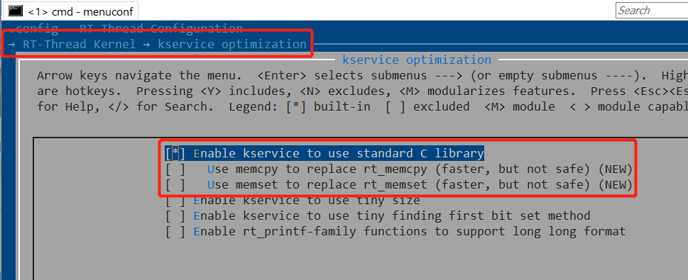

# ISO/ANSI C 标准

## 1 标准输出函数 (printf 家族)

### 1.1 printf 函数

在 Keil 和 IAR 编译平台下，用户可以直接使用 printf 函数；在 GCC 下，需要额外使能 `RT_USING_POSIX_FS` 和 `RT_USING_POSIX_STDIO` 宏才能使用 printf 函数。

### 1.2 rt_kprintf 函数 与 printf 函数的使用选择

如果不是特殊需求，建议使用 rt_kprintf 函数，因为 printf 是由编译平台内部提供的，其空间占用、以及内存使用情况我们无从得知，printf 函数要比 rt_kprintf 函数的 ROM 占用大很多。

无论是 rt_kprintf 函数以及 printf 函数都是非线程函数，在多线程同时使用的情况下，会出现交叉打印的现象，该问题是正常现象，因为根据 C 标准的要求，printf 函数就是非线程安全的。

原生 rt_kprintf 函数是经过优化的，占用空间要比 printf 函数小很多。但是 rt_kprintf 函数并不支持浮点类型的输出。因此：

1. 如需 rt_kprintf 函数支持浮点类型的输出，可以安装 [rt_vsnprintf_full 软件包](https://github.com/mysterywolf/rt_vsnprintf_full)。
2. 如需 rt_kprintf 函数支持线程安全输出，可以安装 [rt_kprintf_threadsafe 软件包](https://github.com/mysterywolf/rt_kprintf_threadsafe)。
3. 上述两个软件包可以同时安装使用，以同时让 rt_kprintf 支持线程安全和浮点类型输出的能力。

### 1.3 其他字符串格式化输出函数 (例如 snprintf 等)

其他字符串格式化输出函数（例如 snprintf 等）都是可以直接使用的。

强烈建议用户使用 rt_snprintf 等 RT-Thread 这侧的函数来代替 snprintf 等函数以降低资源消耗。尤其是在 GCC 编译链下，Newlib（GCC 工具链内部默认的 C 库）内置提供的 snprintf 函数是非线程安全的，在多线程无保护输出浮点数的情况下可能会引发死机（snprintf 函数非线程安全是不正常的）。

同理，原生 rt_snprintf 等函数不支持浮点输出，用户可以通过安装 [rt_vsnprintf_full 软件包](https://github.com/mysterywolf/rt_vsnprintf_full) 来支持浮点数输出。

## 2 内存相关函数

malloc 、realloc 、calloc 、free 内存分配函数可以直接使用，其已经被 rt_malloc 、rt_calloc 、rt_realloc 、rt_free 函数接管，二者无任何区别。

memcpy 、memset 等内存操作相关函数。这里需要注意的时，建议使用 rt_memcpy 以及 rt_memset 来代替 memcpy 和 memset ，虽然 rt_memxxx 函数要比C库的内存操作函数要慢一些，但是要更安全；除非您对拷贝速度非常在意，否则建议使用 rt_memxxx 函数。如果使用的是 Cortex-M 的 MCU，可以安装 [rt_memcpy_cm](https://github.com/mysterywolf/rt_memcpy_cm) 软件包来对 rt_memcpy 函数进行汇编加速，该软件包安全且高效。

## 3 字符串相关函数

strlen 等字符串相关函数为编译器C库内置函数，可以直接使用。

## 4 系统函数

exit 、abort 函数，调用后相当于删除当前线程。

system 函数可以用于在 C 程序中内置执行一些 FinSH 命令。

## 5 时间函数

所有 ANSI/ISO-C 规定的时间函数均可以使用，例如 time 、ctime 等函数。注意：部分涉及到获取当前时间的函数需要使能 RTC 设备才可以正常工作，如果没有使能 RTC 设备就调用这些函数，会在串口终端给出警告。

支持时区功能，可以通过 `RT_LIBC_DEFAULT_TIMEZONE` 宏定义设置默认时区，默认的时区为 UTC+8 北京时间，在运行过程中也可以使用 tz_set() 、 tz_get() 、 tz_is_dst() 函数动态设置或获取时区相关信息（需要包含 <sys/time.h> 头文件）。

***注意：***

1. 时区是给人看的，不是给机器看的。因此，底层驱动不应当使用带有时区的时间，而应该使用格林威治时间，即 UTC+0。当且仅当该时间需要显示出来给人看的时候，才需要临时将其使用带有时区转换功能的函数（例如 ctime）显示时间。否则很容易引发时间上的错乱。
   
   注意以下两组函数的区别，功能相同，唯一的区别是是否考虑时区问题：
   
   |     | 考虑时区      | 不考虑时区  |
   | --- | --------- | ------ |
   | 第一组 | localtime | gmtime |
   | 第二组 | mktime    | timegm |

2. 目前，时间相关函数不支持的是夏令时自动转换相关功能。夏令时在中国不使用，主要是欧美国家在使用。

## 6 kservice.c

在RT-Thread内核 (Kernel) 中有一个叫 kservice.c 的文件。该文件提供了RT-Thread自己实现的C库函数，例如 rt_strlen、rt_strcpy 等等。这些函数存在的意义在于让 RT-Thread 内核具备自持能力，即在不依赖任何C库的情况下，依然可以正常运行。此外，部分编译器内置的C库函数，如上所说，存在一些缺陷，kservice.c 文件中提供的函数更安全，且可控。如果认为，kservice.c 文件中提供的函数与编译器内置C库函数重复，可以通过配置，将 kservice.c 中的大多数函数重映射到编译器内置C库函数中，例如：在开启如下图所示的选项后，调用 rt_strlen 函数实际相当于直接调用编译器内置C库的 strlen 函数。

## 7 标准库C头文件
### 7.1 不同编译平台的兼容

为保证跨不同编译器、不同工具链的兼容性，建议用户应用层代码：
  * 使用 `sys/time.h` 代替 `time.h`
  * 使用 `sys/errno.h` 代替 `errno.h`
  * 使用 `sys/signal.h` 代替 `signal.h`

### 7.2 标准库C头文件的POSIX扩展函数声明

POSIX 在标准库C头文件的基础上又扩展了一些函数声明，例如在标准C头文件 `stdio.h` 中是没有 `getline` 函数的，该函数是POSIX.1-2008标准中出现在 `stdio.h` 文件中的。因此如果使用涉及到类似上述的POSIX扩展C库函数（如 `getline`），需要引用 `posix/stdio.h` 头文件，而非 `stdio.h` 头文件。其他C标准库头文件，诸如 `ctype.h`、`stdlib.h` 等也是同理。

这是由于Keil、IAR、WIN32编译器内置C库中的标准头文件只支持到ISO-ANSI C标准，并不支持POSIX扩展的函数声明，因此RT-Thread的编译器配平层中，采用这种方式来补足上述三个编译器，从而让上层代码方便地跨编译器平台运行。
