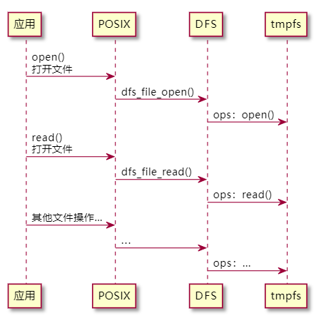
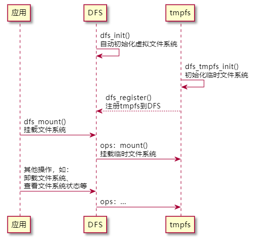
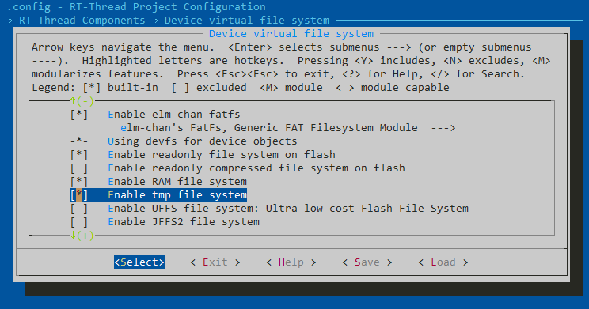
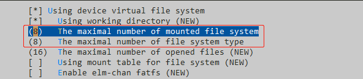
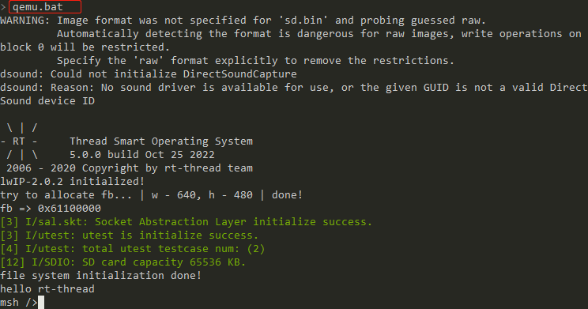

# TMPFS 临时文件系统

tmpfs 是临时文件系统，是一种基于内存的文件系统，优势是：

- 动态调整虚拟内存
- 读写速度快

tmpfs 还有一个特点，它不是存在于一个底层块设备上面，而是直接建立在虚拟内存之上的，无需使用 mkfs 格式化，直接 mount 就可以创建 tmpfs 文件系统。由于是在内存中存储数据，那么在断电后数据也会丢失。

在 RT-Thread 中，tmpfs 和 ramfs 的区别如下表：

| 特性                   | tmpfs            | ramfs               |
| --------------------- | ---------------- | -------------------- |
| 是否固定大小           | 否                 | 是                 |
| 是否支持文件夹操作      | 是                 | 否                  |
| 具有易失性            | 是                 | 是                   |

目前 tmpfs 已经作为一个组件存在于 RT-Thread（rt-smart 分支） 中，位于 `rt-thread\components\dfs\filesystems\tmpfs`，可以进行裁剪配置。

## 文件管理

对 tmpfs 文件的操作，应用层可以直接使用 POSIX 进行访问，操作文件的访问序列图如下所示：



对文件的操作有：

- open：打开文件
- close：关闭文件
- read：读取文件数据
- write：向文件中写数据
- lseek：改变读写一个文件时读写指针位置
- getdents：获取目录项
- stat：获取文件状态

## 目录管理

对目录的管理可以使用 POSIX 接口，其访问序列图与访问文件序列图类似，对目录的操作有：

- mkdir：创建目录
- rmdir：删除目录
- opendir：打开目录
- readdir：读取目录
- closedir：关闭目录
- dirent：读取目录
- telldir：取得目录流的读取位置
- seekdir：设置下次读取目录的位置
- rewinddir：重设读取目录的位置为开头位置

## MSH 命令

可以使用 DFS 的 MSH 命令对 tmpfs 进行操作，文件系统操作常用的 MSH 命令如下表所示：

| MSH 命令 | 描述                                                         |
| -------- | ------------------------------------------------------------ |
| ls       | 显示文件和目录的信息                                         |
| cd       | 进入指定目录                                                 |
| cp       | 复制文件                                                     |
| rm       | 删除文件或目录                                               |
| mv       | 将文件移动位置或改名                                         |
| echo     | 将指定内容写入指定文件，当文件存在时，就写入该文件，当文件不存在时就新创建一个文件并写入 |
| cat      | 展示文件的内容                                               |
| pwd      | 打印出当前目录地址                                           |
| mkdir    | 创建文件夹                                                   |

## 如何使用

如下是应用层使用 DFS 虚拟文件系统的 API 对 tmpfs 进行访问的序列图：

- 文件系统自动初始化：开启自动初始化之后，虚拟文件系统和临时文件系统都将自动初始化，无需用户执行。
- 在应用层使用 dfs_mount() 挂载 tmpfs 文件系统。
- 在应用层使用 DFS 虚拟文件系统的 API 对 tmpfs 进行访问，更多 API 接口详见 [DFS 虚拟文件系统](https://www.rt-thread.org/document/site/#/rt-thread-version/rt-thread-standard/programming-manual/filesystem/filesystem)。



## 使用示例

使用 QEMU 演示 tmpfs 的使用，以挂载在 "/mnt/tmp" 目录为例进行演示。

在 rt-thread 源码的 rt-smart 分支上，打开 qemu-vexpress-a9 BSP，使用 menuconfig 在组件中配置 tmpfs，位于 "RT-Thread Components → Device virtual file system"，退出保存。



注意：若同一个系统中使用多个文件系统，注意在同一界面修可挂载文件系统数量值与文件系统类型个数的值，使其支持多文件系统。



在 mnt.c 中使用 dfs_mount 挂载文件系统的代码如下所示：

```c
	/* romfs 挂载在 / 下 */
	/* fatfs 挂载在 /mnt 下 */
	/* tmpfs 挂载在 /mnt/tmp 下 */
    if (dfs_mount(RT_NULL, "/mnt/tmp", "tmp", 0, NULL) != 0)
    {
        rt_kprintf("Dir /tmp mount failed!\n");
        return -1;
    }
```

使用命令 `scons` 编译后，输入 `qemu.bat` 运行 qemu，切换到 mnt 目录下创建 tmp 目录（若是第一次使用 fatfs，则需要先使用 mkfs 格式化）

```shell
msh />cd mnt            # 使用 cd 命令切换目录
msh /mnt>mkdir tmp      # 使用 mkdir 创建新目录
msh /mnt>ls             # 使用 ls 命令查看当前目录信息
Directory /mnt:
tmp                 <DIR>
```

执行 "ctrl+c" 退出 qemu 后，再次执行 `qemu.bat` 运行 qemu



使用文件系统的 MSH 命令在 tmpfs 文件系统中操作文件：

```shell
msh /mnt/tmp>echo "RT-Thread"         # 将字符串输出到标准输出
RT-Thread

msh /mnt/tmp>mkdir test               # 创建 test 目录
msh /mnt/tmp>echo "rtt" tmpfile.txt   # 使用 echo 命令将输入的字符串输出到指定输出位置
msh /mnt/tmp>ls                       # 使用 ls 命令查看当前目录信息
Directory /mnt/tmp:
tmpfile.txt         3
test                <DIR>

msh /mnt/tmp>cat tmpfile.txt          # 使用 cat 命令查看文件内容
rtt
```

