# PSoC™6 开发实践指南

## 零、实践指南说明

### 硬件介绍

PSoC™ 62 系列是 Arm-Cortex-M4 和 Arm-Cortex-M0 的组合，具有单周期乘法的 150-MHz Arm Cortex-M4F CPU (浮点和存储器保护单元)，100-MHz Cortex M0+ CPU，带单周期乘法和 MPU，可编程数字和模拟资源以及一流的用于触摸的 CAPSENSE™ 技术。

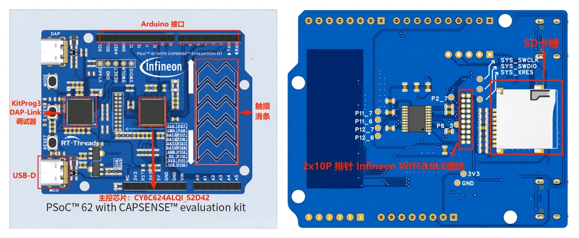

特性：

-   150MHz Cortex-M4 + 100MHz Cortex-M0
-   2MB 代码闪存和 1MB SRAM
-   8KB 数据闪存，提供与 EEPROM 类似的数据存储功能
-   从 48 引脚到到 100 引脚的封装选择
-   内部电压调节电路
-   增强型电容触摸感应单元 (CTSU2)
-   12 位 ADC，12 位 DAC，低功耗比较器
-   32 位通用 PWM 定时器，16 位通用 PWM 定时器，低功耗异步通用定时器
-   实时时钟

### 开发环境

实验前需要下载

- [RT-Thread Studio 安装包](https://www.rt-thread.org/page/studio.html)

串口自动识别安装

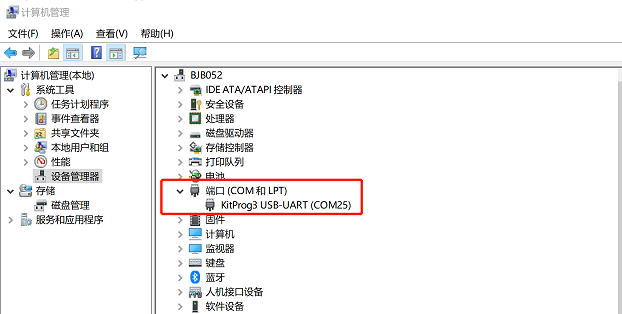

### 如何使用 RT-Thread Studio

#### 3.1 studio 安装开发板支持包

请安装最新发布版本。

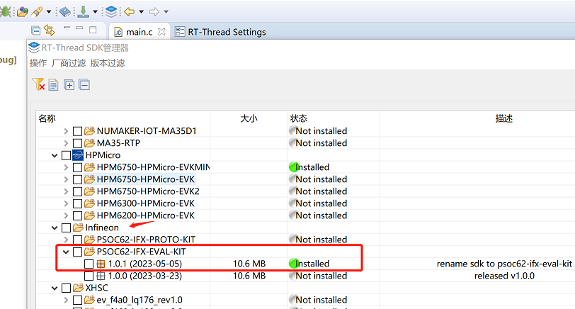

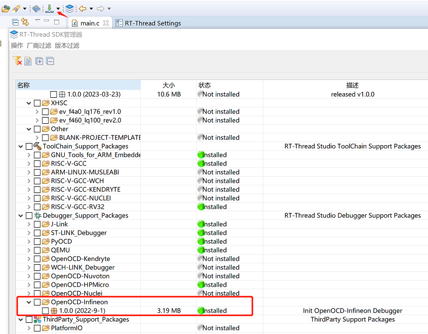

#### 3.2 studio 新建工程

1. 打开 studio，如下图所示，新建工程。

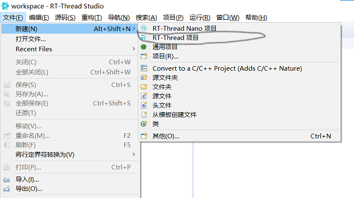

1. 填写工程名称、选择基于开发板创建，选好开发板，如下图：


1. 生成的工程如下图：

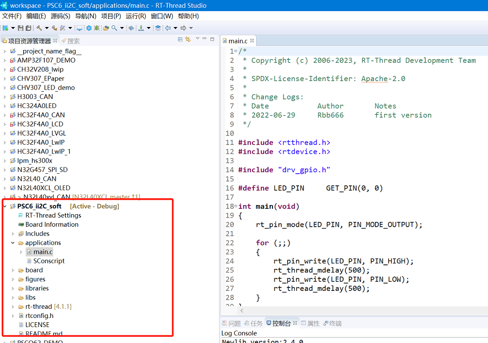

#### 3.3 编译

单击编译按键，编译工程，如下图所示。

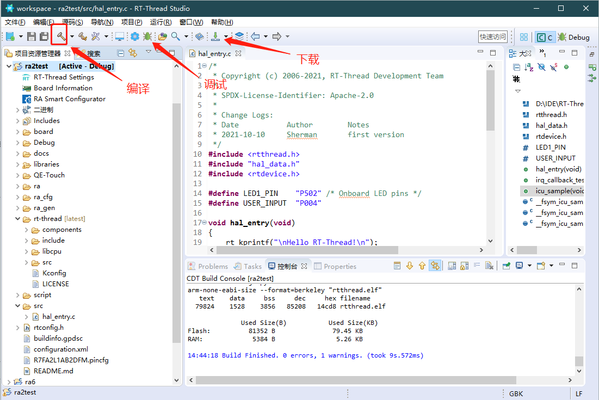

## 一、PSoC™6 上的 UART 实践

### 前言说明

#### 本章内容

本章通过 RT-Thread Studio 配置 UART 实现。

#### 模块介绍

本模块我们测试 UART5，在原理图中位置如下所示：对应开发板 CON7 插件上的 7&8 引脚，对应芯片上的 P11.0 与 P11.1 引脚。

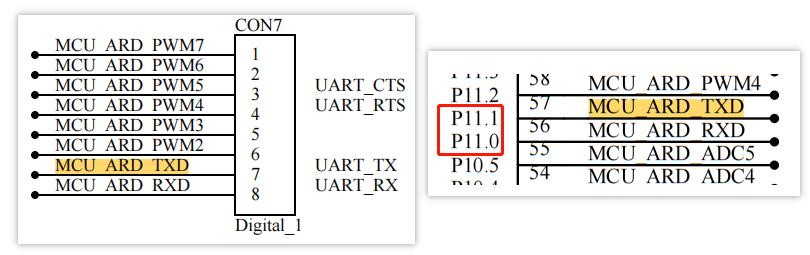

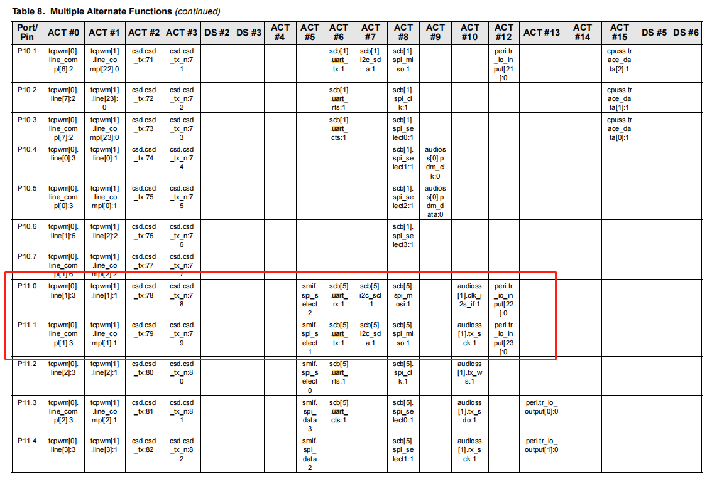

参考文档位于：新建的工程中的 Board Information

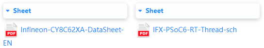

#### 开发软件

使用 RT-Thread Studio 进行测试验证。

### 步骤说明

#### 新建工程

新建基于开发板 PSOC62-IFX-EVAL-KIT 的工程

#### 配置 UART

在 settings 中打开串口 5，对应开发板 CON7 插件上的 7&8 引脚，对应芯片上的 P11.0 与 P11.1 引脚。

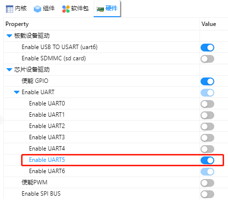

打开代码，在 uart_config.h 文件中，修改 UART5 对应的引脚配置（改为 P11_1 与 P11_0）

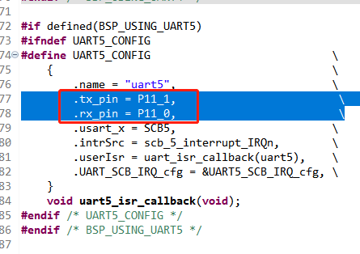

### 代码验证

将开发板上的 UART5 RX 与 UART5 TX 通过 USB 转串口线连接到 PC。以下测试 2 选 1 即可。

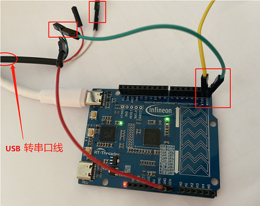

#### 3.1 测试 1 代码：

将终端移植到 UART5 上，直接修改 rtconfig.h，将终端名称改为 uart5

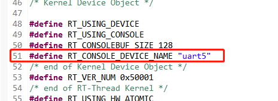

**测试 1 验证**

编译下载，查看并打开 USB 转串口对应的 COM 口终端（例如 COM10），可以看到 UART5 已作为终端使用，打印了上电开机 logo。

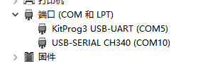


#### 3.2 测试 2 代码：

测试代码如下所示：

将测试代码复制到工程中，编译下载。

**测试 2 验证**


打开终端和 USB 转串口的终端（例如 COM5 和 COM10），在终端中输入 uart_sample 执行 uart 测试代码；然后在 uart 转串口对应的端口查看会输出 “hello RT-Thread!”，并在该端口输入字符，会经过代码进行错位输出（例如键盘输入 a，则端口输出 b）。

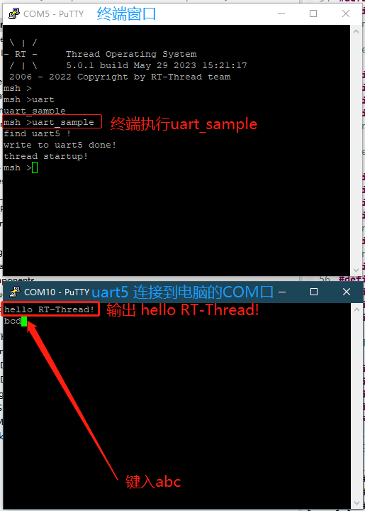

#### 3.3 修改波特率：

修改波特率代码：

```c
#define SAMPLE_UART_NAME       "uart2"    /* 串口设备名称 */
static rt_device_t serial;                /* 串口设备句柄 */
struct serial_configure config = RT_SERIAL_CONFIG_DEFAULT;  /* 初始化配置参数 */

/* step1：查找串口设备 */
serial = rt_device_find(SAMPLE_UART_NAME);

/* step2：修改串口配置参数 */
config.baud_rate = BAUD_RATE_9600;        // 修改波特率为 9600
config.data_bits = DATA_BITS_8;           // 数据位 8
config.stop_bits = STOP_BITS_1;           // 停止位 1
config.bufsz     = 128;                   // 修改缓冲区 buff size 为 128
config.parity    = PARITY_NONE;           // 无奇偶校验位

/* step3：控制串口设备。通过控制接口传入命令控制字，与控制参数 */
rt_device_control(serial, RT_DEVICE_CTRL_CONFIG, &config);

/* step4：打开串口设备。以中断接收及轮询发送模式打开串口设备 */
rt_device_open(serial, RT_DEVICE_FLAG_INT_RX);
```

### 总结

1. [RT-Thread 的 UART 设备](https://www.rt-thread.org/document/site/#/rt-thread-version/rt-thread-standard/programming-manual/device/uart/uart_v1/uart)。
2. 在 settings 中打开相应的 UART 设备后，需要查看 uart_config.h 文件中相应的引脚是否配置正确，不正确则需要进行修改。

还需查看该 UART 引脚是否已经做了其他类外设的复用。

## 二、英飞凌 PSoC™6 上的 GPIO 实践

更多内容请点击链接查看在线文档 [《PSoC™6 开发实践指南》](https://docs.qq.com/doc/DZmpvR0xocFpVVGhQ)，包含内容如下：

- 零、实践指南说明
- 一、英飞凌 PSoC™6 上的 UART 实践
- 二、英飞凌 PSoC™6 上的 GPIO 实践
- 三、英飞凌 PSoC™6 上的模拟 I2C 实践
- 四、英飞凌 PSoC™6 上的 SPI 实践
- 五、英飞凌 PSoC™6 上的 ADC 实践
- 六、英飞凌 PSoC™6 上的 DAC 实践
- 七、英飞凌 PSoC™6 上的 PWM 实践
- 八、英飞凌 PSoC™6 上的 WDT 实践
- 九、英飞凌 PSoC™6 上的 RTC 实践
- 十、英飞凌 PSoC™6 上的 Flash 实践
- 十一、英飞凌 PSoC™6 上的硬件 I2C 实践
- 十二、英飞凌 PSoC™6 上的 SDIO 实践
- 十三、英飞凌 PSoC™6 上的 CapSense 实践
- 十四、英飞凌 PSoC™6 上的 usb 实践
- 十五、英飞凌 PSoC™6 上的 USBD 实践
- 十六、FAQ


