# 瑞萨 RA2L1 开发实践指南

## 实践指南说明

### 1. 硬件介绍

RA2L1 产品组基于 Cortex-M23 核心（现 Cortex-M 系列中功耗最低的 CPU）。RA2L1 产品组能够支持 1.6V 至 5.5V 宽电压工作，CPU 时钟频率最高 48MHz，且运行模式电流和待机模式电流更低。 RA2L1 产品群配备了增强型电容式触摸感应单元 (CTSU2)、串行通信接口、高精度模拟电路和定时器。 产品封装从 48 引脚到 100 引脚。

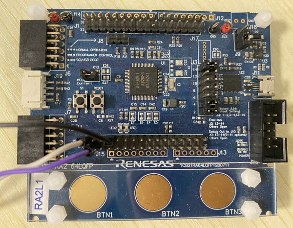

特性：

- 48MHz Cortex-M23
- 128KB/ 256KB 代码闪存和 32KB SRAM（支持 ECC）
- 8KB 数据闪存，提供与 EEPROM 类似的数据存储功能
- 从 48 引脚到到 100 引脚的封装选择
- 内部电压调节电路
- 增强型电容触摸感应单元 (CTSU2)
- 12 位 ADC，12 位 DAC，低功耗比较器
- 32 位通用 PWM 定时器，16 位通用 PWM 定时器，低功耗异步通用定时器
- 实时时钟
- 串行通信接口（UART、简单 SPI、简单 I2C）
- 独立的 SPI 接口 / I2C 多主接口
- CAN
- 安全功能
- 加密功能

### 2. 开发环境

#### 2.1 准备

实验前需要下载

- [RT-Thread Studio 安装包](https://www.rt-thread.org/page/studio.html)
- 灵活配置软件包 (FSP)
- CPK-RA2L1 板级支持包
- usb 转串口工具

#### 2.2 灵活配置软件包 (FSP) 安装

可快速配置开发板的外设功能，请使用 v3.5.0 版本，目前可在 github 上下载 3.5.0 版本（下载地址：<https://github.com/renesas/fsp/releases/tag/v3.5.0>（注意文件名称为：setup_fsp_v3_5_0_rasc_v2021-10.exe）），注意官网为 3.6.0 版本，不向前兼容，使用 3.6.0 版本会会导致本工程不可用。

1、找到下载的文件打开（注意文件名称包含为 rasc）：setup_fsp_v3_5_0_rasc_v2021-10.exe。

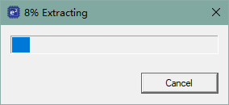

2、配置安装路径，安装完成后找到此路径，之后添加 CPK-RA2L1 板级支持包时会用到。

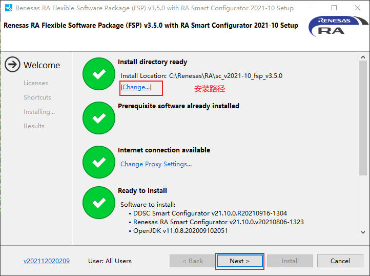

3、勾选 Licenese。

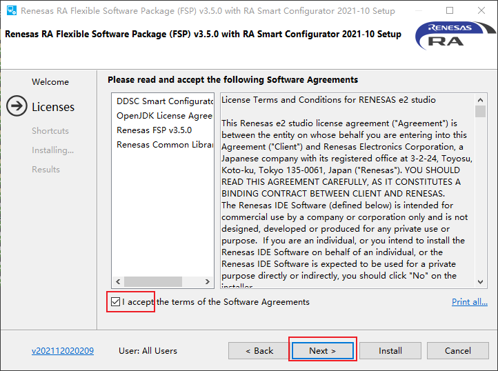

4、点击 install 等待安装完成。

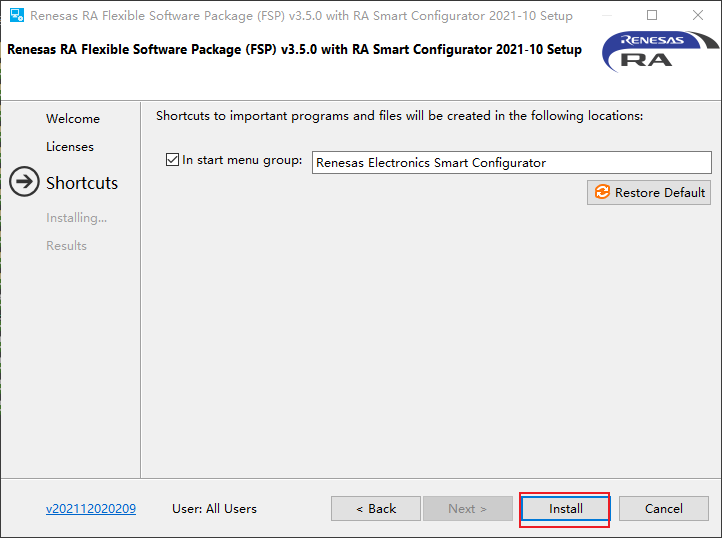

5、运行 rasc.exe，验证是否安装成功。路径：`\eclipse\rasc.exe`。

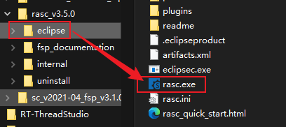

6、成功启动后关闭即可，继续接下来的操作。

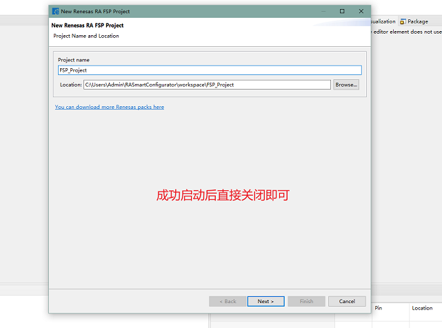

#### 2.3 CPK-RA2L1 板级支持包安装

此部分可以参考 [Renesas 官网文档《向 FSP 中添加 CPK 评估板的 BSP 》](<https://www2.renesas.cn/cn/zh/document/gde/1596896?language=zh&r=1527191>)。

1、下载 3.5.0 版本支持包。

配合 FSP 一起使用，是开发板的图形化配置支持包, 请使用 v3.5.0 版本。[可在 Renesas 官网下载:](https://www2.renesas.cn/cn/zh/products/microcontrollers-microprocessors/ra-cortex-m-mcus/cpk-ra2l1-evaluation-board#design_development)

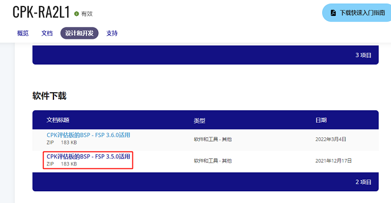

2、在下载的支持包中可以找到以下三个文件

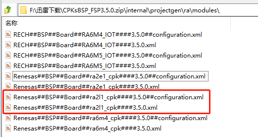

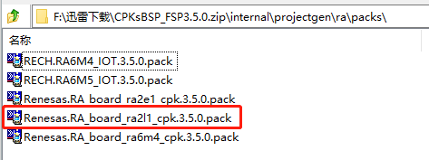

3、此时找到 FSP 的安装路径，进入 `\internal\projectgen\ra\` ，将文件复制到对应的文件夹中。

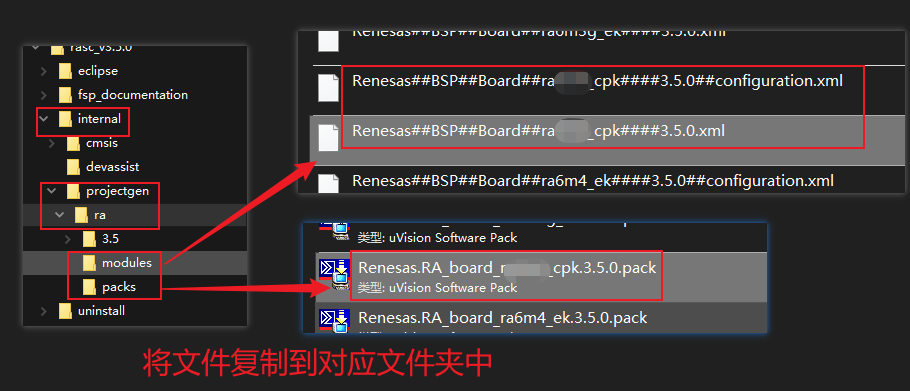

4、再次打开 rasc.exe，查看是否添加成功。点击 next 进入工程创建

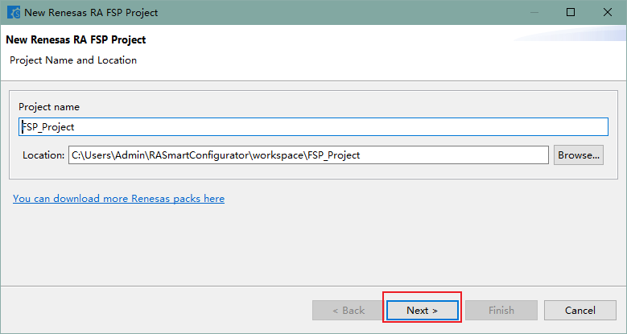

5、确认是否存在已添加的 CPK-RA2L1 开发板的支持包，此步骤仅为验证是否添加成功，不必继续创建工程，关闭即可。

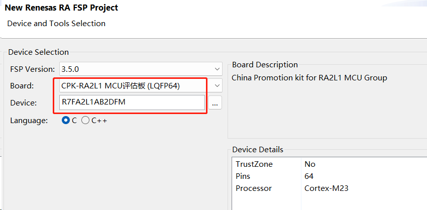

到此基本将瑞萨开发板相关的环境搭建完成。

2.4 RT-Thread Studio 安装

首先需要确保已经安装 RT-Thread Studio。

在工具栏找到 SDK 管理器，点击后在弹出窗口，`Board_Support_Packages -> Renesas -> CPK-RA2L1` , 勾选，安装资源包，至此可以在 RT-Thread Studio 基于 RA2L1 做开发了

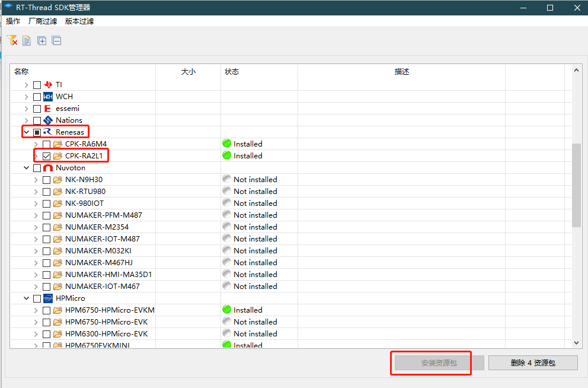

### 3. RT-Thread Studio IDE 使用的基础介绍

#### 3.1 studio 新建工程

打开 studio，如下图所示，新建工程。

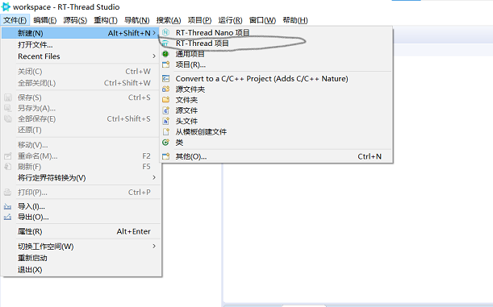

选择 基于开发板，然后选择 CPK-RA2L1

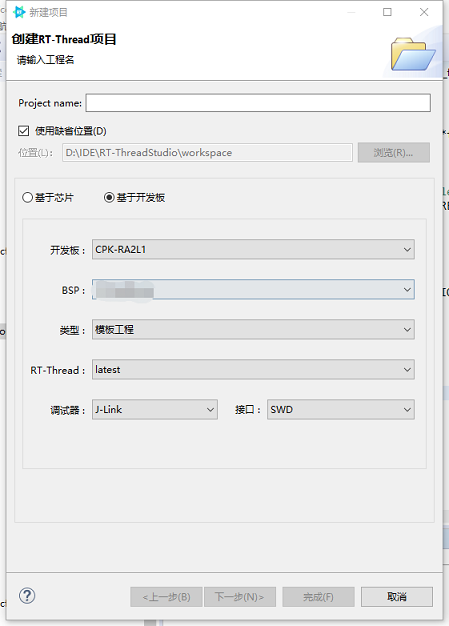

#### 3.2 编译

单击编译按键，编译工程，如下图所示。

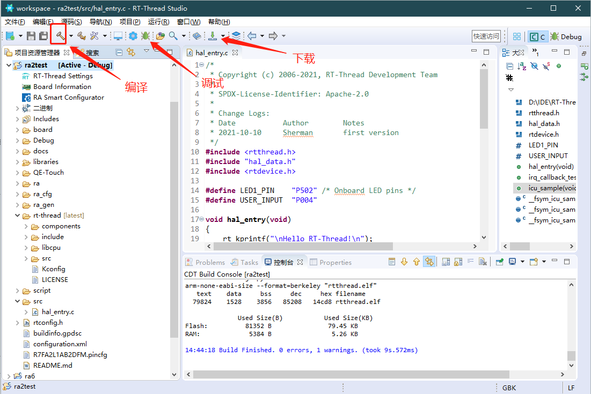

#### 3.3 使用 FSP 配置工具，配置工程

1、打开创建的工程，双击 RA Smart Configurator 即可打开刚刚安装的 FSP 配置工具：

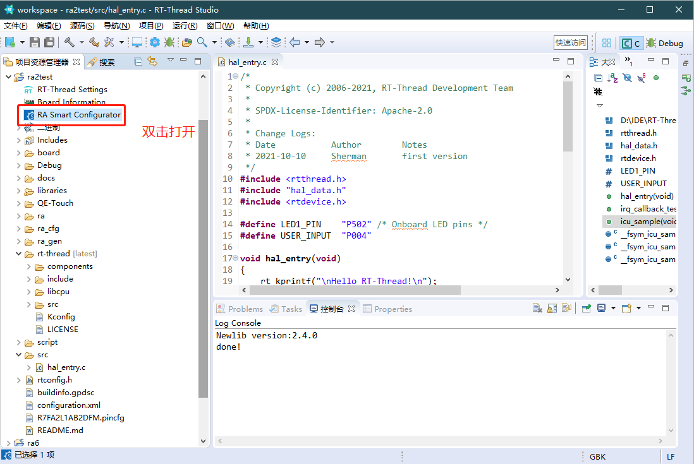

**如果看不到这个图标，需要按照下面的操作，打一个临时的补丁:**

右键单击创建的工程，打开资源所在路径，然后找到项目文件下的 .settings 目录下的 projcfg.ini 文件。使用文本编辑器打开，在里面添加一行：`dvendor_name=RENESAS`

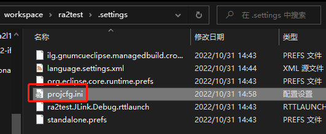

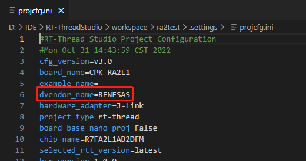

然后再刷新 RT-Thread Studio 工程，即可看到 RA Smart Configurator 配置工具的图标。

2、第一次打开需要配置 FSP 路径，选择到安装路径即可。确认可打开 FSP 即可关闭，先不做修改继续后续操作。

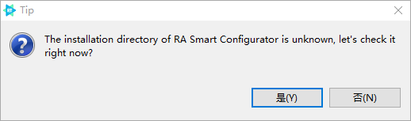

3、如要使用配置工具配置芯片外设，按照下图操作。

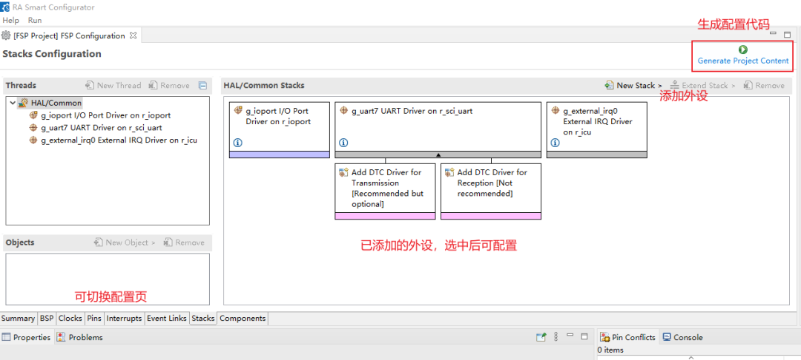

## 瑞萨 RA2L1 上的 GPIO 实践

### 前言说明

#### 本章内容

本章通过 RT-Thread Studio 配置 GPIO 实现输入、输出的设定，及 GPIO 中断使用。

#### 模块介绍

主要介绍按键输入 (P004) 及 led(P502)  输出控制的使用

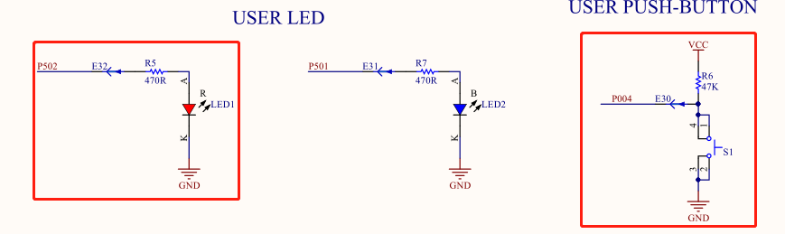

#### 开发软件

- 开发环境：RT-Thread Studio
- 下载工具：Jflash--板载

### 步骤说明

工程搭建参考  **RT-Thread Studio IDE 使用的基础介绍**，注意 FSP 只能使用 3.5.0 版本，使用 4.0.0 测试无法出现配置界面

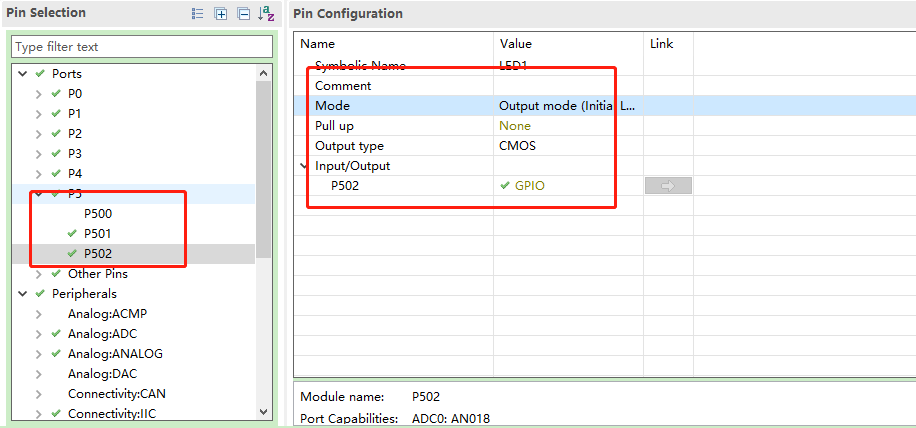

将 LED 对应 pin 脚 P502 设置为输出模式，输出类型为 CMOS，P502 配置成 GPIO

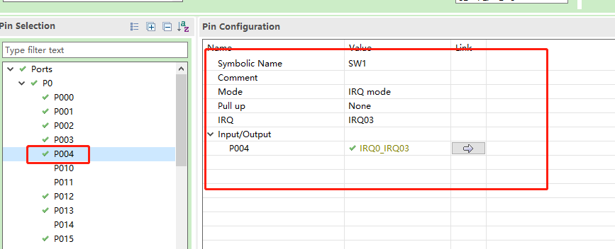

按键对应的 P04 设置为 为 IRQ_mode，分配 IRQ 为 3 指定 P004 类型为 IRQ0_IRQ_03

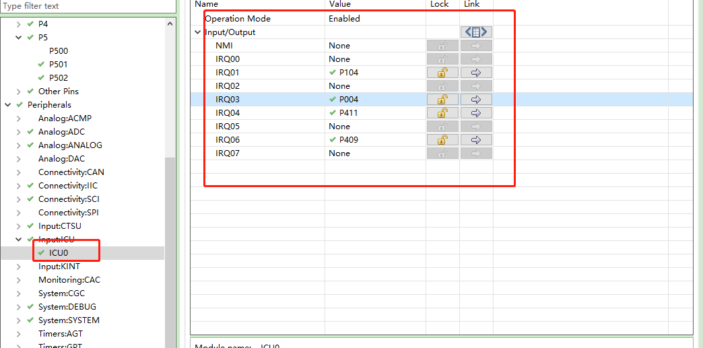

icu0 中有整体的 IRQ 管理控制设置

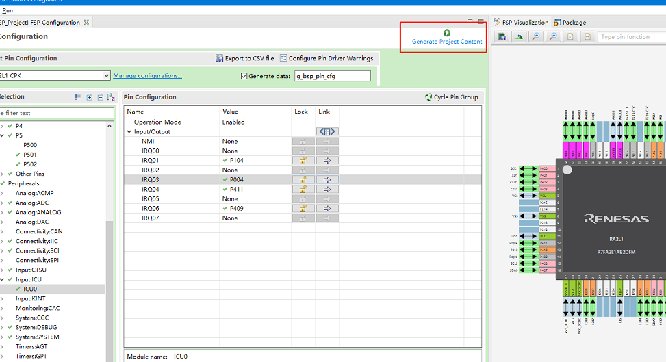

保存设置，点击工程生成

#### 编写测试程序

```c
#include <rtthread.h>
#include "hal_data.h"
#include <rtdevice.h>

#define LED1_PIN    "P502" /* Onboard LED pins */
#define USER_INPUT  "P004"

void hal_entry(void)
{
    rt_kprintf("\nHello RT-Thread!\n");
    while (1)
    {
        rt_thread_mdelay(500);
    }
}

void irq_callback_test(void *args)
{
    static int out ;
    rt_kprintf("\n IRQ03 triggered \n");
    rt_uint32_t led1_pin = rt_pin_get(LED1_PIN);
    out = rt_pin_read(led1_pin)?PIN_LOW:PIN_HIGH;
    rt_pin_write(led1_pin,out);
}

void push_btn(void)
{
    /* init */
    rt_uint32_t pin = rt_pin_get(USER_INPUT);
    rt_kprintf("\n pin number : 0x%04X \n", pin);
    rt_err_t err = rt_pin_attach_irq(pin, PIN_IRQ_MODE_RISING, irq_callback_test, RT_NULL);
    if (RT_EOK != err)
    {
        rt_kprintf("\n attach irq failed. \n");
    }
    err = rt_pin_irq_enable(pin, PIN_IRQ_ENABLE);
    if (RT_EOK != err)
    {
        rt_kprintf("\n enable irq failed. \n");
    }
}
MSH_CMD_EXPORT(push_btn, push_btn);
```

### 代码验证

代码下载、烧录,串口助手输入push_btn,点击按钮，观察led 是否状态反转（亮-按钮点击-灭--按钮点击---亮...）

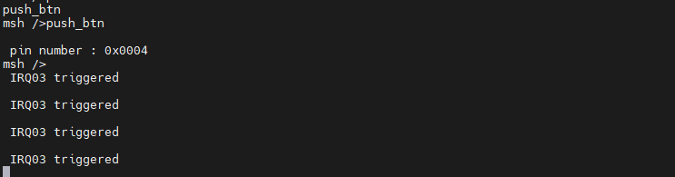

### 章节总结

GPIO 是 MCU 控制中最基础的，可以用于模拟 I2C IR UART 等协议，主要有输入输出设定、中断、回调触发函数等设置。

## 瑞萨 RA2L1 上的模拟 I2C 实践

更多内容请点击链接查看在线文档 [《瑞萨 RA2L1 开发实践指南》](https://docs.qq.com/doc/DQktJWmpBZkNiTnh6)，包含内容如下：

- 零、实践指南说明
- 一、瑞萨 RA2L1上 的 UART 实践
- 二、瑞萨 RA2L1上 的 GPIO 实践
- 三、瑞萨 RA2L1上 的 模拟 I2C 实践
- 四、瑞萨 RA2L1上 的 SPI 实践
- 五、瑞萨 RA2L1上 的 ADC 实践
- 六、瑞萨 RA2L1上 的 DAC 实践
- 七、瑞萨 RA2L1上 的 PWM 实践
- 八、瑞萨 RA2L1上 的 WDT 实践
- 九、瑞萨 RA2L1上 的 RTC 实践
- 十、瑞萨 RA2L1上 的 Flash 实践
- 十一、瑞萨 RA2L1 上的 I2C 实践
- 十二、瑞萨 RA2L1 上的 CAN 实践
- 十三、瑞萨 RA2L1 上的 CapTouch 实践


