# 瑞萨 RA6M3 开发实践指南

## 零、实践指南说明

### 硬件介绍

1. 开发板描述

HMI-Board 为 RT-Thread 联合瑞萨推出的高性价比图形评估套件，取代传统的 HMI + 主控板 硬件，一套硬件即可实现 `HMI + IoT + 控制` 的全套能力。依托于瑞萨高性能芯片 RA6M3 及 RT-Thread 软件生态，HMI Board 不仅硬件性能强劲，同时软件生态丰富，助力开发者快速开发出 GUI 智能硬件产品。

HMI-Board 搭载 2M Flash 大容量主控芯片 RA6M3，内置 2D 加速、JPEG 编解码器、LCD 控制器等模块，助力图形应用开发，并且板载 TFT 显示屏和音频接口，可以让开发者在 HMI 领域大展身手；此外，HMI-Board 还支持 IoT 连接，板载以太网接口、高速 WIFI 模块，让开发板无时无刻连接云端；同时，HMI-Board 还支持多种控制方式，包括 CAN 接口、Arduino 接口以及两路 PMOD 接口等，可以让开发者方便地扩展各种外设，从而实现更加灵活的控制方式。通过 HMI-Board 开发板，开发者可以轻松实现 GUI 智能硬件产品。

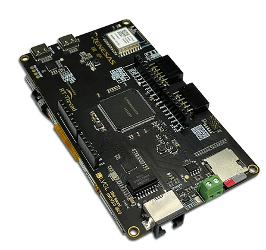

2. 硬件配置

- RA6M3(R7FA6M3AH3CFB)：Cortex-M4F 内核，120Mhz 主频，具有 2MB Flash/640KB RAM，集成 TFT 控制器、2D 加速器和 JPEG 解码器。
- 4.3 寸 LCD (RGB 888)
- 板载仿真器
- 以太网
- RW007 (SPI 高速 WIFI)
- USB-Device
- TF Crad
- CAN
- 1 路麦克风，1 路扬声器
- Arduino 扩展接口
- 2 路 PMOD 扩展接口
- 4 个按键：3 个用户按键，一个复位按键

### 开发环境

实验前需要下载：

- [RT-Thread Studio 安装包](https://www.rt-thread.org/download.html#download-rt-thread-studio)
- [RA Smart Configurator](https://github.com/renesas/fsp/releases/tag/v3.5.0)

([注意文件名称为：setup_fsp_v3_5_0_rasc_v2021-10.exe 其它版本不能正常使用](https://github.com/renesas/fsp/releases/download/v3.5.0/setup_fsp_v3_5_0_rasc_v2021-10.exe))

串口自动识别安装：

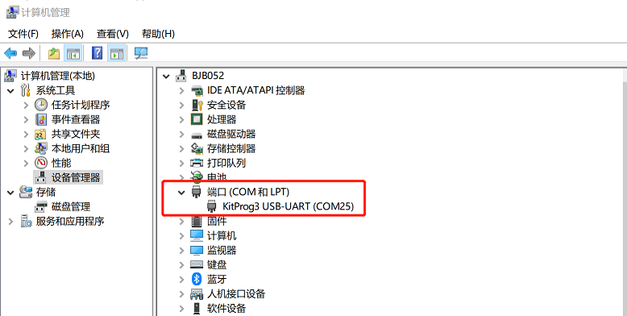

### 如何使用 RT-Thread Studio

（[RA6M3-hmi-board 初步上手使用说明](https://www.rt-thread.org/document/site/#/rt-thread-version/rt-thread-standard/hw-board/ra6m3-hmi-board/ra6m3-hmi-board?id=%e4%bd%bf%e7%94%a8%e8%af%b4%e6%98%8e)）

## 一、瑞萨 RA6M3 上的 UART 实践

### 前言说明

串口是 MCU 上最常见和使用最为频繁的外设之一，可以用作打印调试信息、远程登陆、控制支持串口通讯的外设等功能，了解和掌握串口是嵌入式开发中的一项必备技能。

#### 本章内容

使用 RT-Thread Studio 创建开发板的程序，编写 UART 的程序，实现串口打印数据的功能，同时使用 Finsh Shell 控制开发板上的 LED。

#### 模块介绍

开发板上提供了两个串口连接，分别是在 P109 和 P110 的串口 9，通过调试器的虚拟串口与上位机通讯。（UART9 为默认日志输出端口）

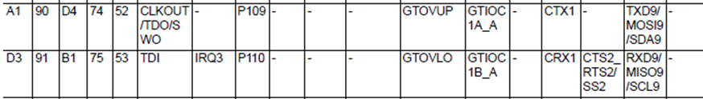

另一个串口位于 P205 和 P206 的串口 4，TXD 和 RXD 引脚引出到 Ardinuo 接口上，在开发板上也直接标出了。

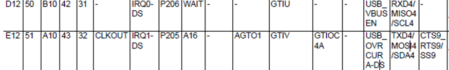

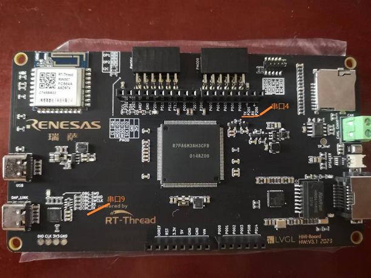

#### 开发软件

根据《实践指南说明》安装 fsp3.5.0 和 RT-Thread Studio(2.2.6)。

### 步骤说明

安装好开发环境后，首先对 RT-Thread Studio 的 SDK Manager 中安装包进行检查，确定相关的软件支持包已经安装。

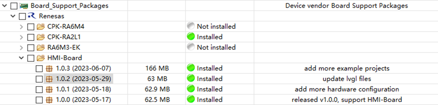

#### 新建工程

点击工具栏中的 `文件 -> 新建 ->RT-Thread 项目`

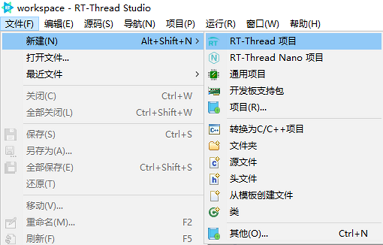

选择目标开发板以及工程默认位置，这里一定要选择 HMI_Board，对应的 BSP 版本为 1.0.3, 如果选择 RA6M3-HMI-Board, 对应的 BSP 版本为 1.0.2，在使用串口时有 Bug 存在，会导致程序无法正常运行。

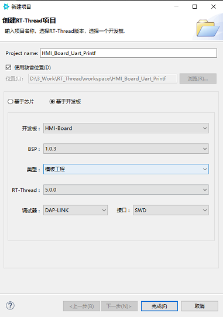

给项目一个合适的名字

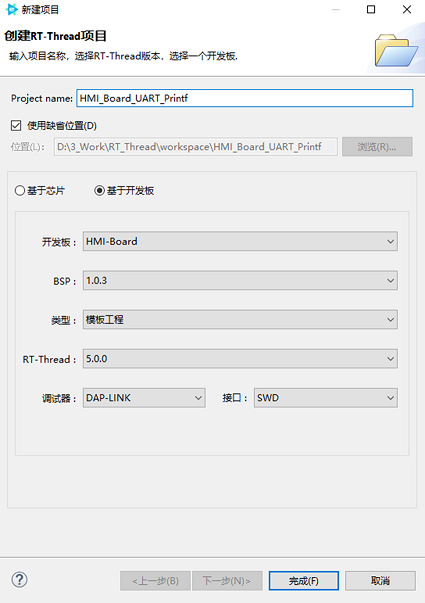

点击完成后，就可以得到一个打印信息、支持 Finsh 以及一秒钟翻转 LED 的程序。

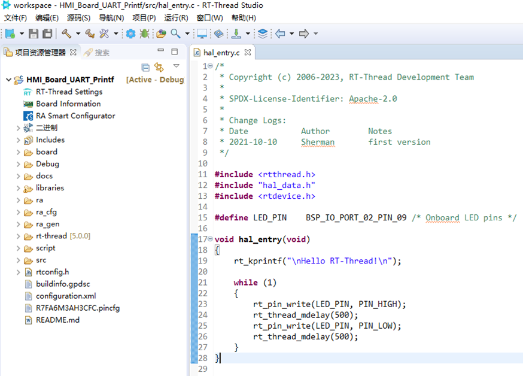

这个程序是一个完整的程序，点击编译后可以直接下载运行。在此基础上我们就可以根据自己的需要编写相应的驱动程序。

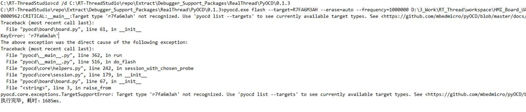

如果在下载过程中遇到上述问题，可以通过更新 pyocd 的版本来修正，这一问题的原因是 pyocd 的版本过低导致。安装 0.2.0 的 pyocd 添加对瑞萨的支持就可以解决这个问题。

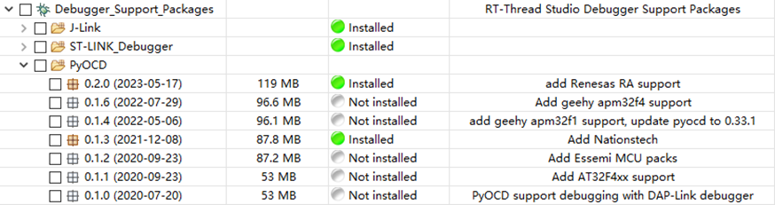

由 RT-Thread Studio 创建的软件工程本身就是一个演示了 LED 翻转和串口功能的例程，我们上来就可以得到可以运行的使用了串口输出信息的程序。需要注意的是，rtthread 为了方便开发者调试，在系统中嵌入了 Finsh 这个简易的控制台程序，根据用户使能的模块提供了不同的控制指令。

新创建的工程编译通过后，利用板载的 daplink 将固件烧写到开发板上。

在串口终端中输入 help，可以查看当前支持的指令。

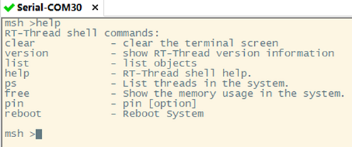

其中 list 的功能很多，后面跟随不同的参数可以实现不同的功能。

如图所示，可以产看当前系统中的线程、定时器、信号量、互斥量、事件、邮箱、消息队列以及设备的实例个数。可以帮助开发者掌握当前系统的运行状态。另外 reboot 功能可以减少设备上下电的次数，方便远程调试。

Finsh 的除了上述已经定义好的功能，还支持自定义函数，可以帮助开发者自定义一些测试函数，方便针对特定情境进行测试。

开发板默认使用 uart9 作为调试串口，在开发板上的 Ardinuo 接口上，引出了 uart4。开发板默认是不开启 uart4，为了能使用 uart4，首先使用 FSP 工具配置相关的引脚。

点击工程中的 RA Smart Configurator，可以启动代码配置工具对 MCU 的外设进行配置。

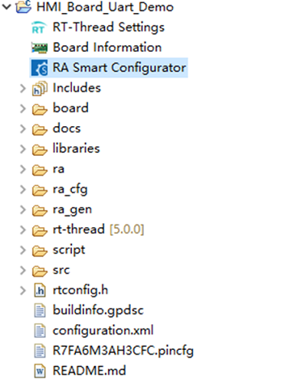

在 Stack 栏中的 `New Stack->Connnectivity->UART` 添加新的 UART 实例。

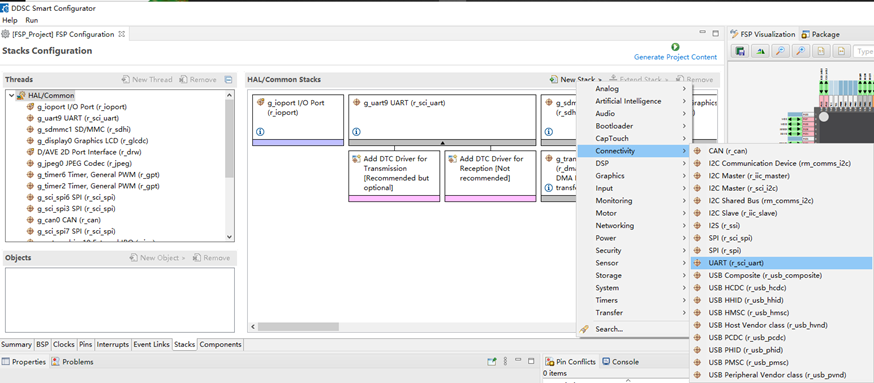

修改 General 栏中的通道和设备名称

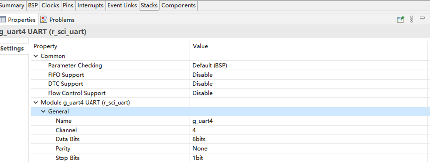

在 Pins 引脚栏中设定使用的引脚和引脚的工作模式。

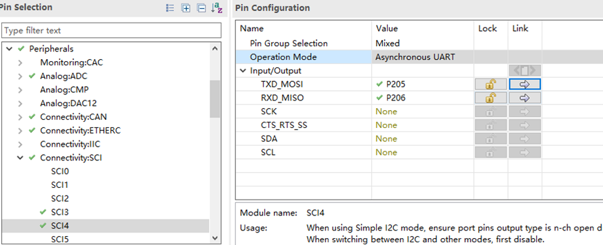

点击右上角 “Generate Project Content”，即可关闭 FSP 工具。

回到工程中点击 RT-Thread Settings，对工程中要使用的硬件进行配置。

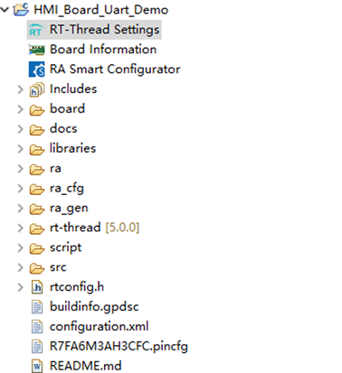

在配置界面的硬件一栏中勾选 Enable UART4

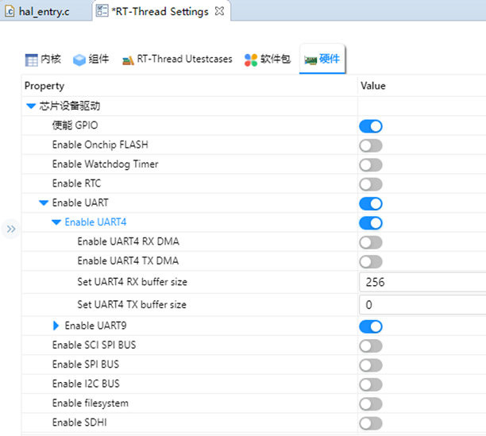

保存文件后，就可以在工程中添加 uart4，并在工程调用相关的串口函数。

#### 编写测试程序

通过串口发送字符串，是嵌入式应用中的基本程序，检验串口是否正常工作。在 hal_entry.c 中添加以下代码：

硬件连接如图：

下面使用 Finsh 的自定义功能实现 uart4 的回环功能。具体的代码如下:

### 代码验证

串口打印的效果如下图所示。

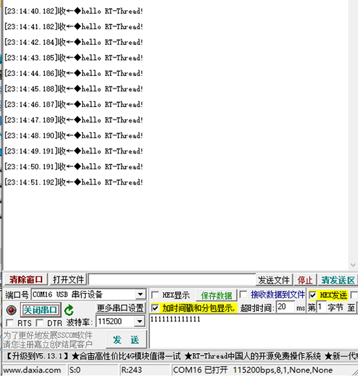

Finsh 自定义函数功能测试，在串口界面中输入控制指令

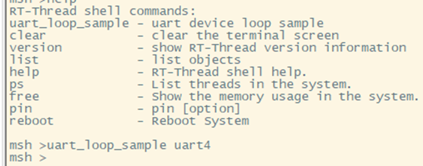

测试效果如图所示：

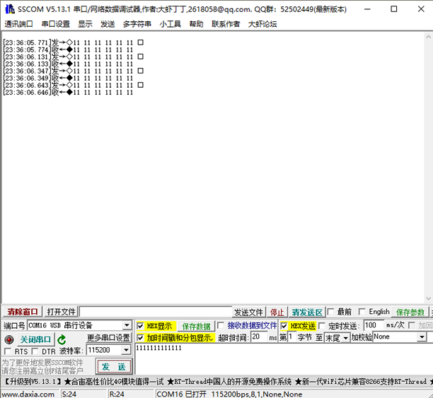

### 章节总结

使用 RT-Thread 和 FSP 进行开始还是很方便的，在 FSP 中修改相关引脚的功能，RT-Thread 中使用配置工具对 BSP 进行使能。同时 RT-Thread 官网上还有详细的文档和示例代码，帮助新手快速搭建工程和入门嵌入式开发是一个不错的选择。

## 二、瑞萨 RA6M3 上的 GPIO 实践

更多内容请点击链接查看在线文档 [《瑞萨 RA6M3 开发实践指南》](https://docs.qq.com/doc/DQmVYUEN1dHVyd0hi)，包含内容如下：

- 零、实践指南说明
- 一、瑞萨 RA6M3 上的 UART 实践
- 二、瑞萨 RA6M3 上的 GPIO 实践
- 三、瑞萨 RA6M3 上的模拟 I2C 实践
- 四、瑞萨 RA6M3 上的 SPI 实践
- 五、瑞萨 RA6M3 上的 ADC 实践
- 六、瑞萨 RA6M3 上的 DAC 实践
- 七、瑞萨 RA6M3 上的 PWM 实践
- 八、瑞萨 RA6M3 上的 WDT 实践
- 九、瑞萨 RA6M3 上的 RTC 实践
- 十、瑞萨 RA6M3 上的 Flash 实践
- 十一、瑞萨 RA6M3 上的 I2C 实践
- 十二、瑞萨 RA6M3 上的 CAN 实践
- 十三、瑞萨 RA6M3 上的 TFT 实践
- 十四、瑞萨 RA6M3 上的 ETH 实践
- 十五、瑞萨 RA6M3 上的 SDHI 实践
- 十六、瑞萨 RA6M3 上的 I2S 实践
- 十七、瑞萨 RA6M3 上的 RW007 实践
- 十八、结合 SquareLine Studio 制作 GUI 界面快速简易入门
- FAQ

