# Infineon + RT-Thread 物联网 DEMO

## 简介

这是一个基于 `CY8CPROTO-062-4343W` 开发板 + `RT-Thread` 实现的物联网 DEMO。

本文将介绍如何一步步从零搭建一个物联网 demo。

下图是整体的设计框图，使用 `RW007` 用于网络通信，使用 `MQTT` 协议连接 One-Net 物联网平台。在主控芯片中添加所需要的软件包、组件等中间件来快速搭建起一个设备上云 Demo。

## 实际运行效果

1、在 msh 中输入`onenet_mqtt_demo_start 【WI-Fi 名称】 【WI-Fi 密码】` 命令创建并启动 demo 线程

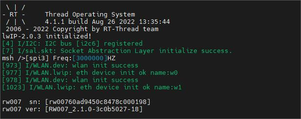

2、在云平台的设备调试页面查看实时刷新的数据。

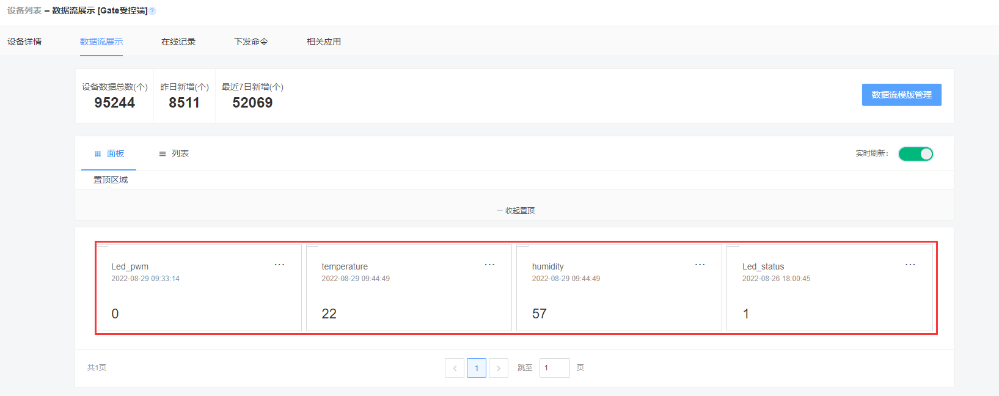

3、进入[可视化网站](https://open.iot.10086.cn/iotbox/appsquare/appview?openid=edfdb062942604d9b1de5674d7433497)，进行查看/下发数据的上行和下行

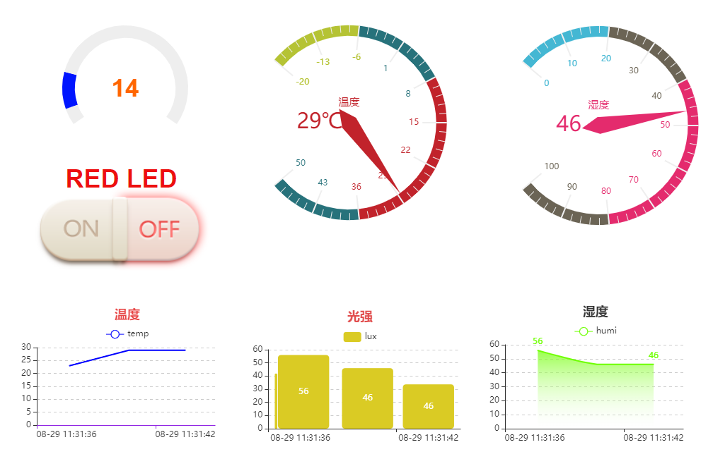

## 准备工作

- [RT-Thread studio v2.2.5](https://download-sh-cmcc.rt-thread.org:9151/www/studio/download/RT-Thread%20Studio-v2.2.5-setup-x86_64_202208011830.exe)

- OneNET：[中国移动物联网开放平台](https://open.iot.10086.cn)
- [CY8CPROTO-062-4343W 开发板](https://www.rt-thread.org/document/site/#/rt-thread-version/rt-thread-standard/tutorial/quick-start/CY8CPROTO-062-4343W/quick-start)
- USB-TTL：连接 UART5 （TX:P5_1; RX:P5_0）**波特率 115200**
- WiFi 网络模块：[RW007](https://www.rt-thread.org/document/site/#/rt-thread-version/rt-thread-standard/application-note/packages/rw007_module_using/an0034-rw007-module-using?id=rw007)

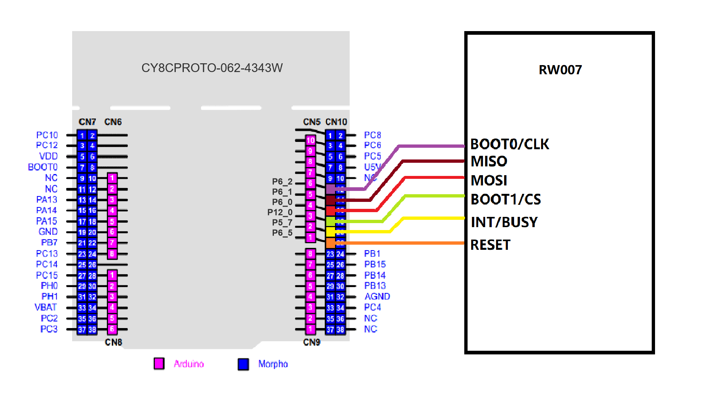

各 IO 接口与功能之间的对应关系表：

| CY8CPROTO-062-4343W 引脚名 |   功能    |
| :------------------------: | :-------: |
|            P6_2            | BOOT0/CLK |
|            P6_1            |   MISO    |
|            P6_0            |   MOSI    |
|           P12_0            | BOOT1/CS  |
|            P5_7            | INT/BUSY  |
|            P6_5            |   RESET   |

## 实现过程

1. 打开 RT-Thread studio，导入开发板示例工程：点击 Studio 左上角 `文件—>导入—>RT-Thread Studio项目到工作空间中 `

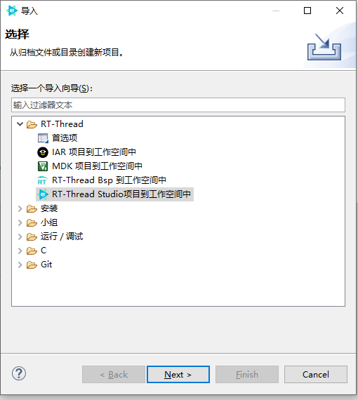

2. 选择本示例工程的根目录进行导入

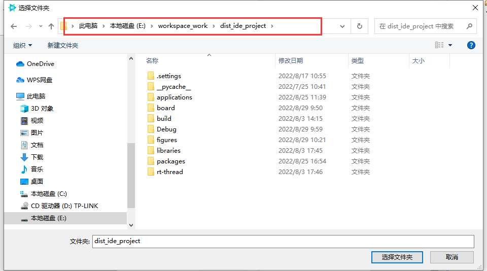

3. 进入 `RT-Studio ` 的SDK管理器中，下载英飞凌的 `OpenOCD` 资源包。

   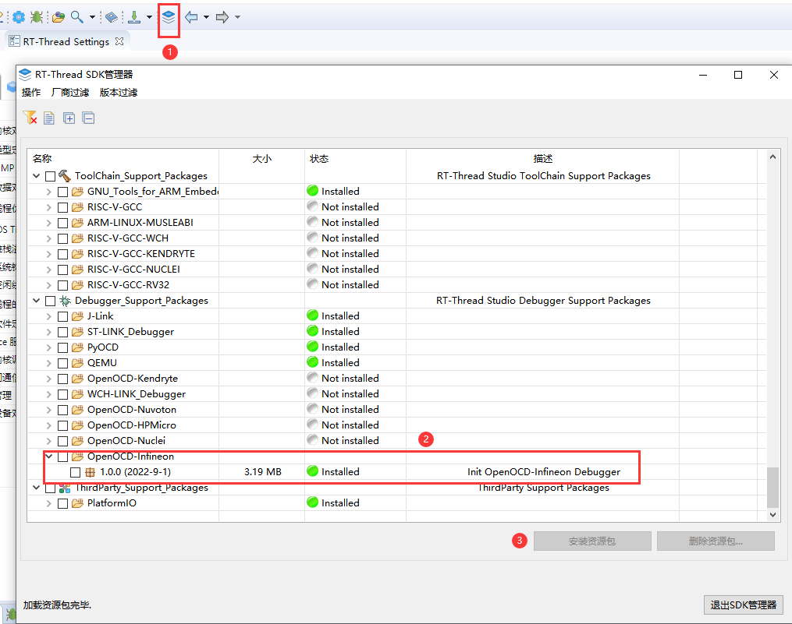

4. 鼠标右键工程，点击 `同步 scons  配置至项目`

   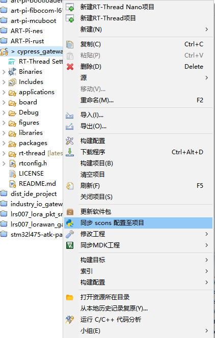

5. 编译、下载，验证运行结果

* 点击 IDE 左上角的构建选项进行工程的编译。

* 当编译无错误警告时，点击 `Debug` 或 `Download` 选项进行调试/下载。

  注：若点击下载并下载成功后串口终端无显示信息，请手动按下复位按键进行重启运行。

  

- 查看系统运行情况

> 在串口终端输入命令 `help`、`ps`、`free`、`list_device` 等命令查看系统运行状态

6. 连云配置

- 在[云平台](https://open.iot.10086.cn)创建项目，创建完成后点击控制台进入配置

* 点击 `全部产品服务—>多协议接入` 进入配置界面

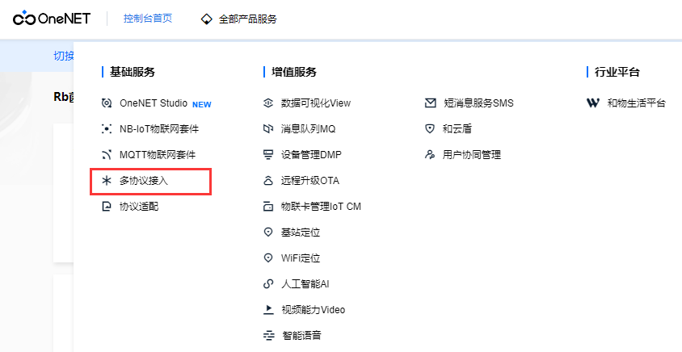

* 添加产品

* 输入产品信息

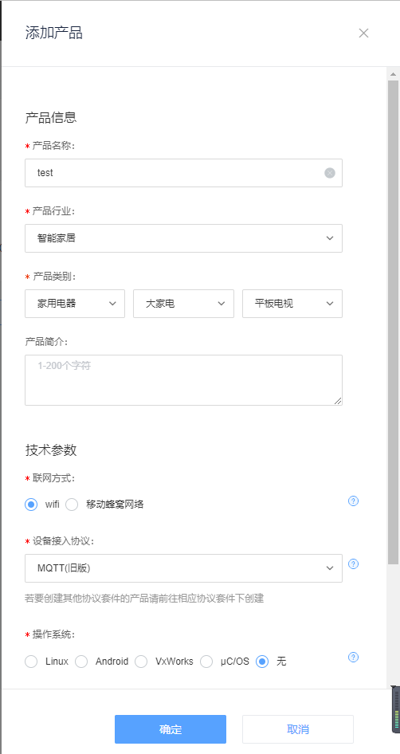

* 添加设备

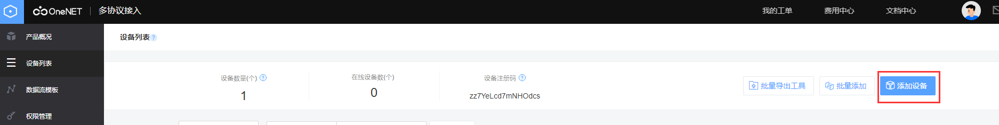

* 输入设备信息

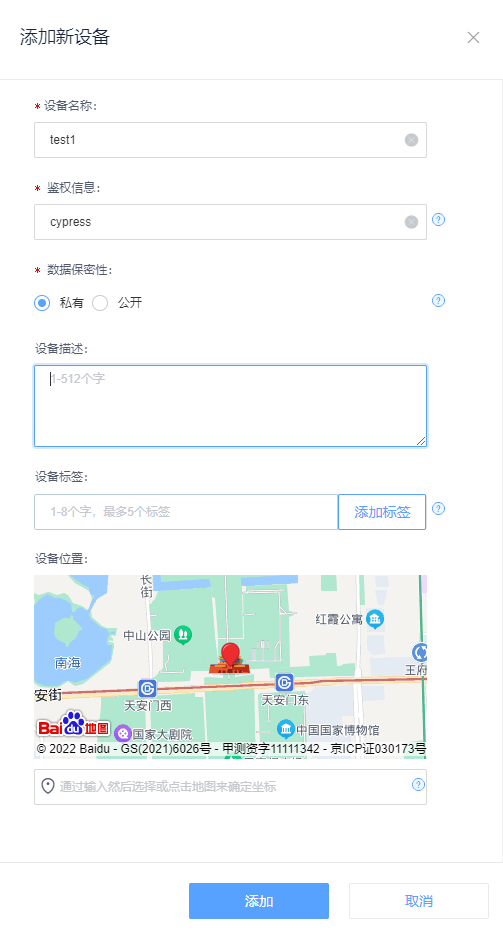

* 进入 `RT-Thread Studio`，双击本工程下的 `RT-Thread Settings` ，进入工程配置界面

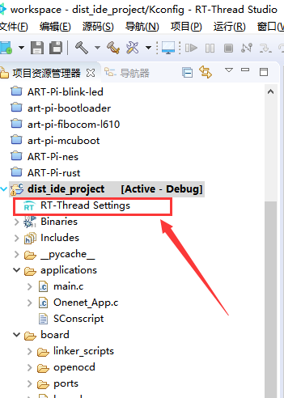

* 对照 `OneNet` 的信息，填写至配置选项中

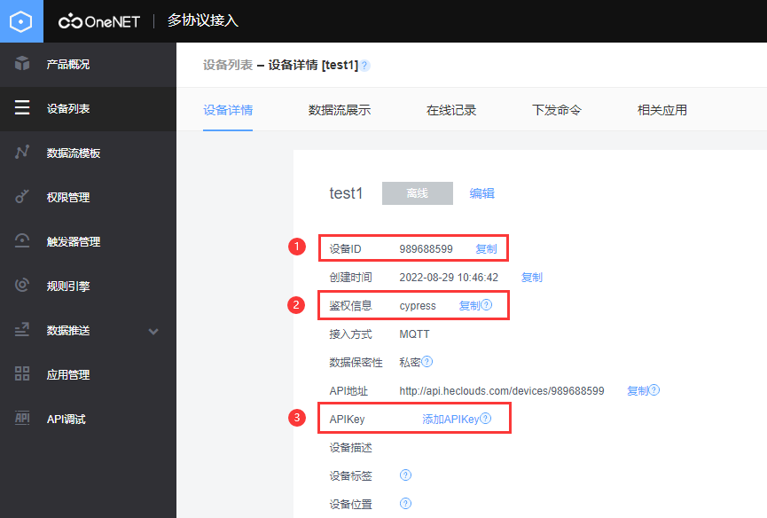

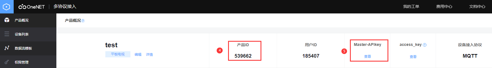

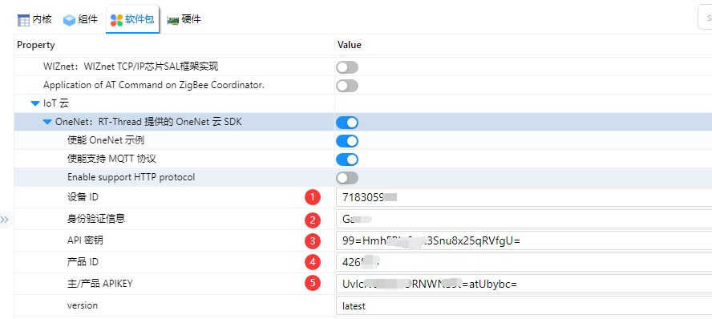

* 编译、下载，验证IOT网关数据上报和下发功能。

## 更多资料

- [开发板官网主页](https://www.infineon.com/cms/en/product/evaluation-boards/cy8cproto-062-4343w/)
- [开发板原理图](https://www.infineon.com/dgdl/Infineon-CY8CPROTO-062-4343W_Schematic-PCBDesignData-v01_00-EN.pdf?fileId=8ac78c8c7d0d8da4017d0f010c6d183a&utm_source=cypress&utm_medium=referral&utm_campaign=202110_globe_en_all_integration-files)
- [英飞凌快速上手指南](https://www.rt-thread.org/document/site/#/rt-thread-version/rt-thread-standard/tutorial/quick-start/CY8CKIT-062S2-43012/quick-start)
- [CY8CPROTO-062-4343W_datasheet](https://www.infineon.com/dgdl/Infineon-PSOC_6_MCU_CY8C62X8_CY8C62XA-DataSheet-v17_00-EN.pdf?fileId=8ac78c8c7d0d8da4017d0ee7d03a70b1)
