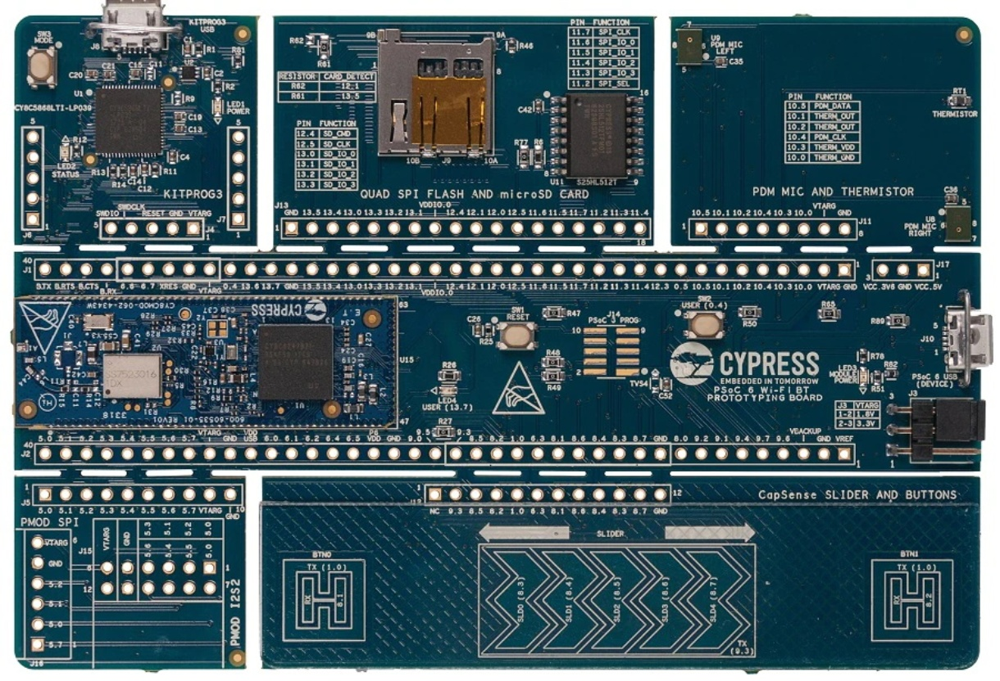
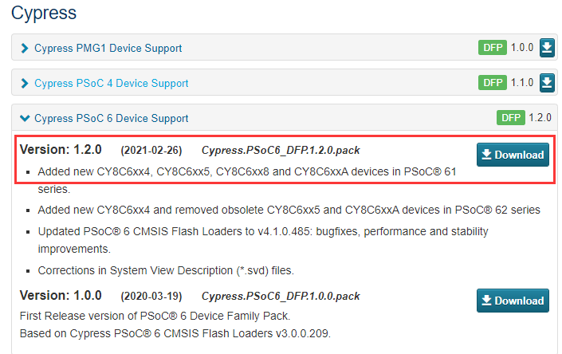
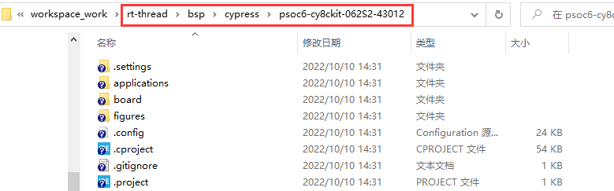
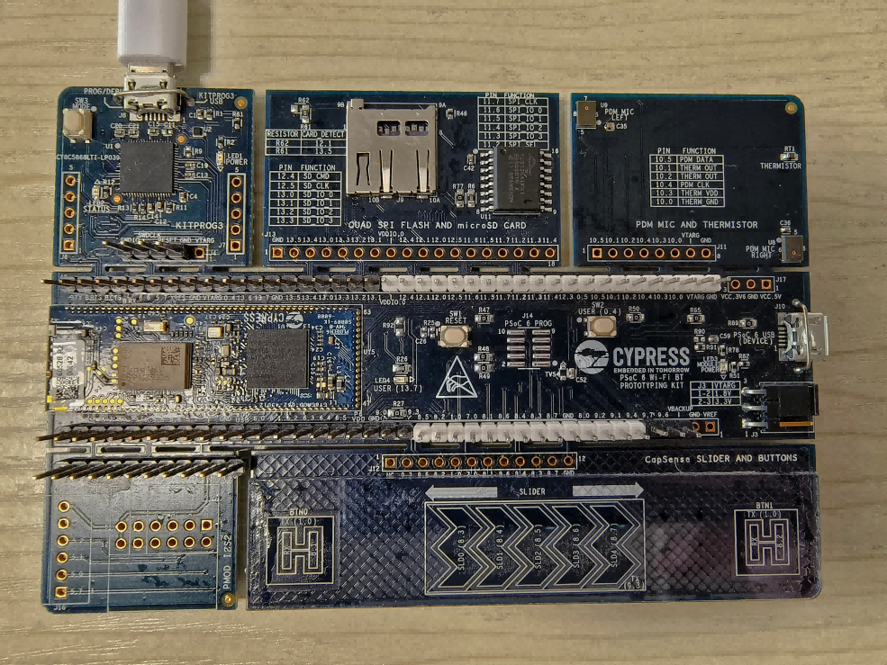

# 英飞凌 Psoc6-CY8CKIT-062S2-43012 上手指南

## 简介

`PSoC6-CY8CKIT-062S2-43012` 是英飞凌推出的一款32位双核CPU子系统（ ARM Cortex-M4 和 ARM Cortex-M0）的开发板，具有单周期乘法的150-MHz Arm Cortex-M4F CPU (浮点和存储器保护单元)，100-MHz Cortex M0+ CPU，带单周期乘法和内存保护单元 MPU，可以充分发挥 PSoC6 双核芯片性能。

开发板外观详细信息：[CY8CKIT-062S2-43012 - Infineon Technologies](https://www.infineon.com/cms/en/product/evaluation-boards/cy8cproto-062-4343w/)

该开发板核心 **板载资源** 如下：

- MCU：CY8C624ABZI-S2D44，Cortex-M4主频 150MHz，Cortex-M0主频 100MHz，2MB Flash 和 1MB SRAM
- MCU手册更多详细信息请参考文档 [PSoC 6 MCU: CY8C62x8, CY8C62xA Datasheet](https://www.infineon.com/dgdl/Infineon-PSOC_6_MCU_CY8C62X8_CY8C62XA-DataSheet-v17_00-EN.pdf?fileId=8ac78c8c7d0d8da4017d0ee7d03a70b1)
- 板载资源：microSD card , 64-Mb Quad-SPI NOR flash， CYW43012 Wi-Fi + Bluetooth Combo Chip
- 仿真器：板载 Psoc5 Dap-link 仿真调试器
- 开发环境：ModusToolbox 2.0/MDK V5
- PSoC® Creator™ 下载链接 [ModusToolbox™ Software - Infineon Technologies](https://www.infineon.com/cms/en/design-support/tools/sdk/modustoolbox-software/)
- 开发板：CY8CKIT-062S2-43012
- 开发板更多详细信息请参考文档 [002-25010_REV A_WEB PDF V1 Final](https://www.infineon.com/dgdl/Infineon-CY8CPROTO-062-4343W_PSoC_6_Wi-Fi_BT_Prototyping_Kit_Quick_Start_Guide-UserManual-v01_00-EN.pdf?fileId=8ac78c8c7d0d8da4017d0f0106871835)

开发板外观如下图所示：

  

## 准备工作

**psoc6-cy8ckit-062S2-43012** 板级支持包提供 MDK5 和 RT-Studio 工程，并且支持 GCC、ArmClang 开发环境，下面介绍如何将示例程序运行起来。运行示例程序前需要做如下准备工作：

 1. MDK 开发环境

    我们需要安装 MDK-ARM 5.24 (正式版或评估版，5.14 版本及以上版本均可)，这个版本也是当前比较新的版本，它能够提供相对比较完善的调试功能。安装方法可以参考 [Keil MDK安装](../keil/keil.md)。

 2. MDK 开发环境

    首先打开 MDK ，若没有安装 `Cypress-PSoC6` 的芯片支持包会提示在线安装，根据提示安装即可。若受网络问题，可以进入 [keil](https://www.keil.com/dd2/pack) 官网下载安装包，进行离线安装。



 3. RT-Thread Studio 开发环境
    首先打开  `RT-Thread Studio` 开发工具，点加左上角文件—>导入—> RT-Thread Studio项目到工作空间中。


 4. 接着选择 `PSoC6-CY8CKIT-062S2-43012` 开发板支持包的目录，进行导入



 5. 连接开发板的 Dap-Link USB 口到 PC 机



## 运行第一个示例程序

1. MDK 环境运行：

进入到 `bsp\cypress\psoc6-cy8ckit-062S2-43012` 文件夹中，双击 project.uvprojx 文件，打开 MDK5 工程，执行编译。编译完成后，点击下载按钮将固件下载至开发板，观察程序运行状况。


2. RT-Thread Studio 环境运行：

   点击 IDE 左上角的构建选项进行工程的编译。

   

   当编译无错误警告时，点击 `Debug` 或 `Download` 选项进行调试/下载。

   

## 运行结果

下载程序成功之后，系统会自动运行。打开终端工具串口助手，选择波特率为 115200。复位设备后，LED 将会以 500HZ 的频率闪烁，而且在终端上可以看到 `RT-Thread` 的输出信息：

注：推荐使用串口调试助手如：`MobaXterm`

```
 \ | /
- RT -     Thread Operating System
 / | \     4.1.1 build Jul 25 2022 18:03:35
 2006 - 2022 Copyright by RT-Thread team
msh >
```

### 其他资料

- [PSoC6开发实践指南(电子书)](https://docs.qq.com/doc/DZmpvR0xocFpVVGhQ)