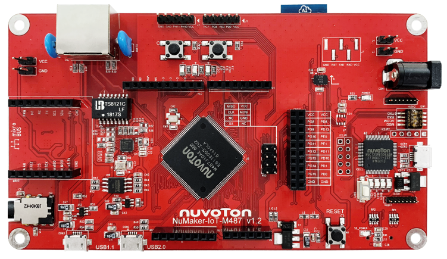

# NuMaker-IoT-M487 上手指南

## 简介

物联网应用广泛，从基础的端点到网关再到云端，之间需要控制、连网与加密等技术。新唐科技推出适合物联网使用之 NuMaker-IoT-M487 开发板，以 NuMicro M487 系列微控制器为主控核心，内建 RJ45 以太网络与 Wi-Fi 模块，让用户可以有线或无线的方式连接云端，亦可通过不同的无线子板提供 NB-IoT、6LoWPAN 等联机能力，以符合各种应用场景需求；配合 NuMicro M487 系列微控制器内建的加解密加速器，提高加密网络联机的效率。

NuMaker-IoT-M487 提供兼容 Arduino UNO 与 mikroBUS™ 接口，可与 GPIO、UART、ADC、PWM、SPI 或 I2C 等接口连接；内建新唐积木式概念的传感器模块 NuMaker Brick I2C 接口；提供独特的仿真影像传感器接口，连接 CMOS 影像传感器，可用于截取影像进行分析；并结合 NAU88L25 音频编译码器，提供高音质的录放音功能；外挂 SPI Flash 及提供 microSD 卡插槽，增加额外的数据存取空间。

NuMaker-IoT-M487 提供多元连网方式与多种接口，并提供影像感测、录放音功能以及弹性扩充数据存取空间，不论是端点装置或轻量型的网关应用，NuMaker-IoT-M487 都是踏入物联网应用的适切选择。

开发板外观如下图所示：



该开发板常用 **板载资源** 如下：

- MCU：M487JIDAE，主频 192MHz，512KB FLASH ，160KB RAM
- 外部 FLASH：W25Q32（SPI，4MB）、NAU88L25 Audio Codec、ESP8266 Wi-Fi
- 常用外设
    * LED：3 个
    * 按键：3 个
- 常用接口：mikro BUS、CMOS 影像接口、USB 转串口、RJ-45 接口、USB 1.1 OTG、USB 2.0 OTG
- 调试接口，板载的 NuLinkMe 下载

开发板更多详细信息请参考 [Nuvoton Direct](https://direct.nuvoton.com/tw/numaker-iot-m487)。

## 软硬件需求

### 软件需求
- Window 10 操作系统。
- Env RT-Thread 开发辅助工具。
- IAR-8.2 以上版本或是 Arm MDK v5(或是 v4) – 工程编译软件。(Optional)
- Nu-Link Driver for Keil MDK。(Optional)
- Nu-Link Driver for IAR。(Optional)
- 终端联机工具，如 Tera Term。
- RT-Thread 源码。

### 硬件需求
- NuMaker-IoT-M487 开发板。
- USB Micro 数据传输线 1 条。

## 准备工作

NuMaker-IoT-M487 板级支持包提供 MDK5 和 IAR 工程，并且支持 GCC 开发环境，介绍如何将示例程序运行起来。运行示例程序前需要做如下准备工作：

1. 源码获取

  在 env 窗口内运行 git clone 将程序拷贝到本地端。[源码目录说明](../src_code_introduction/rtthread_dir.md)

  ```bash
  git clone https://github.com/RT-Thread/rt-thread
  ```

2. 开发环境

  支持 GCC, MDK5, IAR 开发环境.

  | IDE/Compiler  | Tested version            |
  | ---------- | ---------------------------- |
  | MDK5       | 5.26.2                       |
  | IAR        | 8.2                          |
  | GCC        | GCC 5.4.1 20160919 (release) |

  注意: 开发前，请先安装 [Nu-Link_Keil](https://www.nuvoton.com/resource-download.jsp?tp_GUID=SW1120200221180521) 或是 [Nu-Link_IAR](https://www.nuvoton.com/resource-download.jsp?tp_GUID=SW1120200221180914) 驱动。

3. 使用 USB 线连接开发板的 USB ICE Connector 到 PC 机。

## 运行板载功能演示

- 下载项目相关套件

  执行下列命令下载项目相关文件。

  ```bash
  # cd rt-thread
  # cd bsp/nuvoton/numaker-iot-m487
  # menuconfig --generate
  # pkgs --update
  Cloning into 'C:\rt-thread\bsp\nuvoton\numaker-iot-m487\packages\netutils-latest'...
  remote: Enumerating objects: 442, done.
  remote: Total 442 (delta 0), reused 0 (delta 0), pack-reused 442R
  Receiving objects: 100% (442/442), 8.15 MiB | 36.00 KiB/s, done.
  Resolving deltas: 100% (237/237), done.
  ==============================>  FAL v0.4.0 is downloaded successfully.
  ==============================>  netutils update done
  Operation completed successfully.
  ```

- GCC 编译项目

  执行下列指令进行 gcc 编译工程，生成的文件为 rtthread.bin。

  ```bash
  # cd rt-thread
  # cd bsp/nuvoton/numaker-iot-m487
  # scons
  …
  …
  LINK rtthread.elf
  arm-none-eabi-objcopy -O binary rtthread.elf rtthread.bin
  arm-none-eabi-size rtthread.elf
    text    data     bss     dec     hex filename
  245020    4556   10260  259836   3f6fc rtthread.elf
  scons: done building targets.

  <Path-to-rt-thread>\bsp\nuvoton\numaker-iot-m487\rtthread.bin
  ```

- MDK5 编译项目

  通过下列指令选译生成 MDK5 项目工程文件。MDK 项目工程产生在这个目录内，文件名为 project.uvprojx。

  ```bash
  # cd rt-thread
  # cd bsp/nuvoton/numaker-iot-m487
  # scons --target=mdk5 –s

  <Path-to-rt-thread>\bsp\nuvoton\numaker-iot-m487\project.uvprojx
  ```

- IAR 编译项目

  可以通过下列指令生成 IAR 项目工程文件。IAR 项目工程产生在这个目录内，文件名为 project.ewp 和 project.eww。(注意: 编译 IAR 项目工程需使用 8.2 以上的版本。)

  ```bash
  # cd rt-thread
  # cd bsp/nuvoton/numaker-iot-m487
  # scons --target=iar –s

  <Path-to-rt-thread>\bsp\nuvoton\numaker-iot-m487\project.eww
  <Path-to-rt-thread>\bsp\nuvoton\numaker-iot-m487\project.ewp
  ```

- 固件下载

  简易的下载方法: 通过拖拉文档到 NuMicro MCU 虚拟磁盘或是使用传送到 NuMicro MCU 虚拟磁盘的方式，即可完成固件下载。

  

  首先，配置 NuMaker-IoT-M487 上的 ISW1，将四个开关拨到 ‘ON’ 的位置。

  

  配置完成后，将开发板使用 Micro USB 连接线连接计算机，我的计算机将出现一个 NuMicro MCU 虚拟磁盘。接下来，我们将使用这个虚拟磁盘来进行固件下载。(注意：若需要进行 IAR/MDK 源码除错功能，需要将第 4 个指拨开关切换回到 OFF 的位置。)

- 运行

  使用 Tera Term 终端软件操作 rt-thread finsh/msh 命令行功能。串口的配置如图所示。(注意: Nuvoton Virtual Com Port 对应的串口编号可在设备管理器内找到。例如: 串口编号为 COM30, 115200N81。)

  

  在 console 操作 ifconfig 指令打印取得的 IP 地址, 并使用 ping 指令，进行测试网关连接。

  

## 继续学习
已完成 RT-Thread 快速上手！点击这里进行 [内核学习](../../kernel/kernel-video.md) 。
