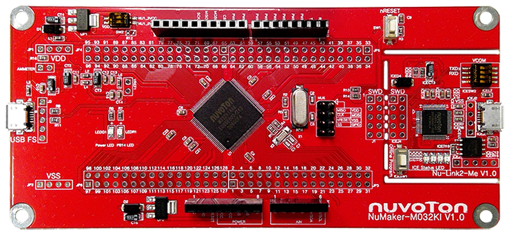
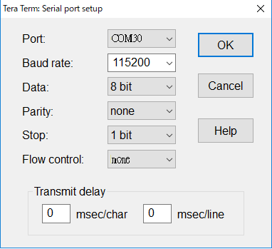

# NuMaker-M032KI 上手指南

## 简介

NuMaker-M032KI 由两部分组成，采用 NuMicro® M032KIAAE 微控制器的主控板，与 Nu-Link2-Me 除错刻录器。使用者只需使用此开发板就可以开发、刻录并验证应用程序。

NuMaker-M032KI 的主控板带有 M032KIAAE 所有脚位的扩展接口，并提供兼容于 Arduino UNO 的接口，还有灵活的电源供应设计，方便搭配各式接口设备或 Arduino 模块，进行开发。主控板并带有一电流量测接口，用户在开发过程中可轻松量测微控制器的功耗。

Nu-Link2-Me 刻录与除错器可透过SWD接口进行刻录与除错，还带有一 16 Mbit 大小的 SPI Flash 供脱机刻录使用。Nu-Link2-Me 也是一个 USB 存储装置，支持拖拉式刻录，将档案拖拉至 Nu-Link2-Me 即可刻录目标芯片。Nu-Link2-Me 支持虚拟串口功能，可输出讯息至终端机窗口。Nu-Link2-Me 可从开发板上拆下，作为量产刻录工具使用。

开发板外观如下图所示：



该开发板常用 **板载资源** 如下：

- MCU：M032KIAAE，主频 72 MHz，512KB Dual Bank FLASH ，96kB RAM
- 外部装置：N/A
- 常用外设
    * LED：2 个
    * 按键：1 个
- 常用接口：USB 转串口、USB 1.1 Device
- 调试接口，板载的 Nu-Link2-Me 下载

开发板更多详细信息请参考 [Nuvoton Direct](https://direct.nuvoton.com/tw/numaker-m032ki)。

## 软硬件需求

### 软件需求
- Window 10 操作系统。
- Env RT-Thread 开发辅助工具。
- IAR-8.3 以上版本或是 Arm MDK v5 – 工程编译软件。(Optional)
- Nu-Link Driver for Keil MDK。(Optional)
- Nu-Link Driver for IAR。(Optional)
- 终端联机工具，如 Tera Term。
- RT-Thread 源码。

### 硬件需求
- NuMaker-M032KI 开发板。
- USB Micro 数据传输线 1 条。

## 准备工作

NuMaker-M032KI 板级支持包提供 MDK5 和 IAR 工程，并且支持 GCC 开发环境，介绍如何将示例程序运行起来。运行示例程序前需要做如下准备工作：

1. 源码获取

    在 env 窗口内运行 git clone 将程序拷贝到本地端。[源码目录说明](../src_code_introduction/rtthread_dir.md)

    ```bash
    git clone https://github.com/RT-Thread/rt-thread
    ```

2. 开发环境

    支持 GCC, MDK5, IAR 开发环境.

    | IDE/Compiler  | Tested version            |
    | ---------- | ---------------------------- |
    | MDK5       | 5.28                         |
    | IAR        | 8.32                          |
    | GCC        | GCC 6.3.1 20170620 (Need update env) |

    注意: 开发前，请先安装 [Nu-Link_Keil](https://www.nuvoton.com/resource-download.jsp?tp_GUID=SW1120200221180521) 或是 [Nu-Link_IAR](https://www.nuvoton.com/resource-download.jsp?tp_GUID=SW1120200221180914) 驱动。

3. 使用 USB 线连接开发板的 USB ICE Connector 到 PC 机。

## 运行板载功能演示

- 下载项目相应套件

    执行下列命令下载项目相关文件。
    ```bash
    # cd rt-thread
    # cd bsp/nuvoton/numaker-m032ki
    # menuconfig --generate
    ```

- GCC 编译项目

    执行下列指令进行 gcc 编译工程，生成的文件为 rtthread.bin。

    ```bash
    # cd rt-thread
    # cd bsp/nuvoton/numaker-m032ki
    # scons
    …
    …
    LINK rtthread.elf
    arm-none-eabi-objcopy -O binary rtthread.elf rtthread.bin
    arm-none-eabi-size rtthread.elf
    text    data     bss     dec     hex filename
    176328    3696   22840  202864   31870 rtthread.elf
    scons: done building targets.

    <Path-to-rt-thread>\bsp\nuvoton\numaker-m032ki\rtthread.bin
    ```

- MDK5 编译项目

    通过下列指令选译生成 MDK5 项目工程文件。MDK 项目工程产生在这个目录内，文件名为 project.uvprojx。

    ```bash
    # cd rt-thread
    # cd bsp/nuvoton/numaker-m032ki
    # scons --target=mdk5 –s

    <Path-to-rt-thread>\bsp\nuvoton\numaker-m032ki\project.uvprojx
    ```

- IAR 编译项目

    可以通过下列指令生成 IAR 项目工程文件。IAR 项目工程产生在这个目录内，文件名为 project.ewp 和 project.eww。(注意: 编译 IAR 项目工程需使用 8.3 以上的版本。)

    ```bash
    # cd rt-thread
    # cd bsp/nuvoton/numaker-m032ki
    # scons --target=iar –s

    <Path-to-rt-thread>\bsp\nuvoton\numaker-m032ki\project.eww
    <Path-to-rt-thread>\bsp\nuvoton\numaker-m032ki\project.ewp
    ```

- 固件下载

    简易的下载方法: 通过拖拉文档到 NuMicro MCU 虚拟磁盘或是使用传送到 NuMicro MCU 虚拟磁盘的方式，即可完成固件下载。

    

    首先，配置 Nu-Link2-Me 上的指拨开关，将四个开关拨到 ‘ON’ 的位置。

    

    配置完成后，将开发板使用 Micro USB 连接线连接计算机，我的计算机将出现一个 NuMicro MCU 虚拟磁盘。接下来，我们将使用这个虚拟磁盘来进行固件下载。

- 运行

    使用 Tera Term 终端软件操作 rt-thread finsh/msh 命令行功能。串口的配置如图所示。(注意: Nuvoton Virtual Com Port 对应的串口编号可在设备管理器内找到。例如: 串口编号为 COM30, 115200N81。)

    
    
    

## 继续学习
已完成 RT-Thread 快速上手！点击这里进行 [内核学习](../../kernel/kernel-video.md) 。
