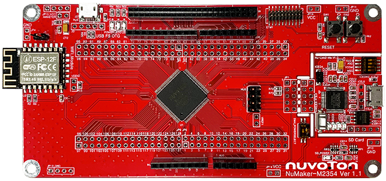

# NuMaker-M2354 上手指南

## 简介

NuMaker-M2354 由两部分组成，采用 NuMicro® M2354KJFAE 微控制器的主控板，与 Nu-Link2-Me 除错烧录器。使用者只需使用此开发板就可以开始进行开发、烧录并验证应用程序。NuMaker-2354 可作为安全项目评估、开发、验证以及功耗监控的平台。

NuMaker-M2354 平台带有 NuMicro® M2354KJFAE 微控制器以及完整的脚位扩展接口，提供兼容于 Arduino UNO 的接口，方便搭配各式接口设备或 Arduino 模块，该平台提供多种的电源供应设计，让项目的开发更加灵活。NuMaker-M2354 平台具备电流量测接口可以随时监控功耗，协助项目开发与评估。NuMaker-M2354 还带有 Wi-Fi 模块以及支持 COM/SEG LCD，让使用者能快速进行项目开发。

NuMaker-M2354 的另一部分为 Nu-Link2-Me 除错烧录器。Nu-Link2-Me 可通过 SW 接口对新唐微控制器进行在线 ICP 烧录与除错，也可以进行脱机 ICP 烧录，烧录的状态会显示在状态 LED 上。Nu-Link2-Me 也支持虚拟串口（VCOM）功能，可输出讯息至终端机窗口。Nu-Link2-Me 还可以与开发板分离，成为独立的批量生产烧录器。

开发板外观如下图所示：



该开发板常用 **板载资源** 如下：

- MCU：M2354KJFAE，主频 96 MHz，1MB Dual Bank FLASH ，256kB RAM
- 外部装置：ESP8266 Wi-Fi、COM/SEG LCD
- 常用外设
    * LED：3 个
    * 按键：2 个
- 常用接口：USB 转串口、USB 1.1 OTG
- 调试接口，板载的 Nu-Link2-Me 下载

开发板更多详细信息请参考 [Nuvoton Direct](https://direct.nuvoton.com/tw/numaker-m2354)。

## 软硬件需求

### 软件需求
- Window 10 操作系统。
- Env RT-Thread 开发辅助工具。
- IAR-8.3 以上版本或是 Arm MDK v5 – 工程编译软件。(Optional)
- Nu-Link Driver for Keil MDK。(Optional)
- Nu-Link Driver for IAR。(Optional)
- 终端联机工具，如 Tera Term。
- RT-Thread 源码。

### 硬件需求
- NuMaker-M2354 开发板。
- USB Micro 数据传输线 1 条。

## 准备工作

NuMaker-M2354 板级支持包提供 MDK5 和 IAR 工程，并且支持 GCC 开发环境，介绍如何将示例程序运行起来。运行示例程序前需要做如下准备工作：

 1. 源码获取

  在 env 窗口内运行 git clone 将程序拷贝到本地端。[源码目录说明](../src_code_introduction/rtthread_dir.md)
  ```bash
  git clone https://github.com/RT-Thread/rt-thread
  ```

 2. 开发环境

  支持 GCC, MDK5, IAR 开发环境.
  | IDE/Compiler  | Tested version            |
  | ---------- | ---------------------------- |
  | MDK5       | 5.26.2                       |
  | IAR        | 8.32                          |
  | GCC        | GCC 6.3.1 20170620 (Need update env) |

  注意: 开发前，请先安装 [Nu-Link_Keil](https://www.nuvoton.com/resource-download.jsp?tp_GUID=SW1120200221180521) 或是 [Nu-Link_IAR](https://www.nuvoton.com/resource-download.jsp?tp_GUID=SW1120200221180914) 驱动。

 3. 使用 USB 线连接开发板的 USB ICE Connector 到 PC 机。

## 运行板载功能演示

- 下载项目相应套件

  执行下列命令下载项目相关文件。

  ```bash
  # cd rt-thread
  # cd bsp/nuvoton/numaker-m2354
  # menuconfig --generate
  # pkgs --update
  Cloning into 'C:\rt-thread\bsp\nuvoton\numaker-m2354\packages\netutils-latest'...
  remote: Enumerating objects: 442, done.
  remote: Total 442 (delta 0), reused 0 (delta 0), pack-reused 442R
  Receiving objects: 100% (442/442), 8.15 MiB | 36.00 KiB/s, done.
  Resolving deltas: 100% (237/237), done.
  ==============================>  FAL v0.4.0 is downloaded successfully.
  ==============================>  netutils update done
  Operation completed successfully.
  ```

- GCC 编译项目

  执行下列指令进行 gcc 编译工程，生成的文件为 rtthread.bin。

  ```bash
  # cd rt-thread
  # cd bsp/nuvoton/numaker-m2354
  # scons
  …
  …
  LINK rtthread.elf
  arm-none-eabi-objcopy -O binary rtthread.elf rtthread.bin
  arm-none-eabi-size rtthread.elf
    text    data     bss     dec     hex filename
  245020    4556   10260  259836   3f6fc rtthread.elf
  scons: done building targets.

  <Path-to-rt-thread>\bsp\nuvoton\numaker-m2354\rtthread.bin
  ```

- MDK5 编译项目

  通过下列指令选译生成 MDK5 项目工程文件。MDK 项目工程产生在这个目录内，文件名为 project.uvprojx。

  ```bash
  # cd rt-thread
  # cd bsp/nuvoton/numaker-m2354
  # scons --target=mdk5 –s

  <Path-to-rt-thread>\bsp\nuvoton\numaker-m2354\project.uvprojx
  ```

- IAR 编译项目

  可以通过下列指令生成 IAR 项目工程文件。IAR 项目工程产生在这个目录内，文件名为 project.ewp 和 project.eww。(注意: 编译 IAR 项目工程需使用 8.3 以上的版本。)

  ```bash
  # cd rt-thread
  # cd bsp/nuvoton/numaker-m2354
  # scons --target=iar –s

  <Path-to-rt-thread>\bsp\nuvoton\numaker-m2354\project.eww
  <Path-to-rt-thread>\bsp\nuvoton\numaker-m2354\project.ewp
  ```

- 固件下载

  简易的下载方法: 通过拖拉文档到 NuMicro MCU 虚拟磁盘或是使用传送到 NuMicro MCU 虚拟磁盘的方式，即可完成固件下载。

  

  首先，配置 Nu-Link2-Me 上的指拨开关，将四个开关拨到 ‘ON’ 的位置。

  

  配置完成后，将开发板使用 Micro USB 连接线连接计算机，我的计算机将出现一个 NuMicro MCU 虚拟磁盘。接下来，我们将使用这个虚拟磁盘来进行固件下载。

- 运行

  使用 Tera Term 终端软件操作 rt-thread finsh/msh 命令行功能。串口的配置如图所示。(注意: Nuvoton Virtual Com Port 对应的串口编号可在设备管理器内找到。例如: 串口编号为 COM30, 115200N81。)

  

  在 console 操作 ifconfig 指令打印取得的 IP 地址, 并使用 ping 指令，进行测试网关连接。

  

## 继续学习
已完成 RT-Thread 快速上手！点击这里进行 [内核学习](../../kernel/kernel-video.md) 。
