# core-v-mcu 上手指南

## 1 MCU 简介

core-v-mcu 的目的是展示 cv32e40p，这是 Open Hardware Group(OpenHW) 提供的经过充分验证的 RISC-V 内核。cv32e40p 核心连接到一组具有代表性的外围设备。

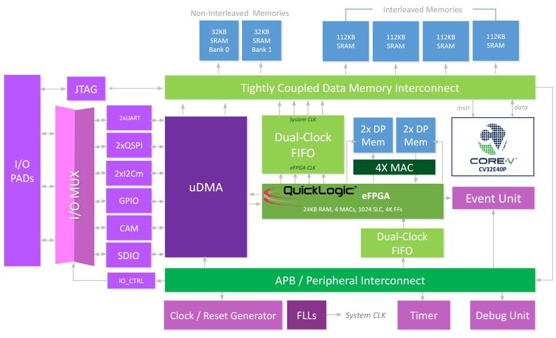

**core-v-mcu 资源：**

- 2xUART
- 2xI2C master
- 1xI2C slave
- 2xQSPI master
- 1xCAMERA
- 1xSDIO
- 4xPWM
- eFPGA with 4 math units

更多信息请访问 [core-v-mcu 介绍](https://docs.openhwgroup.org/projects/core-v-mcu/doc-src/overview.html)，更多资源详见 [OpenHW 官网](https://www.openhwgroup.org/)。

## 2 编译说明

板级包支持 RISC-V GCC 开发环境，以下是具体版本信息：

| IDE / 编译器 | 已测试版本              |
| ---------- | ----------------------- |
| GCC        | riscv32-unknown-elf-gcc |

## 3 使用说明

> 本章节是为在 core-v-mcu 上使用 RT-Thread 的用户提供，core-v-mcu 目前没有实际的硬件，采用 QEMU 的方式实现模拟, 本文使用的 qemu 为 ubuntu18.04 环境下编译 qemu。

### 3.1 使用 Env 编译 BSP

本节讲解如何使用 Env 工具来编译 BSP 工程。

#### 3.1.1 编译 BSP

1. 准备工作 1：[下载 Linux 环境下 GCC 编译工具链](https://github.com/Yaochenger/openhw-/tree/master/toolchain)，将下载的工具链放在自己的 Linux 环境下。

2. 准备工作 2：在 Linux 环境下安装 Env，在控制台运行以下命令。

   ```shell
   wget https://gitee.com/RT-Thread-Mirror/env/raw/master/install_ubuntu.sh
   chmod 777 install_ubuntu.sh
   ./install_ubuntu.sh --gitee
   ```

3. 准备工作 3：在 Linux 环境下编译 PLCT 实验室提供的 [qemu](https://github.com/plctlab/plct-qemu), 参考 README.rst 中给出的编译方法编译 Linux 环境下的 qemu，或使用笔者编译好的 [qemu](https://github.com/Yaochenger/openhw-/releases/tag/qemu-linux)。

4. Windows 环境下载 [RT-Thread最新源码](https://github.com/RT-Thread/rt-thread/archive/refs/heads/master.zip)，此步骤同样可以在 Linux 环境下完成。

5. Windows 环境下载当前 BSP 根目录下打开 Env 工具并执行以下命令编译,`scons --exec-path=xxx`,`xxx` 为工具链路径，Windows 下的工具链可以直接使用 RT-Studio 下载，工具链的路径依据用户的具体环境进行配置，此步骤同样可以在 Linux 环境下完成，示例命令如下：

   ```shell
   scons --exec-path=D:\RT-ThreadStudio\repo\Extract\ToolChain_Support_Packages
   \RISC-V\RISC-V-GCC-RV32\2022-04-12\bin
   ```

    在指定工具链位置的同时直接编译，编译后生成 rtthread.elf 文件，编译结果如下：

   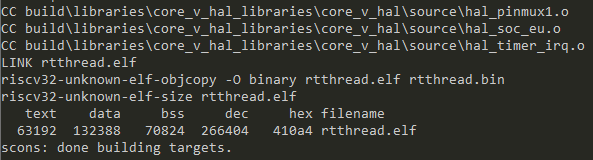

6. 试运行 rtthread.elf，将上步生成的 rtthread.elf 拷贝到编到编译的 qemu 工具的 bin 文件目录下，执行以下命令

   ```shell
   ./qemu-system-riscv32 -M core_v_mcu -bios none -kernel rtthread.elf -nographic -monitor none -serial stdio
   ```

   运行结果如下：

   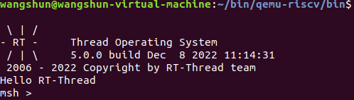

7. 运行以下命令生成完整可拷贝的工程

   ```shell
   scons --dist
   ```

   将生成的独立工程拷贝到 Linux 环境下。

### 3.2Liunx 环境下编译运行工程

#### 3.2.1 配置工程

1. 在上文拷贝的完整的工程根目录下找到 **rtconfig.h**, 去掉该文件中的预编译命令, 一定要执行这步操作，否则会编译报错, 需要去掉的内容如下：

   ```c
   #ifndef RT_CONFIG_H__
   #define RT_CONFIG_H__
   ...
   #endif
   ```

   去掉后的内容如下：

   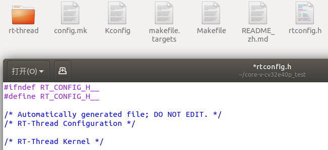

2. 执行以下命令生成 makefile 工程

   ```shell
   scons --target=makefile
   ```

3. 在命令行输入 **make** 编译工程

4. 运行以下命令，启动 qemu 运行编译出 rtthread.elf，`/home/wangshun/bin/qemu-riscv/bin/qemu-system-riscv32` 为 Linux 环境的工具链路径，这里设置为用户的工具链路径。

   ```shell
   /home/wangshun/bin/qemu-riscv/bin/qemu-system-riscv32 -M core_v_mcu -bios none -kernel rtthread.elf -nographic -monitor none -serial stdio
   ```

   BSP 支持 RT-Thread 的 Finsh 组件，输入 version 可以查看 rt-thread 的版本信息，Tab 键可以查看支持的命令，运行结果如下：

   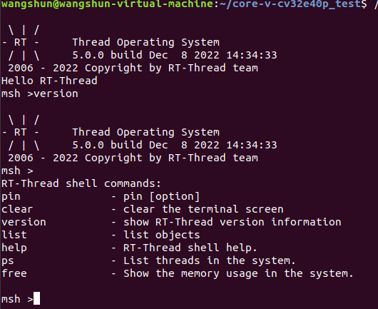

   至此，基于 core-v-mcu 的 RT-Thread 工程的配置与运行测试完成。

### 3.3 将 RT-Thread 工程导入 OpenHW 的 Core-V-IDE

1. 下载安装 [core-v-sdk](https://github.com/openhwgroup/core-v-sdk), 按照[README.md](https://github.com/openhwgroup/core-v-sdk#readme) 中的步骤安装 Linux 环境下的 IDE。

2. 在主目录下创建 workspace 文件夹，打开 IDE 将 workspace 文件夹作为工作路径。

3. 选择 `Import projects` 选项 。

   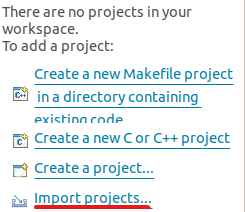

4. 选择 `Existing Code as Makefile Project` 选项。

   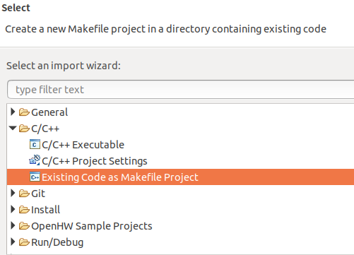

5. 设置如下

   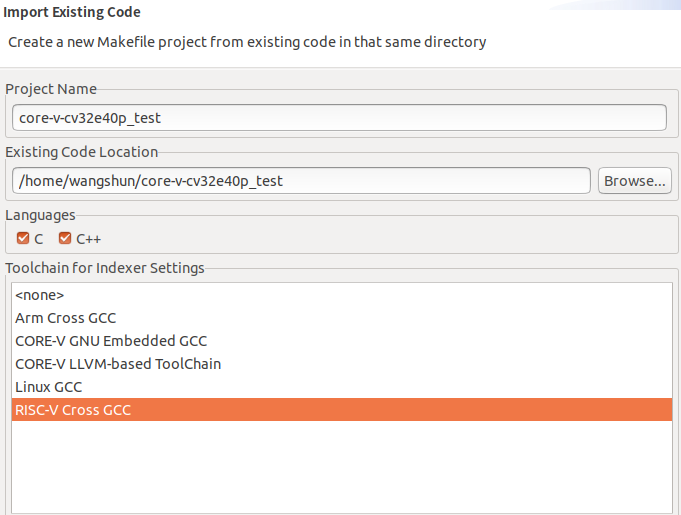

6. 工程配置设置

   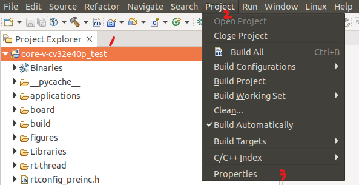

7. 修改编译命令

   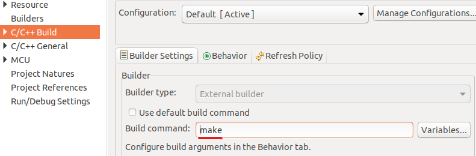

8. 清空工程编译出的文件，重新编译工程

   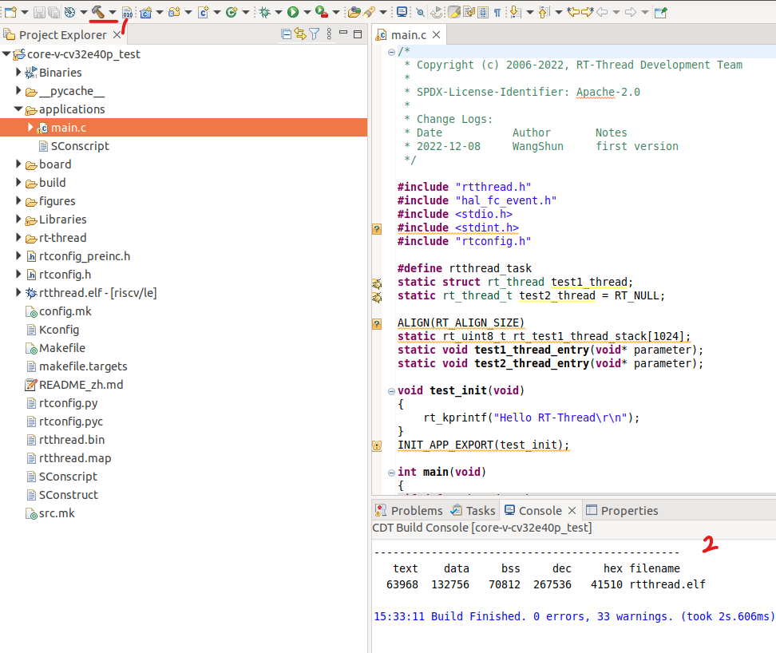

9. 在使用 IDE 编译的工程的根目录下运行以下命令，结果和 **3.2.1** 运行的结果一致 IDE 下的工程便配置完成，至此，IDE 导入 core-v-mcu 的 RT-Thread 工程的导入与运行测试完成。

   ```shell
   /home/wangshun/bin/qemu-riscv/bin/qemu-system-riscv32 -M core_v_mcu -bios none -kernel rtthread.elf -nographic -monitor none -serial stdio
   ```

### 3.4 调试配置

1. Debug Configurations 配置

   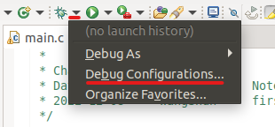

2. 双击 `GDB OpenOCD Debugging`，生成调试配置选项

   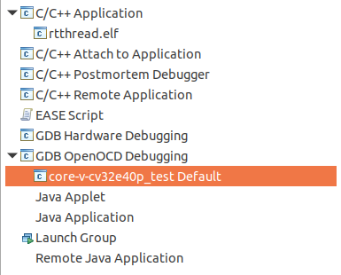

3. 导入内核寄存器文件

   文件路径 `OpenHW/CORE-V-SDKv0.0.0.4/registers/csr`, 具体路径根据用户安装的 SDK 路径配置。

   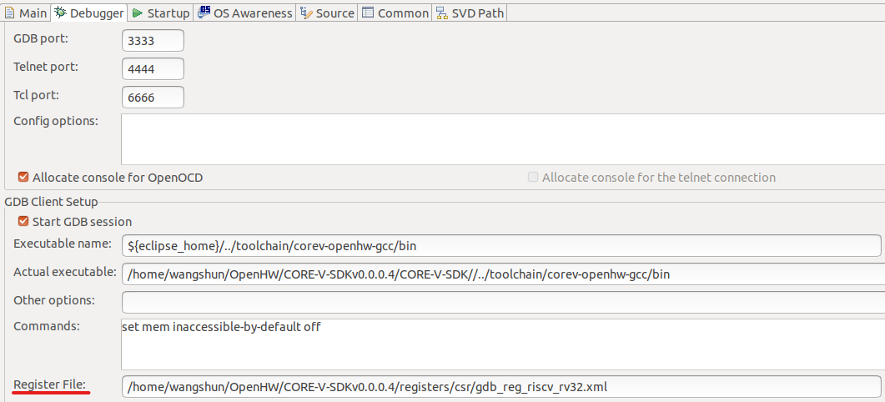

4. 导入片上外设寄存器文件

   文件路径 `/home/wangshun/OpenHW/CORE-V-SDKv0.0.0.4/registers/peripheral`, 具体路径根据用户安装的 SDK 路径配置。

   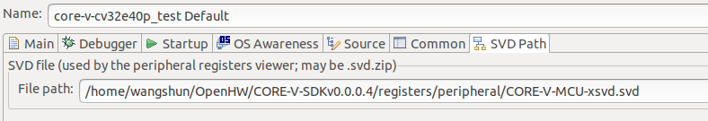

5. 配置 qemu 运行环境

   取消 `Start OpenOCD locally` 的勾选，配置参数如下

   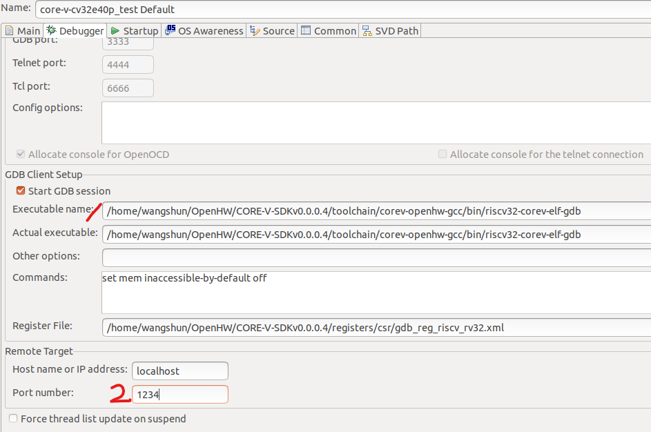

6. 运行下述指令

   ```shell
   /home/wangshun/bin/qemu-riscv/bin/qemu-system-riscv32 -M core_v_mcu -bios none -kernel rtthread.elf -nographic -monitor none -serial stdio -s -S
   ```

7. 点击 debug 开始调试

   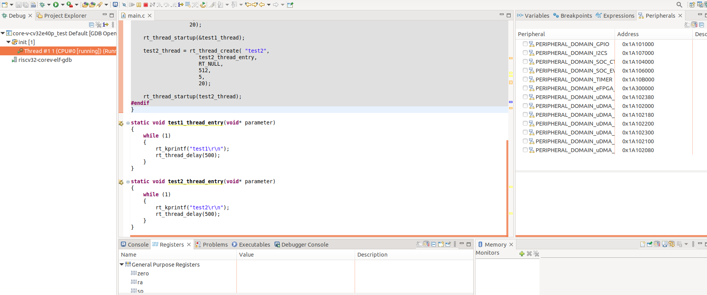

### 4.CLI 组件

​OPENHW 提供的 FreeRTOS 工程支持一个 CLI 组件用于测试，在使用 RT-Thread 时为了兼容原有的 CLI，所以将原来的 CLI 做成了独立的软件包，同时该软件包自动开启 FreeRTOS 兼容层，所以该软件包既可以支持原有的 CLI 组件，同时用户可以自行选择使用 FreeRTOS 的 API 或者 RT-Thread 的 API。

#### 4.1 使用方法

​在 Env 工具中使用 menuconfig 配置开启 CorevMCU_CLI 软件包，将 example.c 中的示例代码放到 main.c 提示的地方。使用 menuconfig 配置的步骤如下：

```c
RT-Thread online packages
 miscellaneous packages --->
    [*] CorevMCU_CLI
```
