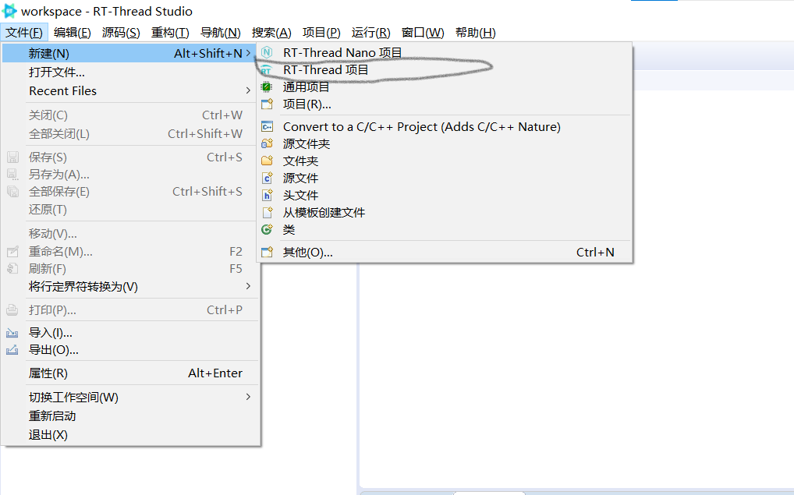
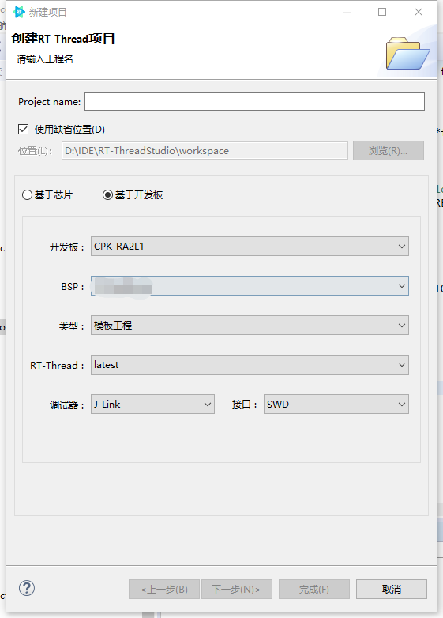

# 瑞萨 RA2L1-cpk 上手指南

## 简介

RA2L1 产品组基于Cortex-M23 核心（现Cortex-M 系列中功耗最低的 CPU）。RA2L1 产品组能够支持 1.6V 至 5.5V 宽电压工作，CPU 时钟频率最高 48MHz，且运行模式电流和待机模式电流更低。 RA2L1 产品群配备了增强型电容式触摸感应单元 (CTSU2)、串行通信接口、高精度模拟电路和定时器。 

开发板外观如下图所示：


特性：

 - 48MHz Cortex-M23
 - 128KB/ 256KB 代码闪存和 32KB SRAM（支持 ECC）
 - 8KB 数据闪存，提供与 EEPROM 类似的数据存储功能
 - 从 48 引脚到到 100 引脚的封装选择
 - 内部电压调节电路
 - 增强型电容触摸感应单元 (CTSU2)
 - 12 位 ADC，12 位 DAC，低功耗比较器
 - 32 位通用 PWM 定时器，16 位通用 PWM 定时器，低功耗异步通用定时器
 - 实时时钟
 - 串行通信接口（UART、简单 SPI、简单 I2C）
 - 独立的SPI接口 / I2C 多主接口
 - CAN
 - 安全功能
 - 加密功能

开发板更多详细信息请参考 [官方产品介绍](https://www.renesas.cn/cn/zh/products/microcontrollers-microprocessors/ra-cortex-m-mcus/cpk-ra2l1-evaluation-board)。

## 准备工作

RA2L1-cpk 支持 RT-Thread Studio 开发环境，下面以 Studio 开发环境为例，介绍如何将示例程序运行起来。运行示例程序前需要做如下准备工作：

 1. RT-Thread Studio

     下载安装 https://www.rt-thread.org/studio.html 

 2. 源码获取

     <https://github.com/RT-Thread/rt-thread/>

     [源码目录说明](../src_code_introduction/rtthread_dir.md)

 3. 灵活配置软件包 (FSP) 及 CPK-RA2L1 板级支持包安装

    - FSP 请使用 v3.5.0 版本，目前可在github上下载3.5.0版本（下载地址：[https://github.com/renesas/fsp/releases/tag/v3.5.0](https://github.com/renesas/fsp/releases/tag/v3.5.0)（文件名称为：setup_fsp_v3_5_0_rasc_v2021-10.exe）注意官网为 3.6.0 版本，不向前兼容，使用 3.6.0 版本会导致本工程不可用）
    - 下载 3.5.0 版本 CPK-RA2L1 板级支持包。配合 FSP 一起使用，是开发板的图形化配置支持包，可在[Renesas官网下载](https://www2.renesas.cn/cn/zh/products/microcontrollers-microprocessors/ra-cortex-m-mcus/cpk-ra2l1-evaluation-board#design_development)。

    详细的安装步骤参考：[瑞萨RA2L1开发实践指南](https://docs.qq.com/doc/DQktJWmpBZkNiTnh6?u=3507021c92a04b2fbc058e7deb92b1cd) **开发环境**章节。

 4. 使用 USB 线连接开发板的 USB 转串口 到 PC 机。

## 运行第一个示例程序

### 编译下载

打开studio，如下图所示，新建工程。





执行编译，编译完成后，点击下载按钮将固件下载至开发板，下载完成后，程序会自动开始运行，观察程序运行状况。


### 运行

如没有自动运行，按下复位按键重启开发板，观察开发板上 LED 的实际效果。正常运行后，LED 灯会周期性闪烁。

使用串口工具（如：PuTTY）打开板子对应的串口(115200-8-1-N) ，复位设备后，可以看到 RT-Thread 的输出信息：

```bash
 \ | /
- RT -     Thread Operating System
 / | \     3.1.1 build Nov 19 2018
 2006 - 2018 Copyright by rt-thread team
msh >
```

## 继续学习

已完成 RT-Thread 快速上手！点击这里进行 [内核学习](../../kernel/kernel-video.md) 。

如要探索开发板更多功能，参考：[瑞萨RA2L1开发实践指南](https://docs.qq.com/doc/DQktJWmpBZkNiTnh6?u=3507021c92a04b2fbc058e7deb92b1cd)。